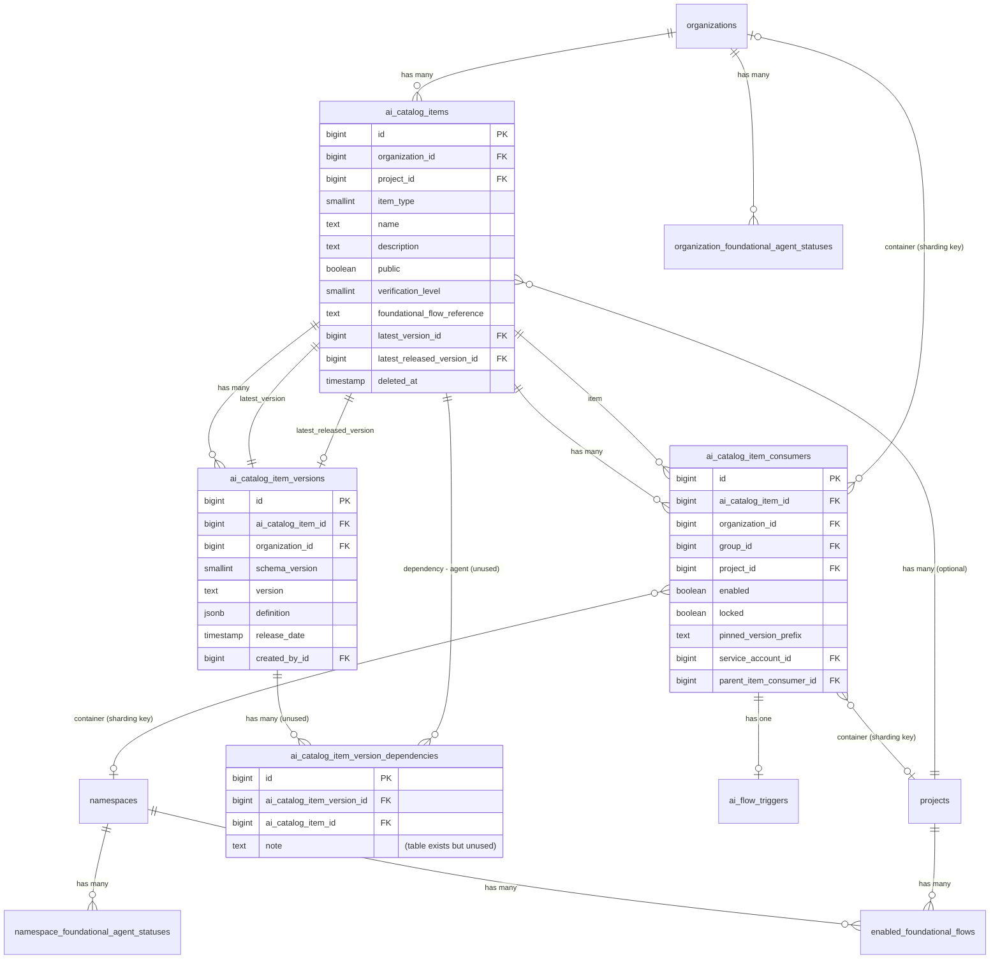
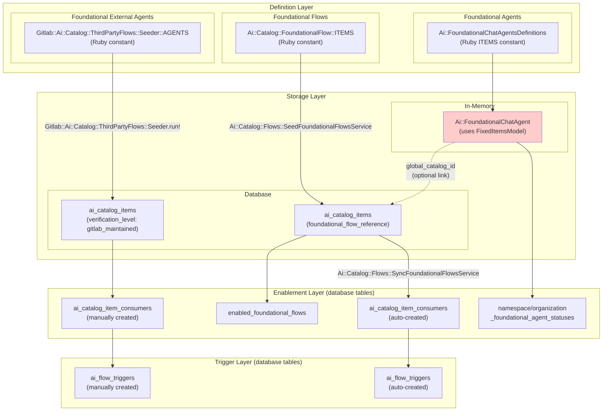
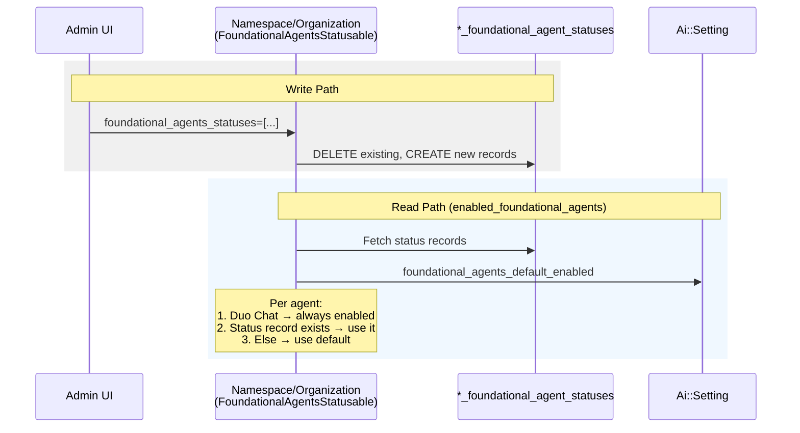
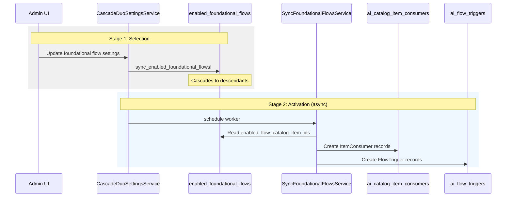
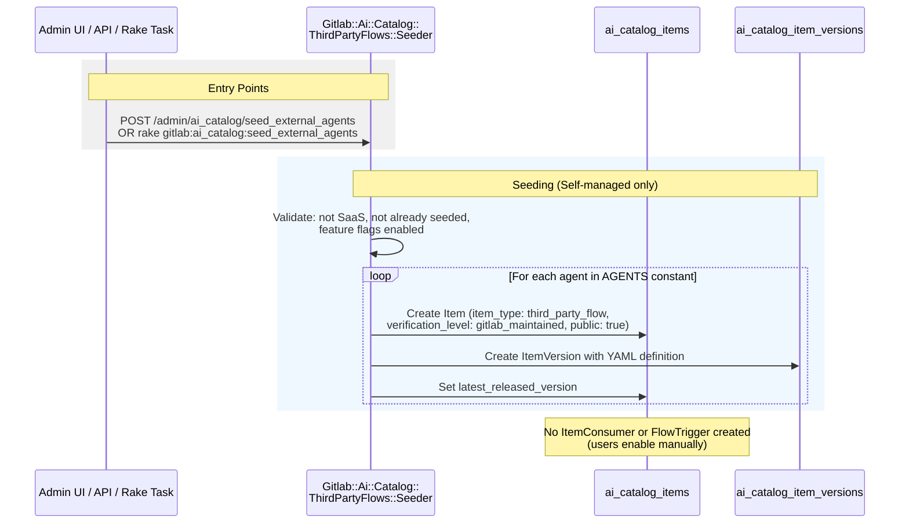
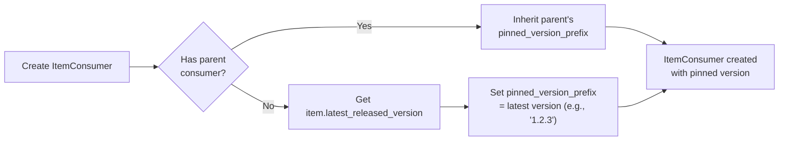
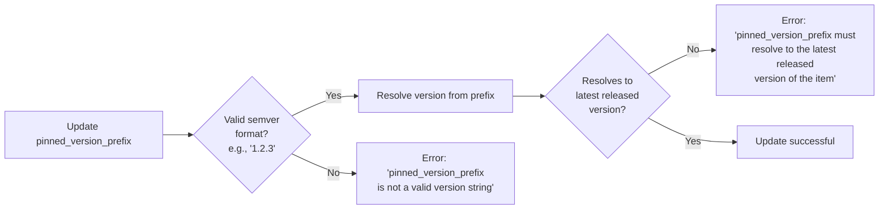
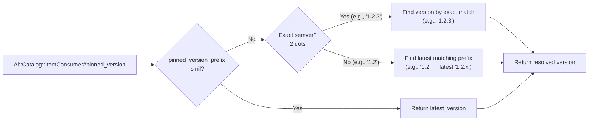
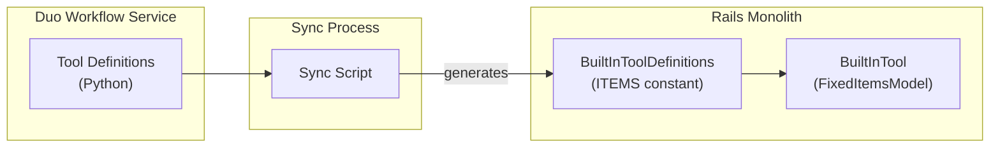
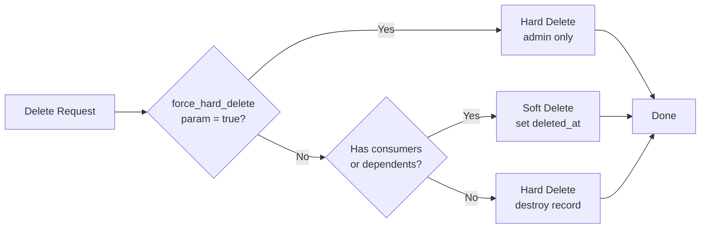

---

title: AI Catalog Backend Architecture
status: implemented
creation-date: "2026-02-12"
authors: [ "@.luke"]
coaches: []
dris: []
owning-stage: "~devops::ai_powered"
participating-stages: []
toc_hide: true
---



## Summary

This document captures the current architecture of the AI Catalog backend in the GitLab Rails monolith. It documents the data model, different implementation patterns for foundational vs custom items, and identifies architectural inconsistencies that have emerged as the system evolved.

This documentation enables:

- Architecture review
- Creation of improvement roadmap for unifying patterns
- Better onboarding for engineers working on the catalog

## Problem Statement

The workflow catalog backend architecture has evolved incrementally to support (see [glossary](https://docs.gitlab.com/development/ai_features/glossary/#agent-types)):

- Custom agents
- Custom flows
- Custom external agents (third-party flows)
- Foundational agents
- Foundational flows
- Foundational external agents
- MCP servers (on the horizon)

This evolution has happened without unified architectural patterns, resulting in different implementation approaches for similar concepts. This document aims to capture the current picture.

## Core Data Model

### Database Tables

| Table | Purpose |
| ----- | ------- |
| `ai_catalog_items` | Core catalog items (agents, flows, external agents) |
| `ai_catalog_item_versions` | Versioned definitions for items (definitions stored in jsonb `definition` column) |
| `ai_catalog_item_consumers` | Links items to groups/projects that use them |
| `ai_catalog_item_version_dependencies` | Tracks which agents a flow version depends on (unused) |
| `enabled_foundational_flows` | Tracks which foundational flows are selected per namespace/project |
| `namespace_foundational_agent_statuses` | Per-agent enablement overrides for foundational agents (namespace level) |
| `organization_foundational_agent_statuses` | Per-agent enablement overrides for foundational agents (organization level) |
| `ai_flow_triggers` | Event-based triggers for flows and external agents (assign, mention, pipeline hooks) |

### In-Memory Models (`FixedItemsModel`)

These are Ruby classes using the `FixedItemsModel` pattern - they are **not stored in the database**:

| Model | Purpose | Definition Location |
| ----- | ------- | ------------------- |
| `Ai::Catalog::FoundationalFlow` | GitLab-provided flows (Code Review, Developer, etc.) | `ee/app/models/ai/catalog/foundational_flow.rb` |
| `Ai::Catalog::BuiltInTool` | Predefined tools available to agents | `ee/lib/ai/catalog/built_in_tool_definitions.rb` |
| `Ai::FoundationalChatAgent` | GitLab-provided chat agents (Duo Chat, etc.) | `ee/lib/ai/foundational_chat_agents_definitions.rb` |

### Entity Relationship Diagram



### Item Types

The `ai_catalog_items.item_type` enum defines three types:

| Value | Type | Description |
| ----- | ---- | ----------- |
| 1 | `:agent` | Custom agents with system/user prompts and tool selections. User prompt is unused. |
| 2 | `:flow` | Multi-step workflows composed of agents (agents are defined in-line within the flow) |
| 3 | `:third_party_flow` | External agents executed through CI/CD (Docker image + commands) |

### Definition Schemas

Item definitions are stored as JSONB in `ai_catalog_item_versions.definition` and validated against JSON schemas:

| Schema | Item Type | Key Fields |
| ------ | --------- | ---------- |
| `agent_v1.json` | Agents | `system_prompt`, `user_prompt` (unused), `tools` (array of BuiltInTool IDs) |
| `flow_v1.json` | Flows (legacy) | `steps` with `agent_id` references |
| `flow_v2.json` | Flows (current) | `components`, `routers`, `flow`, `prompts`, `yaml_definition` |
| `third_party_flow_v1.json` | External Agents | `image`, `commands`, `variables`, `yaml_definition` |

---

## Foundational vs Custom Items

### Overview

The catalog supports both user-created (custom) items and GitLab-maintained (foundational) items. However, the implementation patterns differ significantly between foundational agents, flows, and external agents.

### Comparison Table

| Aspect | Foundational Agents | Foundational Flows | Foundational External Agents |
| ------ | ------------------- | ----------------- | ---------------------------- |
| **Definition Location** | `Ai::FoundationalChatAgentsDefinitions::ITEMS` | `Ai::Catalog::FoundationalFlow::ITEMS` | `Gitlab::Ai::Catalog::ThirdPartyFlows::Seeder::AGENTS` |
| **Storage Pattern** | `Ai::FoundationalChatAgent` (in-memory, uses `FixedItemsModel`) | `ai_catalog_items` table (`foundational_flow_reference`) | `ai_catalog_items` table (`verification_level: gitlab_maintained`) |
| **Seeding Mechanism** | None (pure fixtures) | `Ai::Catalog::Flows::SeedFoundationalFlowsService` | `Gitlab::Ai::Catalog::ThirdPartyFlows::Seeder.run!` |
| **Consumer Records** | **None** | Auto-created by `Ai::Catalog::Flows::SyncFoundationalFlowsService` | Manually created |
| **Enablement Tracking** | `namespace_foundational_agent_statuses` / `organization_foundational_agent_statuses` tables | `enabled_foundational_flows` + `ai_catalog_item_consumers` | `ai_catalog_item_consumers` only |
| **Trigger Support** | N/A (chat-based) | `ai_flow_triggers` (auto-created) | `ai_flow_triggers` (manually created) |

Note, foundational agents [can optionally be represented in `ai_catalog_items` table](https://docs.gitlab.com/development/ai_features/foundational_chat_agents/#using-the-ai-catalog), so they are visible in the catalog and allowing duplication. However, functionally the source of data for the foundational agents is always `Ai::FoundationalChatAgent`.

### Architectural Diagram



## Enablement Mechanisms

### Foundational Agents

Foundational agents use a dedicated status table system, separate from the standard `ItemConsumer` pattern.

**Tables:**

- `namespace_foundational_agent_statuses`
- `organization_foundational_agent_statuses`

**Schema:**

```plaintext
├── namespace_id / organization_id (FK)
├── reference (string) - e.g., "duo_planner", "security_analyst_agent"
├── enabled (boolean)
└── timestamps
```

**Logic** (in `Ai::FoundationalAgentsStatusable` concern):

1. Duo Chat (`reference: 'chat'`) is **always enabled** (hardcoded exception)
2. If an explicit status record exists -> use its `enabled` value
3. Otherwise -> fall back to `foundational_agents_default_enabled` setting

**Key characteristics:**

- Does NOT create `ItemConsumer` records

#### Flow Diagram



### Foundational Flows

Foundational flows use a two-table approach:

#### Stage 1: Selection (`enabled_foundational_flows`)

Records the admin's **selection** of which flows to enable.

**Schema:**

```plaintext
├── namespace_id OR project_id (exactly one)
├── catalog_item_id (FK to ai_catalog_items)
└── timestamps
```

**Written by:** `sync_enabled_foundational_flows!` by `CascadeDuoSettingsService`

**Cascades:** Down the hierarchy (group -> subgroups -> projects)

#### Stage 2: Activation (`ai_catalog_item_consumers`)

Records the **operational configuration** for execution.

**Written by:** `SyncFoundationalFlowsService` (asynchronously through worker)

**Includes:** Service account setup, trigger creation, version pinning

**Key characteristics:**

- Auto-creates `ItemConsumer` records for all projects in group hierarchy
- Requires keeping `ItemConsumer` records in sync through hooks in after [project creation](https://gitlab.com/gitlab-org/gitlab/-/blob/5c2913e148da0d7054d03949e21ac5b9bc796bc6/ee/app/services/ee/projects/create_service.rb#L229) and after changes to enabled foundational flow options

#### Flow Diagram



### Foundational External Agents

Use the standard `ItemConsumer` pattern directly.

Foundational external agents use a **one-time seeding** approach.

**Defined in:** `Gitlab::Ai::Catalog::ThirdPartyFlows::Seeder::AGENTS` constant

**Written by:** `Gitlab::Ai::Catalog::ThirdPartyFlows::Seeder.run!`

**Triggered by:** Admin API (`POST /admin/ai_catalog/seed_external_agents`), Rake task, or Admin UI

**Key characteristics:**

- Does not auto-create `ItemConsumer` records, requires manual enabling

#### Flow Diagram



## Version Pinning

### Overview

Version pinning allows consumers to lock to a specific version of a catalog item rather than always using the latest.

### Key Characteristics

1. Pinning follows semver format - `MAJOR.MINOR.PATCH` (for example, 1.2.3)
1. Pinning rules are conservative - The code supports resolving a `"1"` or `"1.2"` pin to using prefix matching, and `nil` to resolve to latest released version, but current create and update validations require pinning to the exact semver format
1. Code for resolving pin to a version is in `Ai::Catalog::ItemConsumer#pinned_version` and `Ai::Catalog::Item#resolve_version`

### Storage

Column: `ai_catalog_item_consumers.pinned_version_prefix`.

### Creation

Creation happens through the `aiCatalogItemConsumerCreate` GraphQL mutation and `Ai::Catalog::ItemConsumers::CreateService` service class.



### Updating

Updating happens through the `aiCatalogItemConsumerUpdate` GraphQL mutation and `Ai::Catalog::ItemConsumers::UpdateService` service class.



### Resolving item version from a pin

This diagram shows how version pinning resolves which version to use.

Note that while the resolution logic supports all three modes, the current creation and update validation rules only permit exact semver format—the nil and prefix matching paths are not reachable through normal `ItemConsumer` flows.



---

## Built-in Tools

### Overview

Built-in tools are predefined capabilities that can be assigned to custom agents. They represent actions that Duo Workflow Service can execute.

### Source of Truth

Duo Workflow Service, synchronised to Rails.

### Storage

`FixedItemsModel` pattern (not in database), defined as fixtures in `Ai::Catalog::BuiltInToolDefinitions::ITEMS`.

```ruby
{
  id: 1,                      # Stable ID (referenced in agent definitions)
  name: "gitlab_blob_search", # Machine-readable name
  title: "Gitlab Blob Search", # Human-readable title
  description: "..."          # Description for UI
}
```

### Synchronization of tool data

A script generates `ee/lib/ai/catalog/built_in_tool_definitions.rb` from Duo Workflow Service definitions.

**Synchronization flow**



### Limitations

- Data source must be manually updated through synchronization.
- There is currently no process to remove tools (issue: [!584050](https://gitlab.com/gitlab-org/gitlab/-/work_items/584050)).

### Association with agents

Tools are associated with agents through the agent definition (jsonb `ai_catalog_items.definition`).

The agent definition stores the tool ID as defined in `Ai::Catalog::BuiltInToolDefinitions::ITEMS`.

```json
{
  "tools": [1, 3, 10, 39],
  "system_prompt": "...",
  "user_prompt": "..."
}
```

### Mapping to Duo Workflow Service

Tools are mapped back to their Duo Workflow Service names when passed to Duo Workflow Service.

## Flow Triggers

Flow triggers enable automatic execution of catalog flows based on GitLab events.

### Model: `Ai::FlowTrigger`

Stored in `ai_flow_triggers` table. Links a project to either:

- A catalog item consumer (`ai_catalog_item_consumer_id`), OR
- A config file path (`config_path`)

**Event Types:**

| Value | Type | Description |
| ----- | ---- | ----------- |
| 0 | `mention` | User mentions the service account |
| 1 | `assign` | Issue/MR assigned to service account |
| 2 | `assign_reviewer` | Service account added as reviewer |
| 3 | `pipeline_hooks` | Pipeline events |

**Key Validations:**

- Must have exactly one of `config_path` or `ai_catalog_item_consumer`
- User must be a service account
- If linked to a consumer, the consumer's item must be a flow or third-party flow
- Consumer's project must match trigger's project

### Execution: `Ai::FlowTriggers::RunService`

Routes execution based on item type:

| Item Type | Execution Path |
| --------- | -------------- |
| `flow` (foundational/custom) | `Ai::Catalog::Flows::ExecuteService` → Duo Workflow Service |
| `third_party_flow` | `Ci::Workloads::RunWorkloadService` → CI pipeline with Docker image |

For catalog flows, the service:

1. Resolves the pinned version from the consumer
2. Builds user prompt from input and resource context
3. Delegates to `Flows::ExecuteService`

For external agents (third-party flows), the service:

1. Fetches flow definition from the item version
2. Creates an `Ai::DuoWorkflows::Workflow` record
3. Runs a CI workload with the image/commands from the definition
4. Passes context through `AI_FLOW_*` environment variables

## Execution and Integration Points

### Execution Contexts

 Execution differs by item type. Agents are interactive, invoked by users through chat interfaces. Flows and External Agents are event-driven, triggered automatically when configured GitLab events occur. Some foundational flows can also be invoked directly from the GitLab Web UI.

| Item Type | Invoked From | Executes in |
| --------- | ------------- | ----------- |
| Agents | Web UI (Agentic Chat), IDE, Duo CLI | Duo Workflow Service |
| Flows | Flow Triggers, Web UI (foundational flows only) | Duo Workflow Service |
| External Agents | Flow Triggers | CI Pipeline (Docker workload) |

### Agent and flow integration with Duo Workflow Service

Duo Workflow Service is the execution engine for agents and flows. It is a Python-based service with a gRPC API, built on LangGraph.

**Integration paths from Rails:**

1. **Web UI (Agentic Chat)**: WebSocket connection [through Workhorse](../duo_workflow/_index.md#from-the-gitlab-web-ui-without-a-separate-executor), which proxies to Duo Workflow Service using gRPC. The `aiCatalogAgentFlowConfig` GraphQL query provides the flow configuration.

2. **IDE**: The [GitLab Language Server](https://gitlab.com/gitlab-org/editor-extensions/gitlab-lsp) includes a Duo Agent Platform client (a.k.a executor) that connects to Duo Workflow Service through Workhorse proxy and executes workflow actions locally.

3. **Flow Triggers**: `Ai::FlowTriggers::RunService` delegates to `Ai::Catalog::Flows::ExecuteService`, which uses `Ai::DuoWorkflows::StartWorkflowService` to orchestrate execution through CI pipeline.

For detailed architecture diagrams, see the [Duo Workflow Architecture documentation](../duo_workflow/_index.md#gitlabcom-architecture).

### External Agent Execution

External agents (third-party flows) do **not** use Duo Workflow Service. They execute directly as CI workloads:

1. `Ai::FlowTriggers::RunService` receives the trigger event
2. Flow definition (Docker image, commands) is read from `ItemVersion#definition`
3. `Ci::Workloads::RunWorkloadService` creates a CI job
4. Context is passed in `AI_FLOW_*` environment variables

## Agent identity

When flows and external agents execute on runners through [Flow Triggers](#flow-triggers), the permissions of an agent are granted through [composite identity](https://docs.gitlab.com/user/duo_agent_platform/composite_identity/).

Composite Identity is an authentication mechanism that combines a service account (the machine user performing actions) with a human user (who initiated the request) into a single OAuth token. This ensures actions are attributed to the service account while preventing privilege escalation—the token only grants access to resources that both the service account and human user can access.

The service account used for flows and external agents are the user records on `Ai::Catalog::ItemConsumer#service_account` (which are duplicated within the associated [flow trigger](#flow-triggers) record `Ai::FlowTrigger#user`).

Further reading:

- [Composite identity developer docs](https://docs.gitlab.com/development/ai_features/composite_identity/)
- [Composite identity customer docs](https://docs.gitlab.com/user/duo_agent_platform/composite_identity/)

## Service Account Management

Service accounts are automatically created when flows or external agents are enabled at the **group level**. They provide the machine identity for [composite identity](#agent-identity) authentication.

### Creation

When `Ai::Catalog::ItemConsumers::CreateService` creates a group-level consumer for a flow or external agent:

1. **Username Generation**: `"{prefix}-{item_name}-{group_name}".parameterize`
   - Foundational flows: prefix is `duo` (for example, `duo-code-review-my-group`)
   - Custom flows/external agents: prefix is `ai` (for example, `ai-my-flow-my-group`)

2. **Name Generation**: Item name, prefixed with "Duo " for foundational flows

3. **Service Account Creation** through `Namespaces::ServiceAccounts::CreateService`:
   - `namespace_id`: The group ID
   - `composite_identity_enforced: true` (required for composite identity)
   - `organization_id`: Inherited from group

4. **Reuse Logic**: If a service account with the same username exists AND is not already linked to an `ItemConsumer`, it's reused rather than creating a new one.

### Hierarchy

- **Group-level consumers** (`ItemConsumer` with `group_id`): Own the service account (`service_account_id` column)
- **Project-level consumers** (`ItemConsumer` with `project_id`): Reference the parent group consumer through `parent_item_consumer_id` and inherit its service account

When a project-level consumer is created:

- The parent's service account is added to the project with **Developer** role
- The `FlowTrigger` record also stores the service account in its `user` column

### Cleanup

When an `ItemConsumer` is destroyed:

- Project consumers: Service account is removed from the project membership
- Group consumers: Service account is removed from all projects in the group hierarchy

## Soft Delete

Items support soft deletion when consumers exist. This preserves enablements for consumers when an item is public.

### Soft Delete Behavior

Soft-deleted items:

- Are excluded from finder results by default
- Can still be queried directly with `showSoftDeleted: true`
- Retain their consumer and version records
- Cannot be administered by non-org-admins (prevented by `ItemPolicy`)

### Model Support

**Scope:** `not_deleted` filters to items where `deleted_at` is null.

### Deletion Logic

`Ai::Catalog::Items::BaseDestroyService`, the base service class used when destroying all item types, chooses between soft and hard delete:



### Authorization

- `delete_ai_catalog_item`: Required for any deletion (maintainer+ required)
- `force_hard_delete_ai_catalog_item`: Required for forced hard delete (admin required)

### GraphQL Exposure

- Items have a `soft_deleted` field (maps to `deleted?` method)
- `aiCatalogItem` query accepts `showSoftDeleted` argument (defaults to `false`)
- `Ai::Catalog::ItemsFinder` uses `not_deleted` scope by default

## GraphQL API

The AI Catalog backend data is exposed through GitLab's GraphQL API.

| Type | Directory |
| ---- | --------- |
| Queries | `ee/app/graphql/resolvers/ai/catalog/` |
| Mutations | `ee/app/graphql/mutations/ai/catalog/` |
| Types | `ee/app/graphql/types/ai/catalog/` |

## Authorization

### Where Authorization Happens

Authorization is enforced at **three layers**:

| Layer | Location | Mechanism |
| ----- | -------- | --------- |
| **GraphQL** | Mutations | `authorize :permission` + `authorized_find!` |
| **GraphQL** | Resolvers (through finders) | Typically through finders with `Ability.allowed?` checks |
| **Services** | All services | `Ability.allowed?` in `authorized?` method |
| **Model** | `Item` scopes | `public_or_visible_to_user` scope filters by project membership |

### Policy Classes

- `Ai::Catalog::ItemPolicy` Controls access to catalog items themselves.
- `Ai::Catalog::ItemVersionPolicy` — Contains unused version execution permission (similar permissions in `ItemConsumerPolicy` are used instead). Delegates to `ItemPolicy` for base permissions.
- `Ai::Catalog::ItemConsumerPolicy` — Controls item consumer execution. Delegates to both `ProjectPolicy` for project item consumers, and `GroupPolicy` for group item consumers.
- `ProjectPolicy` and `GroupPolicy` - Container-Level permission for creating items and consumers.

## Identified Inconsistencies

### 1. Storage Model Mismatch

Foundational agents use `FixedItemsModel` (in-memory only) while foundational flows and external agents use database records.

### 2. Enablement Fragmentation

Three different enablement mechanisms:

- **Foundational Agents:** Dedicated status tables (`*_foundational_agent_statuses`)
- **Foundational Flows:** Two-stage process (`enabled_foundational_flows` -> `ItemConsumer`)
- **Everything else:** Direct `ItemConsumer` records

### 3. Consumer Record Inconsistency

Foundational agents do not create `ItemConsumer` records, while foundational flows auto-create them.

### 4. Catalog Item Linkage Variance

- **Agents:** `Ai::FoundationalChatAgent#global_catalog_id` field
- **Flows:** `Ai::Catalog::Item#foundational_flow_reference` column
- **External Agents:** Standard item with `verification_level: :gitlab_maintained`

### 5. Seeding Mechanism Differences

- **Agents:** No seeding (pure fixtures)
- **Flows:** Service-based seeding
- **External Agents:** Admin UI button
