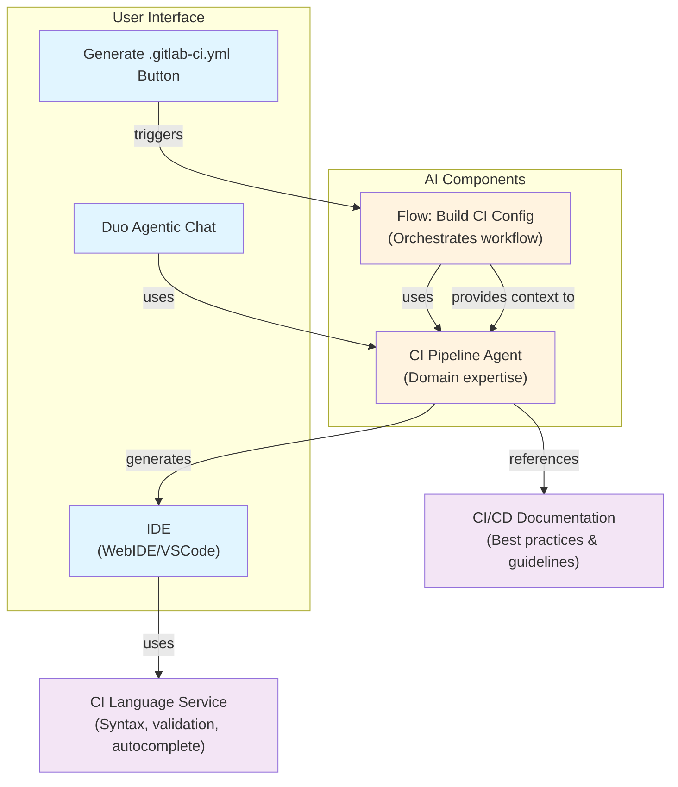



## Introduction

AutoDevOps v2 represents a fundamental evolution of GitLab's automated CI/CD pipeline generation system.
The current AutoDevOps implementation relies on outdated templates and anti-patterns, limiting its effectiveness
and requiring extensive manual configuration from users.
This design proposes transforming AutoDevOps from a static pipeline generator into an intelligent, AI-driven
CI/CD improvement assistant that leverages modern GitLab CI/CD components and GitLab Duo to provide tailored pipeline
recommendations and auto-generation capabilities.

The vision is to make CI/CD pipeline setup and optimization accessible to all users, regardless of their experience level,
while reducing the time spent on manual configuration and enabling continuous improvement of existing pipelines.

## Business Objectives

Primary objectives are:

1. **Reduce Time-to-Value for new projects**: Enable users to get a working CI/CD pipeline tailored to the project needs,
   reducing onboarding friction and time-to-first-pipeline.
2. **Improve pipeline quality**: Provide intelligent recommendations to existing pipeline authors,
   helping them adopt security best practices (e.g., secret detection, container scanning) and performance optimizations.
3. **Increase AutoDevOps adoption**: Transform AutoDevOps from a niche feature into a continuous improvement assistant
   that adds value to all projects, not just those without CI configuration.
4. **Reduce CI/CD learning curve:** Lower the barrier to entry for users unfamiliar with CI/CD concepts by providing
intelligent guidance, best practice recommendations, and auto-generated configurations that serve as educational templates.

Expected business impact:

- **User productivity**: Estimated hours saved in initial CI/CD setup time per new project.
- **Security posture**: Increased adoption of security scanning components across the customer base.
- **Feature adoption**: Higher engagement with GitLab CI/CD components and catalog features.
- **Customer satisfaction**: Improved onboarding experience and reduced configuration complexity.

## High-Level Overview

AutoDevOps v2 will operate as a multi-faceted system with two primary capabilities:

### 1. Pipeline auto-generation for new projects

When a project lacks a `.gitlab-ci.yml` file, an AI-driven process will analyze the project structure and generate an initial pipeline configuration. This analysis will detect:

- Project type (Node.js, Python, Go, Ruby, etc.)
- Presence of Dockerfile or container-related files
- Existing test frameworks and configurations
- Security-sensitive files (secrets, credentials)
- Reading the `AGENTS.md` files to get more context of the project, how to build and test.

The generated configuration will be composed of CI templates or GitLab-maintained CI/CD components from the catalog but also specific jobs tailored to the project.
The process will use CI lint tool to validate the generated `.gitlab-ci.yml` and make required adjustments.

### 2. Continuous commit-validate loop for autonomous pipeline fixing

After the initial pipeline commit, AutoDevOps v2 will autonomously observe pipeline execution and automatically fix runtime failures in a merge request through an iterative commit-validate cycle. This capability enables the system to:

- **Detect runtime failures**: Monitor pipeline execution for failures caused by missing dependencies, misconfigured commands, or environment issues
- **Analyze failure root causes**: Use pipeline logs and error messages to identify the underlying problem (e.g., missing package, incorrect command syntax, incompatible versions)
- **Generate fixes**: Automatically create commits that resolve identified issues (e.g., adding missing dependencies to build configuration, correcting command parameters, updating package versions)
- **Validate fixes**: Re-run the pipeline to verify that the fix resolves the failure
- **Iterate until success**: Repeat the cycle until the pipeline executes successfully in the merge request

This autonomous loop reduces manual intervention and enables projects to achieve working pipelines without requiring users to debug and fix issues manually. The system maintains a record of all fixes applied, enabling users to review and understand what changes were made to their pipeline configuration.

**Key constraints**:

- Fixes are limited to configuration and dependency issues that can be safely resolved without human judgment
- Complex failures requiring architectural changes or external dependencies remain flagged for user review
- All automated changes are committed with clear commit messages documenting the issue and fix applied

### 3. Intelligent recommendations for existing pipelines

For projects with existing CI/CD configurations, AutoDevOps v2 will provide contextual recommendations:

- Suggest missing security scanning components (SAST, DAST, secret detection, container scanning)
- Recommend performance optimizations (caching strategies, parallel execution)
- Identify outdated dependencies or deprecated CI/CD patterns
- Propose component upgrades based on project analysis

Recommendations will be surfaced through the GitLab UI or Duo Agentic Chat, also compatible with GitLab CI Language Service available in IDEs.

## Current State

The current AutoDevOps implementation (see [AutoDevOps documentation](https://docs.gitlab.com/topics/autodevops/)):

- Generates pipelines only when projects lack a `.gitlab-ci.yml` file
- Uses outdated templates with anti-patterns (excessive top-level keywords, poor variable isolation)
- Relies on CI variables for extensive customization, creating a poor user experience
- Discards generated configurations, missing opportunities for reuse and iteration
- Does not provide recommendations or improvements to existing pipelines
- Has limited scope and cannot adapt to diverse project types and requirements

- **All-or-nothing approach**: AutoDevOps operates as a monolithic template that includes all stages (build, test, deploy, security).
  Users cannot easily opt into specific features without either including the entire template or manually copying and maintaining
  individual job templates, creating a maintenance burden.
- **Limited language and framework detection**: While AutoDevOps claims to "automatically detect your language and framework,"
  the detection is relatively basic and relies on buildpacks which were source of breaking changes in the past.
  It struggles with polyglot projects, modern frameworks,
  and non-standard project structures, requiring extensive variable configuration to work correctly.
- **Configuration through environment variables**: Customization relies heavily on CI/CD variables rather than declarative configuration.
  This creates a poor developer experience where users must discover and understand dozens of variables (like `HELM_UPGRADE_EXTRA_ARGS`, `AUTO_DEVOPS_BUILD_IMAGE_FORWARDED_CI_VARIABLES`, etc.) to achieve desired behavior.
- **Static template inheritance model**: AutoDevOps uses template inclusion, which means users must either accept the entire template or fork it.
  There's no composable, modular approach to selecting and combining specific capabilities, making it difficult to evolve pipelines as project needs change.
- **Lack of intelligent recommendations**: AutoDevOps doesn't provide guidance on what features should be enabled for a given project type.
  Users must manually decide which security scanners, testing tools, and deployment strategies to use, missing opportunities to improve pipeline
  quality proactively.
- **No support for existing pipelines**: AutoDevOps activates when a project lacks a `.gitlab-ci.yml` file. Projects with existing
  pipelines receive no recommendations or improvements, leaving a large portion of the user base without access to AutoDevOps benefits.
- **Outdated dependency management**: AutoDevOps uses some outdated dependencies (for example, PostgreSQL version) creating compatibility issues,
  and potential security gaps.

## Detailed components

Implement AI-assisted CI/CD pipeline generation using a **Flow + Agent** architecture where a foundational CI Pipeline Agent
provides domain expertise while referencing GitLab CI/CD documentation for best practices, and a Flow orchestrates the user experience.

**1. CI Pipeline Agent (Foundational)**

- Generic, reusable component providing CI/CD domain expertise
- Analyzes projects (language, framework, test files, deployment targets)
- Generates pipeline configurations based on best practices
- References CI/CD documentation for recommendations (not hardcoded)
- Can be leveraged by multiple flows and use cases
- Adapts automatically as best practices and guidelines evolve

**2. Flow: Build CI Config (Foundational)**

- Opinionated, guided workflow for first-time pipeline creation
- Orchestrates user journey: context gathering → generation → review → approval
- Triggered by `Generate .gitlab-ci.yml with AI` button in UI
- Uses CI Pipeline Agent internally for heavy lifting
- Reduces cognitive load through constrained choices and smart defaults
- Provides clear entry point for novice users

**3. CI/CD Documentation (Best Practices)**

- Single source of truth for CI/CD recommendations
- Agent references docs for: recommended pipeline structure, job configuration best practices, security scanning,
  performance optimization, tier-specific capabilities
- Decouples best practices from agent logic
- Enables rapid iteration on recommendations without agent retraining

**4. CI Language Service**

- Provides syntax validation, autocomplete, and hover documentation
- Handles YAML schema validation
- Provides visualization of resulting pipeline in real-time
- Complements agent by focusing on syntax, not logic
- Enables real-time feedback in IDE

**5. IDE Integration (WebIDE/VSCode)**

- Displays generated pipeline configuration
- Integrates Language Service for editing support
- Links to documentation for learning
- Shows real-time visualization (future enhancement)

### User Flow

1. User clicks `Generate .gitlab-ci.yml with AI` button
1. Flow initiates and gathers context (project analysis, user preferences)
1. Flow invokes CI Pipeline Agent with gathered context
1. Agent references CI/CD documentation for best practices
1. Agent generates pipeline configuration with explanations
1. Flow presents result to user for review/approval
1. User can open IDE to edit with Language Service support
1. IDE displays documentation links and visualization

### Benefits

- **Flexibility:** Agent remains generic and adaptable to customer needs
- **Maintainability:** Best practices centralized in documentation, not code
- **Reusability:** Agent can power multiple features (flows, chat commands, IDE suggestions)
- **Scalability:** Documentation updates automatically improve agent recommendations
- **User Experience:** Flow provides guided, opinionated experience for novices
- **Future-proof:** Architecture supports WebIDE agent integration when available

## Architecture Decision Records

### ADR 1: Implement core logic as a Foundational Agent

**Context**: AutoDevOps v2 requires sophisticated capabilities including project analysis, pipeline generation, configuration validation, failure investigation, and interactive assistance. These capabilities span multiple domains (code analysis, CI/CD expertise, debugging) and require continuous learning and adaptation.

**Decision**: Implement the core logic of AutoDevOps v2 as a foundational agent based on a modified version of [CI/CD Expert Agent](https://gitlab.com/explore/ai-catalog/agents/1169/) from the GitLab AI Catalog, rather than building discrete microservices or rule-based systems.

**Rationale**:

- **Unified intelligence**: A foundational agent can seamlessly handle multiple tasks (project analysis, pipeline generation, validation, debugging, user assistance) with consistent reasoning and context awareness
- **Leverages proven expertise**: The Agent will understand GitLab CI/CD patterns, best practices, and common issues, reducing development time and improving quality
- **Adaptability**: Agent-based approach enables continuous improvement through tuning and feedback without requiring architectural changes
- **Reduced complexity**: Avoids building and maintaining multiple specialized services with complex inter-service communication
- **Alignment with platform strategy**: Supports GitLab's vision of AI-powered development workflows through foundational agents
- **Extensibility**: Agent framework enables adding new capabilities (e.g., security analysis, performance optimization) without redesigning core architecture

**Trade-offs**:

- Depends on foundational agent platform stability and performance
- Requires careful prompt engineering and validation to ensure reliable outputs
- Agent responses must be validated before taking actions (commits, pipeline execution)
- May require ongoing tuning as AutoDevOps v2 capabilities expand

**Alternatives Considered**:

- Microservices architecture: Requires building and maintaining multiple specialized services with complex orchestration
- Rule-based system: Limited flexibility, difficult to improve over time, cannot handle novel scenarios
- Custom ML models: High development cost, requires ML expertise, longer time-to-market

### ADR 2: CI Component selection

**Context**: AutoDevOps v2 needs to intelligently select components based on project analysis, but users must understand and trust the recommendations.

**Decision**: Implement AI-driven component selection of GitLab-maintained and organization-level components with clear explanations of why each component is recommended, enabling users to accept, customize, or reject recommendations.

**Rationale**:

- Provides intelligent, context-aware recommendations
- Maintains user agency and control
- Builds trust through transparency
- Enables continuous improvement through user feedback

**Trade-offs**:

- The agent needs to balance reusability with maintainability and clarity
- May only recommend GitLab-maintained and organization's internal components

### ADR 3: Focus on CI only for MVP

**Context**: AutoDevOps v2 must balance ambition with delivery risk. CD (Continuous Deployment) introduces significantly higher complexity and risk than CI (Continuous Integration).

**Decision**: Scope MVP to CI capabilities only (testing, security scanning, code quality). Exclude all CD functionality (deployments, releases, infrastructure provisioning) from initial implementation.

**Rationale**:

- CI is lower-risk and higher-value for automation, excellent candidate for full automation without human oversight.
  Catches bugs at high frequency (every branch/tag/MR).
  Mistakes result in failing pipelines, not production incidents.
  Can be derived entirely from repository context (no external secrets/credentials needed).
- CD requires human judgment and carries higher stakes.
  Delivers software to production at lower frequency (release tags/branches).
  Mistakes directly cause production incidents, security breaches, or customer-facing failures.
  Requires handling sensitive credentials and infrastructure access.
  Deployment patterns vary wildly between projects and organizations.
  Relies on project-specific details that cannot be deduced from repository context alone.

**Trade-offs**:

- Limits initial value proposition to pipeline quality and testing.
- Defers deployment automation to future phases.

**Alternatives Considered**:

- Include CD in MVP: Higher implementation complexity, increased security risk, longer delivery timeline.
- Hybrid approach with limited CD: Still requires sensitive credential handling and approval workflows.

### ADR 4: Complementary feature as the CI Pipeline Language Service

**Context**: AutoDevOps v2 generates initial pipelines and provides recommendations, but users need tools to understand, customize, and maintain their CI/CD configurations. A dedicated pipeline authoring experience would improve usability and reduce friction.

**Decision**: Position the [CI Pipeline Language Service](https://gitlab.com/groups/gitlab-org/editor-extensions/-/work_items/158) as a complementary feature to AutoDevOps v2, rather than building pipeline authoring capabilities directly into AutoDevOps v2.

**Rationale**:

- **Separation of concerns**: AutoDevOps v2 focuses on generation and recommendations; CI Pipeline Language Service handles authoring and editing experience
- **Broader impact**: CI Pipeline Language Service benefits all pipeline authors, not just AutoDevOps v2 users
- **Reduced scope**: Allows AutoDevOps v2 to focus on core intelligence without building comprehensive IDE/editor features
- **Synergistic integration**: Both features enhance each other—AutoDevOps v2 generates initial configurations that users refine with CI Pipeline Language Service
- **Faster delivery**: Enables parallel development of both features without blocking each other

**Rationale for CI Pipeline Language Service capabilities**:

- Supporting multiple IDEs brings productivity where users feel most comfortable
- Pipeline visualizations help users understand execution flow and dependencies
- Inline, context-aware autosuggestions and documentation reduce learning curve
- Seamless Duo integration enables users to ask questions and request changes naturally
- Integration with CI catalog (components and functions) enables discoverability and reuse

**Trade-offs**:

- Requires coordination between two separate features
- Users must adopt both tools to get full benefit
- Depends on CI Pipeline Language Service development timeline

### ADR 5: Leverage AGENTS.md for enhanced project context

**Context**: AutoDevOps v2's foundational agent requires accurate project understanding to generate appropriate pipelines and provide relevant recommendations. Project analysis based solely on file structure and dependency detection has limitations in capturing project-specific build processes, testing strategies, and architectural decisions.

**Decision**: Prioritize reading and analyzing `AGENTS.md` files (when present) as a primary source of project context, supplemented by automated project structure analysis and dependency detection.

**Rationale**:

- **Rich contextual information**: AGENTS.md files contain explicit documentation of project structure, build procedures, testing strategies, and deployment considerations written by project maintainers
- **Accuracy and reliability**: Maintainer-provided information is more accurate than inferred patterns, reducing false assumptions and incorrect pipeline generation
- **Handles edge cases**: Captures non-standard project structures, polyglot projects, and custom build processes that automated detection struggles with
- **Supports best practices**: Encourages projects to document their build and test procedures, improving overall project maintainability
- **Reduces configuration burden**: Eliminates need for extensive CI/CD variables or manual configuration when AGENTS.md provides clear guidance
- **Aligns with community standards**: AGENTS.md is gaining adoption as a best practice for documenting agent-readable project information

**Trade-offs**:

- Depends on projects maintaining accurate AGENTS.md files
- Requires fallback to automated analysis for projects without AGENTS.md
- Agent must handle inconsistent or outdated AGENTS.md content gracefully

**Alternatives Considered**:

- Rely solely on automated project analysis: Limited accuracy for complex or non-standard projects, requires extensive CI/CD variable configuration
- Require AGENTS.md as mandatory: Blocks adoption for existing projects without documentation
- Use only file structure heuristics: Misses important project-specific context and best practices

### ADR 6: Initial `.gitlab-ci.yml` generation as a Flow

**Context:** AutoDevOps v2 needs to generate initial `.gitlab-ci.yml` configurations for new projects. While the foundational agent provides the core intelligence for project analysis and configuration generation, the process of creating the initial configuration is a highly specific task that requires specific prompt while allowing users to steer the requirements.

**Decision:** Implement the initial `.gitlab-ci.yml` configuration generation as a Flow built on top of the CI/CD foundational agent, rather than as a fully autonomous agent capability.

**Rationale:**

- **Specific task focus:** Configuration generation is a well-defined, scoped task that benefits from a structured Flow rather than open-ended agent autonomy
- **User agency and control:** Flows maintain clear user control over the generation process, building trust and enabling users to understand and validate each step
- **Iterative refinement:** Users can review intermediate results, request adjustments, and guide the agent toward the desired outcome, improving configuration quality and user satisfaction
- **Better UX:** Flows provide a guided experience with clear prompts and feedback loops, making the process more intuitive for users unfamiliar with CI/CD

**Trade-offs:**

- Requires more user interaction compared to fully autonomous generation
- Flow design must balance guidance with flexibility to accommodate diverse project types
- Requires clear communication of what information the Flow needs from users

## Threat Model

### Security Considerations

1. **Insecure pipelines**: Generated pipelines could inadvertently use insecure practices.
   - **Mitigation**: Validate generated configurations, implement approval workflows
2. **Supply chain attacks**: Compromised components could be recommended and used in generated pipelines
   - **Mitigation**: Implement component verification, maintain component security standards, monitor for vulnerabilities
3. **User manipulation**: AI recommendations could be manipulated to suggest insecure or malicious configurations
   - **Mitigation**: Implement recommendation validation, maintain audit trails, enable user override
4. **Prompt injection:** The agent itself could be manipulated to execute arbitrary code during configuration generation.
   - **Mitigation:** Reduce the privileges of the agent to the bare minimum required for the task. It gets to use very specific read-only API calls, no external network access, and _no_ write API calls outside of its local environment. The only way to get data out is via the generated CI config.

## Closing Summary

AutoDevOps v2 represents a significant evolution in how GitLab helps users set up and optimize their CI/CD pipelines. By leveraging proven CI/CD best practices, modern CI/CD components, AI-driven intelligence, and a project-centric approach, we can transform AutoDevOps from a static pipeline generator into a continuous improvement assistant that adds value to all projects.

Success will be measured through adoption metrics, user satisfaction, and the impact on pipeline quality and security posture across the GitLab user base.

## References

- [AutoDevOps Documentation](https://docs.gitlab.com/topics/autodevops/)
- [GitLab CI/CD Components](https://docs.gitlab.com/ee/ci/components/)
- [GitLab Handbook - Architecture Design Workflow](https://gitlab.com/gitlab-com/content-sites/handbook/-/merge_requests/16893)
- [Issue #627: AutoDevOps v2](https://gitlab.com/gitlab-org/verify-stage/-/issues/627)
- [Epic #20172: Intelligent CI/CD](https://gitlab.com/gitlab-org/verify-stage/-/issues/20172)
