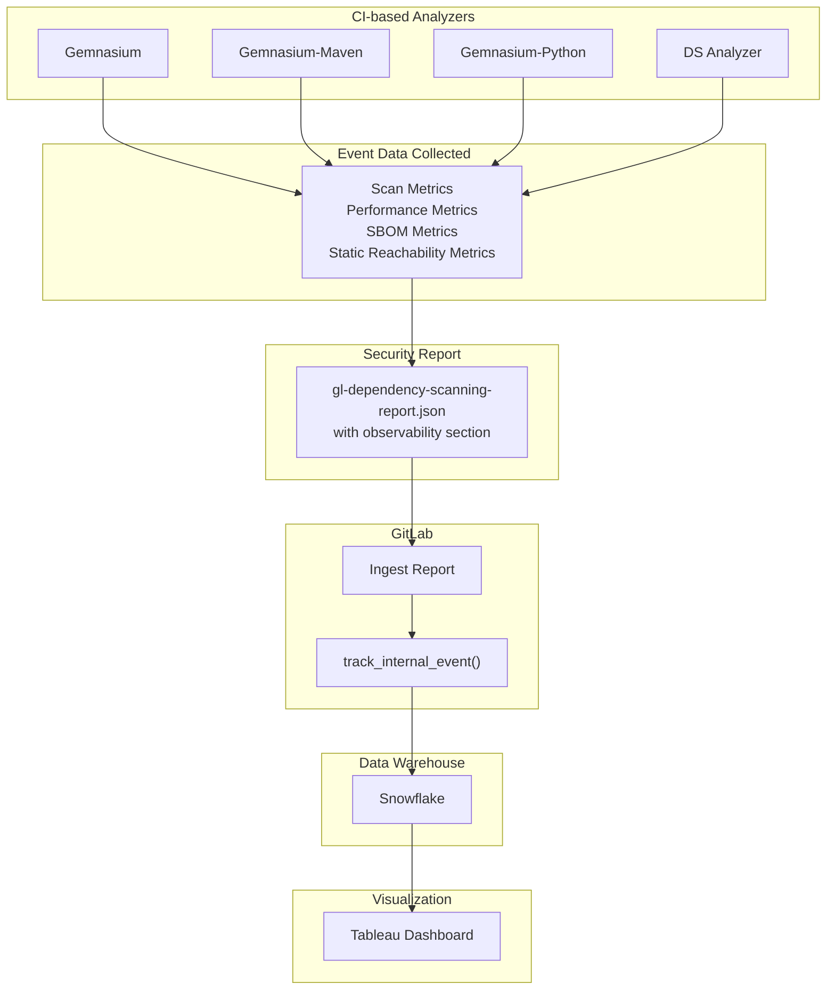



## Summary

This document describes the architectural design for implementing comprehensive end-to-end metrics collection for GitLab's Composition Analysis (CA) feature area.
The goal is to gather better data on how customers use CA tools to inform product decisions and measure feature adoption across different deployment types (GitLab.com, self-managed, and dedicated instances).

**Epic**: [Create end-to-end metrics for CA (#18116)](https://gitlab.com/groups/gitlab-org/-/work_items/18116)

## Motivation

Currently, GitLab lacks comprehensive metrics on Composition Analysis usage.
[Legacy metrics](https://10az.online.tableau.com/#/site/gitlab/views/PDSecureScanMetrics_17090087673440/SecureScanMetrics) may be incomplete or inaccurate.
The team needs better observability into:

- **Breadth of adoption**: How many people, organizations, and projects use CA tools
- **Feature usage**: Which specific features are being used (Dependency Scanning, Container Scanning, Static Reachability, etc.)
- **Intensity of usage**: How frequently are scans run, how many vulnerabilities are found, and what actions are taken
- **Quality metrics**: Scan success rates, error patterns, and performance characteristics
- **Configuration patterns**: How users configure and customize CA analyzers

This data is essential for:

- Measuring migration progress (e.g., from Gemnasium to the new DS analyzer)
- Prioritizing feature development based on actual usage patterns
- Understanding performance characteristics across different project types
- Tracking feature adoption (e.g., Static Reachability enablement)

## Goals

1. **Comprehensive data collection**: Capture metrics across all CA analyzers (Dependency Scanning, Container Scanning, OCS, CVS)
2. **Multi-deployment support**: Collect metrics from GitLab.com, self-managed, and dedicated instances
3. **Granular insights**: Provide data at project, namespace, and instance levels
4. **Performance tracking**: Monitor scan duration, resource usage, and success rates
5. **Feature adoption**: Track which features and configurations are being used
6. **Iterative approach**: Build incrementally, starting with Dependency Scanning

## Proposal

We maintain an event-registry project that defines all analyzer events.
Each analyzer collects events and includes them in the observability section of the Vulnerability Report.
When the dependency-scanning job completes, GitLab ingests the generated report and stores the events in Snowflake.
A Tableau dashboard provides visualization by querying the Snowflake data.

Note that most data comes from gitlab.com.
Self-managed instances only contribute data if users opt in to sending telemetry to GitLab.



### Key Components

#### 1. Observability Data in Security Reports

Analyzers embed observability data directly in the security report JSON under the `observability` section. This includes:

- **Scan metadata**: Duration, analyzer version, number of vulnerabilities found
- **SBOM data**: Component counts, PURL types, input file paths
- **Static Reachability metrics**: Coverage, execution time, in_use components
- **Performance metrics**: Execution time for different phases

Below you can see an example of an SBOM event:

```json
{
  "event": "collect_ds_analyzer_scan_sbom_metrics_from_pipeline",
  "property": "scan_uuid",
  "label": "npm",
  "value": 150,
  "input_file_path": "yarn.lock"
}
```

#### 2. Event Ingestion Pipeline

When a pipeline completes, GitLab processes scan events through:

1. **ProcessScanEventsService** (`ee/app/services/security/process_scan_events_service.rb`)
   - Extracts observability data from security reports
   - Validates events against `EVENT_NAME_ALLOW_LIST`
   - Tracks internal events using `track_internal_event()`

2. **Event Tracking**
   - Events are sent to Snowplow (GitLab.com)
   - Each event contains: event name, property, label, value, and extra (JSON) fields
   - Important filtering/joining data goes in property/label/value columns
   - Additional data goes in extra field (less performant for queries)

#### 3. Event Registry

A centralized Go package manages all CA analyzer events:

- **Project**: [gitlab-org/security-products/analyzers/events](https://gitlab.com/gitlab-org/security-products/analyzers/events)
- **Purpose**: Single source of truth for event definitions
- **Reusability**: Shared between Gemnasium and DS analyzer
- **Maintainability**: Centralized event definitions reduce duplication

## Design Decisions

### 1. Observability Data in Security Reports vs. Separate Artifacts

**Decision**: Embed observability data directly in the security report rather than creating separate artifacts

**Pros**:

- Keeps related data together in one place
- Builds on existing security report infrastructure and the ingestion logic that defines how events are defined, processed and stored in Snowflake.
- Single artifact to manage and store

**Cons**:

- Slightly increases security report size
- Binds metrics to the report
- Requires additional work to collect data when the analyzer fails

### 2. Multiple Events vs. Single Monolithic Event

**Decision**: Create separate events for different data types (scan, SBOM, SR, features) rather than a single event containing all data

**Pros**:

- Reduces fields per event, improving query efficiency in Snowflake. We try to avoid using custom event fields.
- Allows independent scaling of different event types
- Easier to add new event types without modifying existing ones
- Better separation of concerns

**Cons**:

- Requires joining events using scan_uuid
- More events generated per scan

### 3. Event Data Storage: Fast Columns vs. JSON Extra Field

**Decision**: Store important filtering/joining data in property/label/value columns; Avoid as much as possible storing additional data in the extra JSON field

**Fast Columns** Every event is based on a base event class that contains three fields:

- `property`: CA uses this field always for the scan_uuid (for joining related events)
- `label`: CA uses it for data like analyzer version, PURL type
- `value`: component count, execution time, vulnerability count

**Extra Field**: Events can include additional fields, which are stored in a jsonb column. Querying these extra fields is more resource-intensive than querying standard columns.

**Pros**:

- Fast filtering and joining on important dimensions
- Flexible for additional metrics without schema changes

**Cons**:

- Requires careful planning of what goes where

### 4. Centralized Event Registry vs. Distributed Event Definitions

**Decision**: Create a centralized Go package for all CA analyzer events

**Package**: [gitlab-org/security-products/analyzers/events](https://gitlab.com/gitlab-org/security-products/analyzers/events)

**Pros**:

- Single source of truth for event definitions
- Easier to discover available events
- Reduces duplication between analyzers
- Could facilitates reuse across AST groups
- Simplifies event versioning and changes

**Cons**:

- Adds complexity: changes require updates in 2 projects (event registry + analyzer)
- Adds a dependency between projects

### 5. Gemnasium Flavor Differentiation

**Decision**: Distinguish between the 3 Gemnasium flavors directly in the event names. This eliminates the need for a separate field to indicate which Gemnasium flavor the data refers to—the information is encoded in the event name itself.

**Flavors**:

- `gemnasium`
- `gemnasium-maven`
- `gemnasium-python`

**Implementation**: Store flavor information in event name

**Pros**:

- Optimize event storage

**Cons**:

- Requires tracking multiple analyzer variants

## Future work

Future work includes:

- **Failure event tracking:** We need to modify analyzers to generate vulnerability reports even when scans fail. This will enable us to collect failure metrics and, more importantly, build a system for capturing warnings and errors that can be surfaced to users. This capability will be particularly valuable for organization administrators monitoring scan health across projects.

- **Extending event coverage:** Implement similar event tracking for Container Scanning and Operational Container Scanning.
