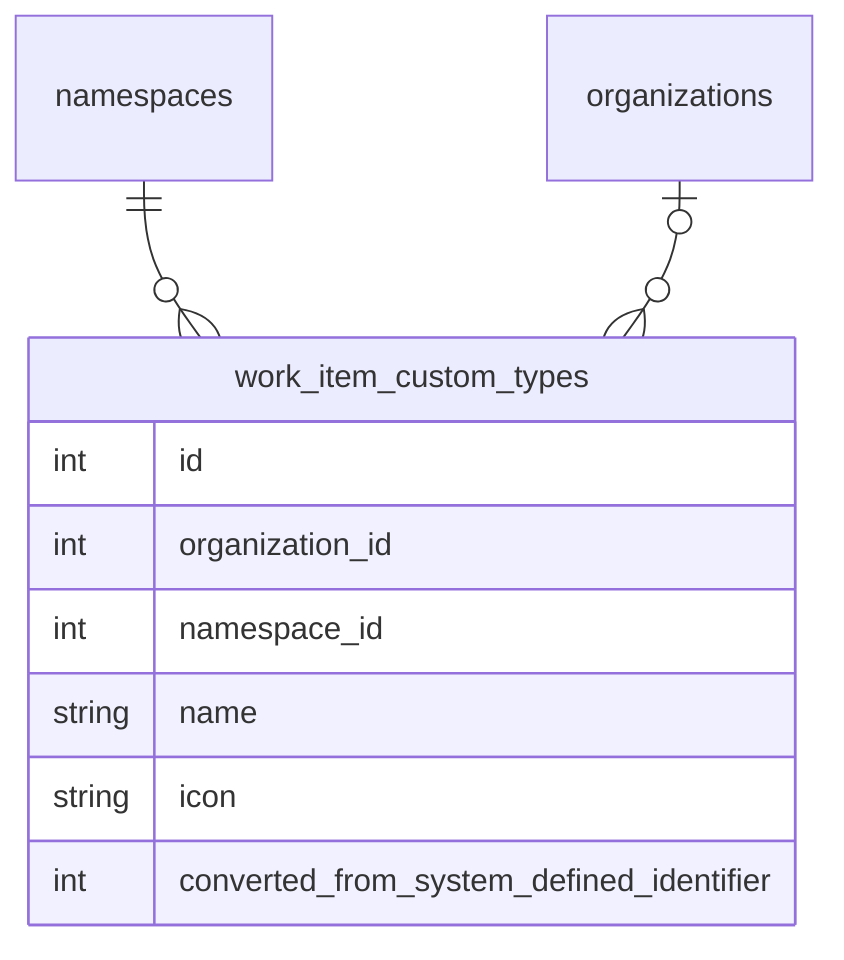

<!-- Design Documents often contain forward-looking statements -->
<!-- vale gitlab.FutureTense = NO -->

<!-- This renders the design document header on the detail page, so don't remove it-->



## Summary

This document outlines our approach to implementing [configurable work item types](https://gitlab.com/groups/gitlab-org/-/epics/9365) for work items in GitLab.

This allows Premium and Ultimate customers to customize the system-defined work item types and create new work item types to match their planning workflows. The
widgets and fields available on these types are also customizable.

To balance customer requirements for top-down control and autonomous teams, users are allowed to customize work item types and their hierarchy restrictions
at the highest possible level only. And if allowed by the organization, descendant namespaces or projects can customize the types further by disabling types they
don't want to use or changing the widgets and fields available on the types.

## Customizing work item types

We allow configuration of work item types at the highest possible level. This allows customers to configure types for all the groups and projects that they own.
This will be the root namespace level for SaaS instances and the [organization level](https://docs.gitlab.com/user/organization/) for self-managed instances.

System-defined types will be stored in-memory and shared across all groups and projects while customizations will be stored in the PostgreSQL database and
sharded by `organization_id` and `namespace_id`.



### Customizing a system-defined type

When a user customizes a system-defined type, we create a new `work_item_custom_types` record and store the system-defined ID in the `converted_from_system_defined_identifier` column. [Similar to custom statuses](../work_items_custom_status/#converting-system-defined-lifecycles-and-statuses-to-custom-ones), this allows us to make the customization take effect immediately on all existing work items.

This conversion is abstracted from the user and we continue to return Global IDs in the format: `gid://gitlab/WorkItems::Type/<system defined identifier>` to avoid breaking customer automations. Our APIs
also accept Global IDs in this format when passing in system defined types that have been customized.

When fetching a work item's type and hierarchy restrictions, we will need to take these conversions into account. The same applies when filtering lists by work item type.

When listing the available types for a namespace or project, we also need to take these into account. We need to fetch all the system-defined and custom types, and then exclude system-defined
types that have a mapped custom type record.

The `converted_from_system_defined_identifier` column will also be used to map special features that are available on certain system-defined types. For example, Service Desk creates work items of type `ticket`.
When `ticket` is customized, Service Desk will create work items based on the custom type that has `converted_from_system_defined_identifier` equal to the system-defined `ticket` identifier.

### Creating a new work item type

A new custom work item type is represented by a `work_item_custom_types` record with a null `converted_from_system_defined_identifier` value.
Global IDs for these custom types are in the format: `gid://gitlab/WorkItems::Custom::Type/<id>`.

For the initial iterations, new types behave like the system-defined `issue` type. They will only be allowed at the project-level and their widgets and hierarchy restrictions will be the same with the `issue` type.

#### Type name uniqueness

To prevent confusion and ensure a clear user experience, type names must be unique across both custom and non-converted system-defined types within a namespace or organization. This means:

- A custom type cannot have the same name as a system-defined type that has not been customized
- A custom type cannot have the same name as another custom type
- If a system-defined type is customized (e.g., renamed from "Task" to "Pizza"), a new custom type can be created with the name "Task" since the original system-defined type is no longer available under that name
- If a user renames a converted type back to its original name, given that original name was not taken in the meantime, then the custom type name becomes available to be taken again. E.g. rename "Pizza" back to "Task", then "Pizza" is now available as a name for a type

### Storing a work item's type

With custom types, a work item can either have a system-defined type or a custom type. We cannot store both in the existing `issues.work_item_type_id` column because of ID collisions and
foreign key constraints.

This means we will need two columns (`work_item_type_id`, `custom_type_id`) to store the type information with a constraint that only one value is not null.

## Configurations and type checks

To reduce hard-coded type checks throughout the application while maintaining clarity about type behavior,
we use a configuration-based approach with a centralized interface for accessing type settings.

Configurations are boolean flags (or value-based attributes in later iterations) that control
how types behave and render. Multiple types can share the same configuration.

### Configuration interface

**Backend:**

```ruby
# Checking configurations
type.configured_for?(:use_legacy_view)  # => true/false
type.configured_for?(:group_level)      # => true/false
type.configured_for?(:available_in_create_flow)  # => true/false

# Future: value-based configurations
type.configuration(:required_widgets)  # => [:title, :description]
```

**Frontend:** Configurations are exposed via GraphQL and passed to the frontend client.
The frontend should not perform type checks but instead query the configuration flags to determine behavior.

### Special type handling

Service Desk and Incident Management functionality is tied to specific work item types (`ticket` and `incident`).
We handle these through:

1. Configuration flags for quick checks:

   ```ruby
   type.configured_for?(:service_desk)         # Is this the service desk type?
   type.configured_for?(:incident_management)  # Is this the incident type?
   ```

2. Type provider for lookups

   ```ruby
   # Finding the designated type for a feature
   # (concrete class name might be subject to change).
   WorkItems::TypesFramework::Provider.new(namespace).service_desk_type
   WorkItems::TypesFramework::Provider.new(namespace).incident_type
   ```

### Required widgets

Types like `ticket` and `incident` have mandatory widgets needed for their associated features (Service Desk, Incident Management).
These required widgets are defined as part of the system-defined type definition and
inherited by converted custom types via `converted_from_system_defined_identifier`.

## Implementation Details

The implementation uses the `WorkItems::TypesFramework` namespace to organize type-related functionality and provide clear separation of concerns.
It continues the pattern we established with the `WorkItems::Statuses` namespace where we grouped all status related functionality in.
In detail this means:

1. System-defined classes using the `FixedItemsModel` use the `WorkItems::TypesFramework::SystemDefined` namespace.
1. Models and classes for custom type related concepts use the `WorkItems::TypesFramework::Custom` namespace.

### Frontend metadata provider pattern

The frontend adds, to the metadata provider vue component, a separate query that fetches work item types configuration. This pattern ensures that type configuration is always available and up-to-date as users navigate between items in different namespaces.

#### How it works

The configuration is fetched once per namespace fullpath and cached in Apollo. This means:

1. When the SPA initially mounts, we fetch the type configuration for the current namespace path (group or project)
2. As users navigate to items within the same namespace, the cached configuration is reused
3. When navigating to items in a different namespace, the fullpath updates and forces a new configuration to be fetched for that namespace path
4. Each namespace path has its own cache entry, allowing the SPA to maintain configurations for multiple namespaces simultaneously
5. When a component wants to access the config, it passes its current work item type to the utility method, returning the right type config for the right namespace.

#### Use cases

This pattern handles several navigation scenarios:

- **Same namespace navigation**: Clicking on items within the same project/group reuses the cached configuration
- **Cross-project navigation**: When navigating to items in different projects, a new configuration is fetched for that project's path
- **Cross-group navigation**: When navigating between items in different groups or root namespaces, the appropriate configuration is fetched and cached
- **Contextual view changes**: When viewing an epic (group context) and then selecting an issue (project context), the configuration updates to reflect the new context

## Work Item Settings sections configurations

This is frontend-specific configuration that doesn't make sense to expose in the API since it's very specific to GitLab's own frontend implementation and UI layout decisions.

### 1. Settings configuration factory

The `getSettingsConfig(context)` factory function in
`ee/app/assets/javascripts/work_items/constants.js` produces a configuration
object tailored to the caller's context. It accepts one of four context strings:
`'root'`, `'subgroup'`, `'project'`, or `'admin'` (defaults to `'root'`).

The function builds the config in two layers:

1. **Base defaults** — a `DEFAULT_SETTINGS_CONFIG` object inside the function
   defines the full set of boolean visibility flags, permissions, and layout:

   | Property | Type | Purpose |
   |---|---|---|
   | `showWorkItemTypesSettings` | `boolean` | Show the configurable types section. |
   | `showEnabledWorkItemTypesSettings` | `boolean` | Show the enabled types section. |
   | `showCustomFieldsSettings` | `boolean` | Show the custom fields section. |
   | `showCustomStatusSettings` | `boolean` | Show the custom status section. |
   | `workItemTypeSettingsPermissions` | `string[]` | Permissions applied to configurable types (for example, `['edit', 'create', 'archive']`). |

2. **Context-specific text** — two lookup maps (`configurableTypesSubtexts` and
   `enabledTypesSubtexts`) key descriptive strings by context. The factory
   merges the matching strings into the returned object as
   `configurableTypesSubtext` and `enabledTypesSubtext`.

Consumers call the factory and then override any flags they need:

```js
// Admin — disable sections not yet supported
const config = {
  ...getSettingsConfig('admin'),
  showEnabledWorkItemTypesSettings: false,
  showCustomFieldsSettings: false,
  showCustomStatusSettings: false,
};

// Subgroup — only the enabled types section
const config = {
  ...getSettingsConfig('subgroup'),
  showWorkItemTypesSettings: false,
  showEnabledWorkItemTypesSettings: true,
  showCustomFieldsSettings: false,
  showCustomStatusSettings: false,
};
```

#### Scalability pattern for new config options

To add a new settings section or config property:

1. Add a new boolean flag (for example, `showMyNewSettings`) to
   `DEFAULT_SETTINGS_CONFIG` inside `getSettingsConfig`.
2. If the new section needs context-specific text, add a new lookup map
   (for example, `myNewSettingsSubtexts`) keyed by context string and merge
   the result into the returned object.
3. Each consumer that already spreads `getSettingsConfig(context)` inherits the
   new default automatically. Consumers only need to override the flag if their
   context requires a non-default value.
4. In `WorkItemSettingsHome`, add a `v-if` guard using the new flag to
   conditionally render the corresponding component.

This approach keeps the factory as the single source of truth for defaults while
allowing each entry point to opt in or out of individual sections. New contexts
(for example, `'organization'`) require only a new entry in each lookup map.

### 2. Enabled work item types section

The `EnabledConfigurableTypesSettings` component
(`ee/groups/settings/work_items/configurable_types/enabled_configurable_types_settings.vue`)
renders inside a `SettingsBlock` and displays which work item types are
currently active in a given namespace.

- Visibility is controlled by `showEnabledWorkItemTypesSettings` in the config.
- The description text comes from `config.enabledTypesSubtext`, so it
  automatically reflects the current context.
- The component delegates rendering to
  `WorkItemTypesListEnabledDisabledView`, which owns its own Apollo query.

---

## Context-Specific Behavior Matrix

| Context | Configurable Types Section | Enabled Types Section | Custom Fields | Custom Status |
|---|---|---|---|---|
| **Admin** | Shown | Hidden | Hidden | Hidden |
| **Root Group** | Shown | Shown | Shown | Shown |
| **Subgroup** | Hidden | Shown | Hidden | Hidden |
| **Project** | Hidden | Shown | Hidden | Hidden |

---

## Component Hierarchy

```text
WorkItemSettingsHome
├── ConfigurableTypesSettings          (if showWorkItemTypesSettings)
│   └── WorkItemTypesList              (always renders list/crud view)
├── EnabledConfigurableTypesSettings   (if showEnabledWorkItemTypesSettings)
│   └── WorkItemTypesListEnabledDisabledView  (self-fetching)
├── CustomStatusSettings               (if showCustomStatusSettings)
└── CustomFieldsList                   (if showCustomFieldsSettings)
```

## Implementation and release plan

We've identified these releases. We only list must-have requirements here. See the epics for a list of all attached subepics and issues.

### Beta

For Beta (what we want to demo)

1. System-defined types
2. Migrate Service Desk issues to tickets
3. Reduce type checks to bare minimum and prepare both BE and FE to consume "any kind of type" for at least the project level.
4. Admin section at the admin settings(organization does not support editing for now) and/or top group level where users can
   1. List types
   2. Rename project work item types
   3. Create new project level work item types
5. New types can have an icon and behave like issues in terms of widgets and hierarchy. Users can associate new types to custom fields and status lifecycles in the top-level group.

### GA (MVC1)

For GA (what we want to ship)

1. Add cascading setting to enable/disable a type on any hierarchy level
2. Add setting to lock visibility for groups/projects on the top level

### Remaining iterations

For completeness the remaining iterations/phases that would follow after GA/MVC1 are these. They don't necessarily depend on each other so the order could be changed:

1. [Widget customization on work item types](https://gitlab.com/groups/gitlab-org/-/epics/20075)
2. [Customizable types within groups and configurable hierarchy](https://gitlab.com/groups/gitlab-org/-/epics/20076)
3. [Enhanced configuration options for types (policies)](https://gitlab.com/groups/gitlab-org/-/epics/20077)

### Timeline

The target dates are linked in the [internal wiki page](https://gitlab.com/groups/gitlab-org/plan-stage/-/wikis/Plan-Stage-Roadmap/Configurable-Work-Item-Types#target-dates) which may change depending on implementation blockers.

## License and tier considerations

Custom work item types are a Premium and above feature. The licensed feature is named `configurable_work_item_types`.
When a customer downgrades to a tier that does not support custom types, we apply the following strategy:

### Downgrade behavior

On downgrade, we keep all existing configurations and data intact but disallow mutations:

- Existing custom types and their configurations remain accessible for reading
- Creating new custom types is blocked
- Modifying existing custom types is blocked
- Relationships and hierarchy remain intact but cannot be modified beyond current license capabilities
- Renamed system-defined types keep their custom names and cannot be modified further

This approach avoids destructive actions and data loss while clearly communicating the reduced functionality
of the downgraded tier and is in line with downgrade behavior of the status and custom fields features.

### Custom type limits

`40` active work item types limit is enforced across custom and system defined work item types, per top level namespace or organization for the Premium tier.

### Future tier differentiation

In future iterations, we may introduce additional restrictions between Premium and Ultimate tiers, such as hierarchy depth limits. These will follow the same strategy: keep existing configurations and relationships, but restrict new usage and modifications beyond the current license capabilities.

## Permissions

The following permissions check verifies both the licensed feature `configurable_work_item_types` and the user's authorization to perform the given action.
In most cases, this requires at least a maintainer+ role.

- `create_work_item_type`
- `update_work_item_type`
- `configure_work_item_type`

### Work item type states

1. Enabled - Default for any work item type
1. Locked - A system type that cannot be renamed, disabled, or deleted.
1. Archived - Alternative for deletion. The optimal workflow was to delete a type and migrate to a new type, however since that wasn't possible, we added this "Archive" type
   1. Should not be available in filters (does not depend on any cascading settings since only happens at root level)
   1. No rename and edit icon allowed
1. Disabled
   1. Should not be available in filters in the projects/groups it is disabled for (if inheriting from parent then continue the same permissions)
   1. Should not be allowed to be created
   1. Rename and edit icon allowed

### Work item type sections

We have separate sections on the work item settings page

1. "Work item types" - This is where types are defined, created, and managed globally.
2. "Enabled work item types" - This is purely local configuration, where we can toggle the availability

Depending on the context and requirement, we have separate combinations for both the above section on work item settings pages.

## Feature flags

For MVC1, we use the feature flag `work_item_configurable_types`, with the root group set as the actor.

For testing purposes, the feature flag is enabled in production for the Plan Stage testing groups
[gl-demo-premium-plan-stage](https://gitlab.com/gl-demo-premium-plan-stage) and [gl-demo-ultimate-plan-stage](https://gitlab.com/gl-demo-ultimate-plan-stage).

## Decision registry

1. [Configure types at the root namespace-level for SaaS instances and at the organization-level for self-managed instances](https://gitlab.com/groups/gitlab-org/-/epics/7897#note_2795232631).

   We are not ready to move every customer to separate organizations on GitLab.com so we have to configure types at the root namespace level for now. Self-managed instances on the other hand
   will always have a single organization so we can configure at the organization level.

   Self-managed customers typically work across multiple root namespaces on their instances so we want them to be able to configure at a higher level so that they will be able to standardize
   their types and workflows.

1. System-defined types will be stored [in-memory as `ActiveRecord::FixedItemsModel` objects](https://gitlab.com/gitlab-org/gitlab/-/issues/519894) to avoid cluster-wide tables and unblock Cells and sharding work.
1. Special features like Service Desk and incident management will be [mapped 1:1 to a system defined type](https://gitlab.com/groups/gitlab-org/-/epics/7897#note_2857326975).
1. To avoid breaking changes, we will [keep the existing Global ID format for system-defined types](https://gitlab.com/gitlab-org/gitlab/-/issues/579238). The same format is also retained even when the system-defined type is customized.
1. [Use configuration-based approach for type behavior instead of separate capability concept](https://gitlab.com/gitlab-com/content-sites/handbook/-/merge_requests/17119#ai-summary-of-the-discussion-in-slack-for-the-record).

   We explored introducing both "capabilities" (exclusive type identities) and "configurations" (behavioral flags) but chose a unified configuration approach. With only two special types requiring exclusive handling, a single concept is simpler to understand and maintain for now.

1. [We use the `WorkItems::TypesFramework` namespace](https://gitlab.com/gitlab-org/gitlab/-/merge_requests/212636#note_2948286714).
1. [On license downgrade, keep existing configurations and data but disallow mutations](https://gitlab.com/gitlab-org/gitlab/-/issues/579231).
1. We are not going ahead with saving/storing pluralization of the work item type name to avoid pluralizing work item type names entirely. Instead of "Issues", "Epics", "Stories", type names should remain singular, and when referring to multiple items of that type, the plurality is handled at the container level: "work items of type: [Name]" or "items".
1. Tickets can only be created via email or using the `/convert_to_ticket user@example.com` quick action.
   1. "Ticket" is removed from the list of available types for creation.
   1. "Create new ticket" is removed from the child items section.
1. We use "New related item" instead of "New related TYPE_NAME" in the header action menu.
1. Users can relate tickets to any other item type
1. [Fetch work item type configuration per namespace path and cache it in Apollo](https://gitlab.com/groups/gitlab-org/-/epics/20061#note_3020401416).

   See the [Frontend metadata provider pattern](#frontend-metadata-provider-pattern) section for details on how this pattern works and its benefits.

1. [Remove all link restrictions between work item types](https://gitlab.com/gitlab-org/gitlab/-/issues/581932#note_3019673313).

   Any work item type should be able to link to any other type with relationships like "Blocked by / Blocks" and "Related to". This decision applies to linked items only, not child items (hierarchy).

1. [We will delegate custom work item types to existing system-defined types](https://gitlab.com/gitlab-org/gitlab/-/issues/581932#note_2959381705),
postponing custom widget definition and hierarchy restriction table creation until users actually customize these features in future iterations.

1. All work item type configuration code should live in `ee/` since configurable work item types is a Premium and above feature.

   CE users will never be able to customize types, widgets, or hierarchy. The top-level work item type GraphQL query and related configuration code can safely reside in the EE codebase. The `namespaceWorkItemTypes` query handles all work item list functionality and is appropriate for CE. Any reusable components that are currently in CE but only used for type configuration should be evaluated for migration to EE.

1. [Type names must be unique across custom and non-converted system-defined types](https://gitlab.com/gitlab-org/gitlab/-/merge_requests/218464#note_3022168638).

1. [Separate system-defined and custom work item types by ID range](https://gitlab.com/gitlab-org/gitlab/-/merge_requests/223117).

   System-defined work item types use IDs 1-1000 while custom work item types use IDs 1001 and above, with a new sequence starting at 1001
   for the `work_item_custom_types` table to prevent any overlap between the two categories.

1. All available work item types will be visible at all levels i.e organization level/top level groups, subgroup level and project level

1. Epics are shown as a work item type at project level with explanation tooltip that it's disabled for projects, because Epics are currently only available at group level. Note: that is subject to change in future iterations.

1. We can only create/edit a work item type at the organization level/top level group.

1. In addition to "Work item types" section , we will have a separate section "Enabled work item types" [which will also be visible on top level groups](https://gitlab.com/gitlab-org/gitlab/-/issues/585643#note_3080703281)

1. Subgroups and projects will only have the "Enabled work item types" section.

1. Archived types are visible at organization level/top level group as split button view but not visible on the project and subgroup level.

1. [Custom work item types use `WorkItems::Type` as the GID model class](https://gitlab.com/gitlab-org/gitlab/-/merge_requests/224790#note_3125745798).

   For new custom types similar to converted and system-defined types, we build the Global ID using the legacy `WorkItems::Type` class. This means both system-defined and custom types produce Global IDs in the format `gid://gitlab/WorkItems::Type/<id>`.

   - It keeps the GraphQL API surface uniform — clients never need to distinguish between system-defined and custom type GIDs.
   - `Custom::Type` is an internal implementation detail, not a public API concept.
   - The `WorkItems::TypesFramework::Provider` is the intended class for resolving both type kinds uniformly; using `WorkItems::Type` as the GID model now means that future refactor will not break existing API contracts.

   See also [Discussion about using `WorkItems::Type` GID uniformly](https://gitlab.com/gitlab-org/gitlab/-/merge_requests/223304#note_3092047469).

## Resources

1. [Top level epic for this initiative](https://gitlab.com/groups/gitlab-org/-/epics/9365)
1. Designs for [create/edit work item type](https://gitlab.com/gitlab-org/gitlab/-/issues/580932)
1. Designs for [work item type detail view](https://gitlab.com/gitlab-org/gitlab/-/issues/580940)
1. Designs for [work item types list view](https://gitlab.com/gitlab-org/gitlab/-/issues/580929)
1. [POC for configurable work item types](https://gitlab.com/gitlab-org/gitlab/-/issues/580260)

## Team

Please mention the current team in all MRs related to this document to keep everyone updated. We don't expect everyone to approve changes.

```text
@gweaver @acroitor @nickleonard @gitlab-org/plan-stage/project-management-group/engineers
```
