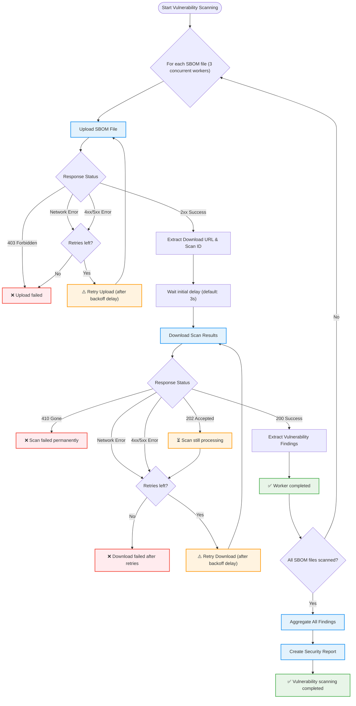

## Context

The initial Dependency Scanning analyzer design ([ADR 001: Graph Export Only](./001_graph_export_only.md)) deliberately excluded vulnerability scanning capabilities. The rationale was to focus the analyzer solely on dependency detection and SBOM generation, delegating vulnerability analysis to the GitLab backend services through the SBOM ingestion pipeline.

However, this approach presented significant limitations:

**User Experience Gaps**: Users expected the dependency scanning analyzer to provide complete security analysis in CI pipelines, not just dependency detection. Requiring a separate backend process to perform vulnerability analysis created a disconnect between dependency discovery and security reporting.

**Delayed Feedback**: Vulnerability analysis happening asynchronously in the backend meant users didn't receive immediate security feedback during their CI pipeline execution.

**Feature Parity Concerns**: The legacy Gemnasium analyzers provided immediate vulnerability detection in CI pipelines. Removing this capability represented a regression in user-facing functionality.

The GitLab SBOM Vulnerability Scanner, developed as part of the unified dependency scanning engine ([Dependency Scanning Engine](../../dependency_scanning_engine/_index.md)), provides a proven, maintainable approach to vulnerability detection that can be leveraged within the CI pipeline context.

## Decision

We reintroduce vulnerability scanning capabilities within the Dependency Scanning analyzer by integrating the SBOM Scan API as documented in [Dependency Scanning Engine ADR 003: SBOM-based CI Pipeline Scanning](../../dependency_scanning_engine/decisions/003_sbom_based_scans_for_ci_pipelines.md).

This approach maintains the separation of concerns established in the unified dependency scanning engine while providing immediate security feedback within CI pipelines.

## Implementation details

### Analyzer workflow

The analyzer follows a four-stage process:

1. **Dependency detection**: Parse lockfiles, graphfiles, or manifests to identify project dependencies
2. **SBOM generation**: Create CycloneDX SBOM documents from detected dependencies
3. **Vulnerability scanning**: Upload SBOMs to the SBOM Scan API and retrieve vulnerability findings
4. **Report generation**: Aggregate findings and produce a dependency scanning security report

### SBOM Scan API Integration

The analyzer integrates with the GitLab SBOM Vulnerability Scanner through the SBOM Scan API. For detailed information about the SBOM Scan API workflow, authentication, rate limiting, and background processing, refer to [Dependency Scanning Engine ADR 003: SBOM-based CI Pipeline Scanning](../../dependency_scanning_engine/decisions/003_sbom_based_scans_for_ci_pipelines.md).

The analyzer handles the following responsibilities:

- **File upload**: Upload generated SBOM files through the CI SBOM Scan API endpoint
- **Polling**: Poll the API for scan completion status
- **Results retrieval**: Download vulnerability findings once scanning completes
- **Aggregation**: Combine results from multiple SBOMs if the project generates multiple SBOM documents

### Concurrent processing

The analyzer processes SBOM files concurrently using up to 3 worker goroutines. Each worker independently:

1. Uploads an SBOM file to the API using multipart form data
2. Extracts the download URL and scan ID from the response
3. Waits for the configured initial delay (`DS_API_SCAN_DOWNLOAD_DELAY`)
4. Polls for scan results with exponential backoff

This concurrent approach balances resource management with scan execution velocity while maintaining reasonable CI pipeline duration.

#### Vulnerability scanning workflow

### Analyzer Error Handling

The analyzer implements comprehensive error handling for SBOM Scan API failures:

**Upload failures**:

- **Transient errors** (network timeouts, 5xx errors): Retry with exponential backoff (3 seconds, 3 seconds)
- **Rate limiting** (429 Too Many Requests): Retry with exponential backoff
- **Unrecoverable errors** (403 Forbidden, other 4xx errors): Fail immediately without retry
- **Feature flag disabled** (403 with specific message): Fail with clear error indicating feature flag is disabled for the project
- **File errors**: Fail immediately if SBOM file cannot be opened or read

**Download failures**:

- **202 Accepted** (scan still processing): Retry with exponential backoff (5s, 10s, 15s, 30s, 60s, then capped at 60s for up to 30 additional attempts)
- **410 Gone** (scan permanently failed): Fail immediately without retry
- **Rate limiting** (429 Too Many Requests): Fail immediately without retry to prevent overwhelming the API
- **Transient errors** (network timeouts, 4xx/5xx errors): Retry with exponential backoff
- **Invalid response**: Retry with exponential backoff

**Extended retry resilience**: Download retries use exponential backoff for the first 5 attempts, then cap at 60-second intervals for up to 30 additional attempts. This provides resilience for long-running scans on instances with slower backend processing.

**Fail-fast behavior**: If any SBOM file fails to scan, the entire vulnerability scanning operation fails. This ensures users receive complete results or none at all, preventing partial or inconsistent security reports.

### CI-only execution and GitLab minimum version requirement

Vulnerability scanning only executes when both conditions are met:

1. The `CI_SERVER_VERSION` environment variable is set (indicating GitLab CI/CD execution) and it's value is at minimum `18.5`.
2. The `DS_ENABLE_VULNERABILITY_SCAN` feature flag is enabled

This prevents failures in local development environments where CI variables are not available and when running with older instances where the SBOM Scan API is not available. When vulnerability scanning is skipped, the analyzer still produces SBOM artifacts but omits the security report.

### Advisory database state validation

The analyzer validates that the advisory database has been synced on the GitLab instance before processing scan results. This ensures that vulnerability detection is not mistakenly reporting that no vulnerabilities have been detected (risk of false negative).

When the SBOM Scan API responds with advisory database state information:

- **Advisory DB synced**: Processing continues normally
- **Advisory DB not synced** (strict mode enabled, default): Scanning fails with an error indicating that advisory data is missing from the GitLab instance
- **Advisory DB not synced** (strict mode disabled): Processing continues with a warning logged

This validation can be disabled via the `DS_FF_STOP_SCAN_WHEN_NO_ADVISORY_DB_SYNC` environment variable (set to `false` to disable strict mode).

### Configuration

The analyzer accepts the following configuration parameters:

- **`DS_ENABLE_VULNERABILITY_SCAN`**: Enable vulnerability scanning (default: true)
- **`DS_API_TIMEOUT`**: API request timeout in seconds (min: 5, max: 300, default: 10)
- **`DS_API_SCAN_DOWNLOAD_DELAY`**: Initial delay before downloading scan results in seconds (min: 1, max: 120, default: 3)
- **`DS_FF_STOP_SCAN_WHEN_NO_ADVISORY_DB_SYNC`**: Stop scanning if advisory database has not been synced (default: true)

CI environment variables are automatically provided by GitLab CI/CD:

- **`CI_SERVER_VERSION`**: Version of the GitLab instance
- **`CI_API_V4_URL`**: GitLab instance API V4 URL
- **`CI_JOB_ID`**: Current CI job ID
- **`CI_JOB_TOKEN`**: CI job authentication token

### Security report generation

After all SBOM files are successfully scanned, the analyzer:

1. Aggregates vulnerability findings from all scan results
2. Extracts scanner details from the first scan result (identical across all scans)
3. Creates a standardized GitLab security report with:
   - Analyzer information (name, version, vendor)
   - Scanner information (from the backend SBOM Vulnerability Scanner)
   - Scan timing information (start and end times)
   - Aggregated vulnerability findings sorted by severity
4. Outputs the report as `gl-dependency-scanning-report.json` artifact

### Limited Availability graceful degradation

During the Limited Availability period, the analyzer implements graceful error handling for specific failure scenarios to prevent CI job failures while the feature stabilizes:

- **Feature flag disabled**: Logs warning and skips API-based vulnerability scanning; SBOM analysis continues after pipeline completion
- **Rate limit exceeded**: Logs warning and skips API-based vulnerability scanning; SBOM analysis continues after pipeline completion
- **API forbidden (403)**: Logs warning and skips API-based vulnerability scanning; SBOM analysis continues after pipeline completion
- **Other errors**: Logs warning with error details and skips API-based vulnerability scanning; SBOM analysis continues after pipeline completion

This approach ensures that CI jobs do not fail due to temporary API issues or feature flag states during the Limited Availability period, while still providing SBOM artifacts and allowing vulnerability analysis to continue via the backend SBOM analysis pipeline.

## Advantages

**Complete security analysis**: Users receive comprehensive vulnerability detection within their CI pipeline, not just dependency detection.

**Consistent results**: Leveraging the GitLab SBOM Vulnerability Scanner ensures identical vulnerability detection across all GitLab scanning contexts, eliminating discrepancies between CI and continuous scanning.

**Reduced analyzer complexity**: Rather than implementing vulnerability detection logic, the analyzer delegates to the proven GitLab SBOM Vulnerability Scanner, reducing maintenance burden and security risk.

**Backward compatible**: The analyzer detects the version of GitLab it's running on and avoids unecessary errors trying to reach the SBOM scan API when it's not available.

## Challenges

**API dependency**: The analyzer depends on the SBOM Scan API being available and responsive. API outages or performance degradation directly impact analyzer performance and vulnerability detection capabilities.

**Fail-fast semantics**: The analyzer fails the entire vulnerability scanning operation if any SBOM file fails to scan. While this ensures result consistency, it may be frustrating for users with large projects where a single transient failure causes the entire scan to fail. Future iterations could consider partial success modes with warnings.

**CI pipeline duration**: Vulnerability scanning adds latency to the CI job. The initial delay before polling (`DS_API_SCAN_DOWNLOAD_DELAY`) adds a minimum delay to all executions.

**Configuration complexity**: Vulnerability scanning requires multiple environment variables and configuration parameters. While most are automatically provided by GitLab CI/CD, users may need to tune timeout and delay parameters for their environment.

## References

- [Bring security scan results back into the Dependency Scanning CI job Epic](https://gitlab.com/groups/gitlab-org/-/work_items/17150)
- [Reintroduce vulnerability scanning in DS analyzer](https://gitlab.com/groups/gitlab-org/-/work_items/17150)
- [Dependency Scanning Engine](../../dependency_scanning_engine/_index.md)
- [Dependency Scanning Engine ADR 001: GitLab SBOM Vulnerability Scanner](../../dependency_scanning_engine/decisions/001_gitlab_sbom_vulnerability_scanner.md)
- [Dependency Scanning Engine ADR 003: SBOM-based CI Pipeline Scanning](../../dependency_scanning_engine/decisions/003_sbom_based_scans_for_ci_pipelines.md)
