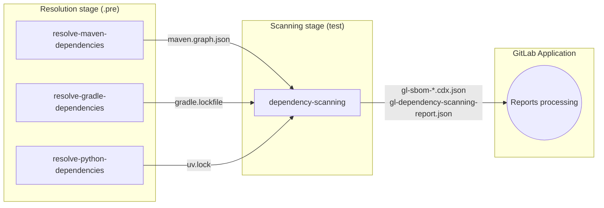
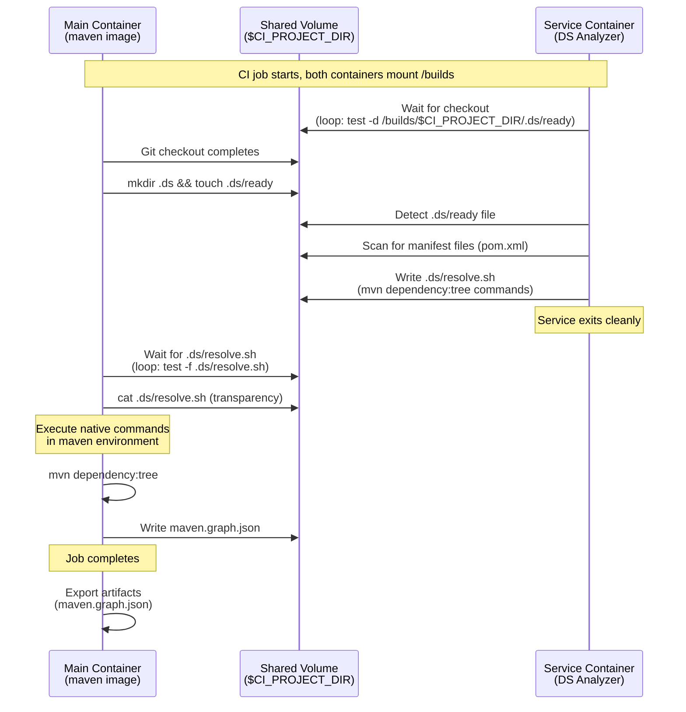

## Context

This ADR documents the revised approach to the Dependency Scanning analyzer, which addresses limitations identified in [ADR 001: Graph Export Only](./001_graph_export_only.md). The initial graph export only approach required users to manually configure build jobs to generate dependency artifacts, creating friction for adoption and preventing enablement at scale through [Scan Execution Policies](https://docs.gitlab.com/ee/user/application_security/policies/scan_execution_policies.html).

GitLab's dependency scanning relies on lockfiles or graphfiles as the entry point for an accurate dependency detection and vulnerability analysis. However, approximately 50% of projects require some form of dependency resolution mechanism to generate these files.
Whether these files are committed to the repository depends on the ecosystem and project practices.

Unlike the legacy Gemnasium analyzer which supports that capability, the original Dependency Scanning analyzer delegated this responsibility to users, expecting them to generate lockfiles/graphfiles in preceding CI jobs. While this approach offers flexibility, it presents some challenges:

**User experience gaps**: Many users expect dependency scanning to work out-of-the-box without manual CI configuration. The requirement to set up custom build jobs creates friction for adoption and increases the barrier to entry for security scanning.

**Limitations to enablement at scale**: [Scan Execution Policies](https://docs.gitlab.com/ee/user/application_security/policies/scan_execution_policies.html) enforce security scanning across projects. However, without this necessary dependency resolution step, projects without pre-existing lockfiles or ad-hoc customization could not benefit from dependency scanning analysis.

To address these challenges, we need to reintroduce dependency resolution capabilities similar to Gemnasium. However, the legacy approach provided "build support" by bundling language runtimes and package managers into dedicated gemnasium images used in separate jobs. This approach presented several significant downsides:

- Large attack surface with many versions of runtimes and system dependencies
- Maintenance burden with vulnerability management and to keep track of system dependencies updates
- Large image sizes impacting air-gapped environments
- Version coverage lagging behind ecosystem releases (e.g., no Java 25 support, Python 3.11 default when 3.14 is current)
- Less customization opportunities (only bundled runtimes and package manager versions are available)

We need to rethink how to achieve automatic dependency resolution with a solution that balances ease of use with maintainability, avoiding Gemnasium's pitfalls.

## Decision

We implement automatic dependency resolution using *preceding resolution jobs* that run ecosystem-native tools in vanilla images, where the DS analyzer runs as a CI/CD **[service](https://docs.gitlab.com/ci/services/)**.
The service container is responsible for detecting compatible manifests (using the mounted `CI_PROJECT_DIR`) and generating **tailored native tool's instructions** that the main job's container then executes to produce the relevant lockfiles/graphfiles.
These files are exported as job artifacts and consumed by the regular `dependency-scanning` job that runs in a following stage of the same pipeline.
Additionally, we implement parsers for manifest files to extract minimal dependency information.

This follows the product principle “accuracy is a dial” to provide a multi-tiered approach to dependency scanning:

1. **Lockfile/graphfile present**: The DS analyzer consumes it directly (highest accuracy)
2. **Automatic dependency resolution**: Preceding jobs generate lockfiles/graphfiles using native tools
3. **Manifest parsing fallback**: Scan dependency manifests directly when resolution fails (lowest accuracy, tracked in [epic #20457](https://gitlab.com/groups/gitlab-org/-/epics/20457))

## Implementation details

### Workflow overview



- For each supported ecosystem, define an optional **resolution job** (for example `resolve-maven-dependencies`, `resolve-python-dependencies`, `resolve-gradle-dependencies`) that:
  - runs in the always available `.pre` stage, only if relevant manifest files are present in the repository
  - uses a **vanilla build image** appropriate for the ecosystem (for example `maven:*`, `gradle:*`, `ghcr.io/astral-sh/uv:*`),
  - uses the **DS analyzer image as a CI service** to detect relevant manifests files and generate a tailored script with native tools instructions,
  - waits for instructions to be provided by the service, then executes native tools in its own environment to generate lockfiles/graphfiles and export them as artifacts.

- Maintain the **single `dependency-scanning` job** as the *source of truth* for the dependency scanning analysis:
  - runs in the `test` stage as usual
  - consumes all committed or dynamically generated lockfiles/graphfiles (and possibly user-provided SBOMs later),
  - fallbacks to manifest files scanning otherwise
  - executes all analysis tasks (static reachability, SBOM generation, vulnerability scanning, security report generation)
  - exposes the final security report and SBOMs as report artifacts.

### Service-Generated Script Pattern with DS analyzer

The DS analyzer implements a new `detect-and-write-scripts` command that allows it to run in "service mode":



1. **Waits for project checkout**: Polls for `CI_PROJECT_DIR` availability on the shared mounted volume (`/builds`)
2. **Detects manifest files**: Uses existing analyzer detection logic to identify project types and handle relevant configuration options
3. **Generates resolution script**: Writes `.ds/resolve.sh` with appropriate native tool commands
4. **Exits cleanly**: Service completes after script generation

The native tool's commands execution is then handled by the main job's script, in its own environement.

This pattern provides:

- **Centralized detection logic**: The DS analyzer remains the single source of truth for understanding project structure and detection customizations
- **Transparent execution**: Users can inspect the generated script (`cat .ds/resolve.sh`) for debugging
- **Full customization**: Users can override the resolution job's script entirely if needed

### Technology-Specific Resolution

Based on spike findings, we simplify dependency resolution by focusing on native tools with single runtime versions:

| Technology | Image | Resolution Command | Output |
|------------|-------|--------------------|--------|
| Maven | `maven:3.9-eclipse-temurin-21` | `mvn dependency:tree` | `maven.graph.json` |
| Gradle | `gradle:8.5-jdk21` | `gradle dependencies` | `gradle.lockfile` |
| Python | `ghcr.io/astral-sh/uv:python3.12-bookworm` | `uv` commands | `uv.lock` or `requirements.txt` (pip-compile requirement file) |

**Key simplifications**:

- **Maven**: Use a single Java version (21 LTS) with the built-in `mvn dependency:tree` command, avoiding the complexity of supporting multiple Java versions
- **Python**: Use the `uv` tool which handles multiple Python project formats (requirements.in, pyproject.toml, Pipfile) with a single, fast resolver
- **Gradle**: Use the native `gradle dependencies` command
- **SBT**: No automatic dependency resolution support initially; users must provide a `dependencies-compile.dot` file (`sbt dependencyDot`) or rely on manifest parsing fallback
- **Go**: No automatic dependency resolution support initially; users must provide a `go.graph` file (`go mod graph > go.graph`) if they wish to have dependency graph data

### Job Orchestration: Stage-Based Approach

Resolution jobs must complete before the `dependency-scanning` job to ensure generated lockfiles/graphfiles are available as artifacts. We evaluated two orchestration approaches:

1. **Stage-based**: Resolution jobs in `.pre` stage, scan job in `test` stage
2. **`needs:optional`**: Both jobs in `test` stage, ordering via `needs:` dependencies

#### Decision: Use `.pre` Stage

We chose the stage-based approach with `.pre` for the following reasons:

**Reliability**: The `.pre` stage is a reserved stage that always exists and always runs first, regardless of how users configure their pipeline stages. This eliminates edge cases where resolution jobs might run after or in parallel with the scan job.

**Open artifact scope**: Stage-based artifact passing automatically makes artifacts from all previous stages available to subsequent jobs. This supports:

- User-provided lockfiles from custom build jobs
- Future third-party SBOM ingestion
- Adding new resolution jobs without modifying the scan job

**Policy compatibility**: The `.pre` stage works seamlessly with Scan Execution Policies (SEP) and Pipeline Execution Policies (PEP). The `needs:optional` approach would break when policies add suffixes to job names (e.g., `maven-resolution` → `maven-resolution:policy-123456-0`), as `needs:` references would point to non-existent jobs.

**No core CI/CD changes required**: The `needs:optional` approach requires modifying core CI/CD behavior - when all optional jobs are absent, the job currently becomes `needs: []` and ignores stage ordering. Changing this behavior is high-risk and affects all GitLab users.

### Graceful Failure Handling

- Resolution jobs use `allow_failure: true` to prevent blocking the pipeline
- If `rules:exists` produces false positives (too many files in repository), the job exits 0 with no artifacts
- The `dependency-scanning` job proceeds with whatever lockfiles/graphfiles are available
- Missing resolution falls back to manifest parsing

### CI/CD template (simplified)

```yaml
spec:
  inputs:
    # ... other inputs ...
    enable_dependency_resolution:
      type: string
      default: "maven,gradle,python"
      description: "Comma-separated list of technologies for automatic dependency resolution. Set to empty to disable all."

---

.resolve-dependencies-base:
  stage: ".pre"
  allow_failure: true
  script:
    # Signal that repo is checked out with proper permissions
    - mkdir -p .ds && chmod 777 .ds && touch .ds/ready && chmod 666 .ds/ready

    # Wait for resolve.sh and execute it
    - |
      TIMEOUT=60
      ELAPSED=0
      while [ ! -f .ds/resolve.sh ] && [ $ELAPSED -lt $TIMEOUT ]; do
        sleep 1
        ELAPSED=$((ELAPSED + 1))
      done

      if [ ! -f .ds/resolve.sh ]; then
        echo "ERROR: resolve.sh not found after $TIMEOUT seconds"
        exit 1
      fi

      cat .ds/resolve.sh
      sh .ds/resolve.sh

resolve-maven-dependencies:
  extends: .resolve-dependencies-base
  image: maven:3.9.9-eclipse-temurin-21
  services:
    - name: $DS_ANALYZER_IMAGE
      alias: ds-analyzer
      command: ["/analyzer", "detect-and-write-scripts", "--project-types", "maven"]
  artifacts:
    paths: ["**/maven.graph.json"]
  rules:
    - if: $[[ inputs.enable_dependency_resolution ]] !~ /maven/
      when: never
    - exists: ['**/pom.xml']

resolve-gradle-dependencies:
  extends: .resolve-dependencies-base
  image: gradle:8.5-jdk21
  services:
    - name: $DS_ANALYZER_IMAGE
      alias: ds-analyzer
      command: ["/analyzer", "detect-and-write-scripts", "--project-types", "gradle"]
  artifacts:
    paths: ['**/gradle.lockfile']
  rules:
    - if: $[[ inputs.enable_dependency_resolution ]] !~ /gradle/
      when: never
    - exists: ['**/build.gradle', '**/build.gradle.kts']

resolve-python-dependencies:
  extends: .resolve-dependencies-base
  image: ghcr.io/astral-sh/uv:python3.12-bookworm
  services:
    - name: $DS_ANALYZER_IMAGE
      alias: ds-analyzer
      command: ["/analyzer", "detect-and-write-scripts", "--project-types", "python"]
  artifacts:
    paths: ["**/uv.lock", "**/requirements.txt"]
  rules:
    - if: $[[ inputs.enable_dependency_resolution ]] !~ /python/
      when: never
    - exists: ['**/requirements.in', '**/pyproject.toml', '**/Pipfile']

dependency-scanning:
  image: $DS_ANALYZER_IMAGE
  stage: test
  script:
    - /analyzer run
  artifacts:
    paths:
      - gl-dependency-scanning-report.json
      - "**/gl-sbom-*.cdx.json"
    reports:
      dependency_scanning: gl-dependency-scanning-report.json
      cyclonedx: "**/gl-sbom-*.cdx.json"

```

## Advantages

**Avoids Gemnasium pitfalls**: No bundling of multiple runtimes/build tools into the DS analyzer image (reducing image size, patch burden, and air-gapped friction).

**Single Source of Truth**: One `dependency-scanning` job performs all DS analysis and produces SBOM and security reports, maintaining architectural consistency with [Dependency Scanning Engine ADR003: SBOM-based CI Pipeline Scanning](../../dependency_scanning_engine/decisions/003_sbom_based_scans_for_ci_pipelines.md).

**Minimal maintenance burden**: Resolution jobs use vanilla public images (e.g., `maven:latest`, `python:3`) maintained by their respective communities, ensuring users receive security updates directly without delays introduced by GitLab's release cycle.

**Clear separation of concerns**: Resolution jobs generate lockfiles or graphfiles; the DS job analyzes them. This is consistent in all supported workflows.

**Full customization**: Users can override resolution job scripts entirely or disable specific technologies via the `enable_dependency_resolution` input.

**Modular expansion**: Coverage for additional technologies can be added by introducing new resolution jobs independently, without changes to the dependency-scanning job or other resolution jobs.

**Third-party SBOM ready**: The `dependency-scanning` job serves as the clear destination for custom SBOM processing, supporting future [SBOM ingestion capabilities](https://gitlab.com/groups/gitlab-org/-/epics/14760).

**Backward compatible**: Matches the documented flow (build job → DS job) that users are already familiar with.

**Transparent debugging**: Resolution script shows exact build commands, making troubleshooting straightforward.

## Challenges

**CI job orchestration**: Resolution jobs run in the `.pre` stage, which may surprise users who expect all security scanning steps to appear in the `test` stage. This could also break some stage based optimizations like having a `pre-build` stage caching step already setup on advanced configuration. This is mitigated by offering to customize the stage for resolution jobs.

**Service communication**: The file-based handoff between service and main container requires polling, adding slight latency to job startup. We could consider using explicit HTTP communication instead.

**Limited coverage**: Focusing on major use cases means some project configurations won't be automatically supported. These fall back to manifest parsing by default, and users can either customize resolution jobs as needed or provide another manual lockfile generation solution. For instance, a project requiring a specific runtime version like python `3.7` whereas the native tool we use for dependency resolution requires version `3.8` at least.

**CI/CD template maintenance**: The CI/CD template now explicitly defines jobs for each supported technology requiring dependency resolution (Maven, Gradle, Python), making it no longer agnostic to supported package managers. Adding or updating technology support requires template changes, increasing update frequency and risk for CI configuration problems. The modular design mitigates this - changes are isolated to individual resolution jobs without affecting others.

### Alternatives considered (rejected)

- **Child pipeline** for generation + scan: lacks official artifact transfer child → parent and fragments UX/reporting.
- **Bundle build tools into DS analyzer**: high security/maintenance burden and large images.
- **Sidecar “services” for each build tool**: conditionality and resource concerns; more networking complexity.
- **Analyzer orchestrates containers (DinD/Podman)**: high complexity and privileged runner constraints.
- **Dedicated external service**: long-term and heavy; not aligned with near-term GA.

See full details in [this internal spike](https://gitlab.com/gitlab-org/gitlab/-/work_items/582607).

## References

- [Dependency Resolution Epic](https://gitlab.com/groups/gitlab-org/-/work_items/20461)
- [Manifest scanning Epic](https://gitlab.com/groups/gitlab-org/-/work_items/20457)
- [Dependency Scanning Engine ADR003: SBOM-based CI Pipeline Scanning](../../dependency_scanning_engine/decisions/003_sbom_based_scans_for_ci_pipelines.md)
