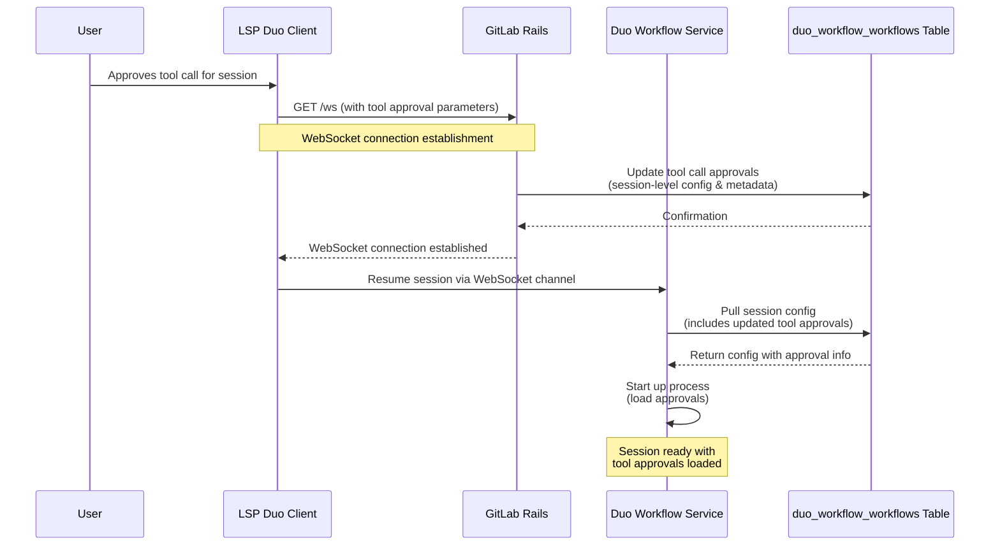



## Summary

Tool Approval Memory enables GitLab Duo agents to persist user approvals across tool invocations within a workflow session. By utilizing GitLab Rails as the single source of truth, this system ensures a "secure-by-default" posture that supports cross-client consistency, centralized auditing, and the long-term roadmap for organizational AI governance.

### Goals

1. **Centralize Security Policy**: Establish GitLab Rails as the authoritative store for tool approvals.
2. **Enable AI Governance**: Provide the architectural foundation for organization-level tool policies, allowlists/denylists, and compliance auditing.
3. **Optimize User Experience**: Eliminate redundant approval prompts within a session without compromising the security boundary.

---

## Motivation

As AI agents move from simple chat interfaces to autonomous workflows, the trust model must scale. While technical spikes explored client-side storage, a backend-mediated approach is required for enterprise-grade security and oversight.

By moving approval state into the GitLab backend, we solve for:

* **Auditability**: Organizations require a permanent record of what was approved and by whom for compliance.
* **Consistency**: A workflow session is a cloud-level entity. Whether a user interacts via VS Code, JetBrains, or the GitLab Web UI, the security context remains identical.
* **Scalability**: This architecture allows for future policy injection, where organizational rules (e.g., "Always allow `ls` in Project X") can be merged with user-level approvals.
* **Extensibility**: This architecture supports extending tool approval to regex patterns and wildcard approvals. As well, this is a fundamental step in enabling autonomous ("yolo") mode for users.

---

## Architecture

### System Overview

The architecture utilizes a centralized persistence model where the Client (LSP) captures user intent, Rails stores the security contract, and the Duo Workflow Service (DWS) enforces execution.

### Components

* **GitLab Rails**: The `duo_workflow_workflows` table serves as the primary store. During the WebSocket (`/ws`) handshake, Rails receives updated approval parameters from the client and updates the workflow's configuration metadata.
* **Duo Workflow Service**: DWS does not rely on the client to send approval state during execution. Instead, it pulls the workflow configuration directly from the GitLab backend (via the AI Gateway).
* **AI Gateway**: Facilitates the secure retrieval of session configuration, ensuring DWS has an authenticated path to the Rails source of truth.

---

## Design Decisions

1. **Unified Metadata Storage**
**Decision**: Store tool approvals as part of the session configuration in the `duo_workflow_workflows` table.
**Rationale**: This avoids creating fragmented tables for every tool-level detail while ensuring that the approval state is tied to the specific lifecycle of a workflow.

2. **Handshake-Driven State Sync**
**Decision**: Use the connection establishment phase to synchronize state.
**Rationale**: By making approval updates a prerequisite for session resumption, we guarantee that the execution environment (DWS) is always in sync with the user's latest permissions.

3. **Server-Side Validation**
**Decision**: DWS validates tool calls against the fetched backend configuration rather than trusting local client state.
**Rationale**: This aligns with the "Zero Trust" model. The client is a UI for gathering consent, but the backend remains the authority for permitting execution.

---

## Security & Governance Model

| Strategy | Implementation |
| :--- | :--- |
| **Tamper Resistance** | Approvals are stored in the GitLab Postgres DB; they cannot be modified by the agent's own tool execution. |
| **Audit Trail** | Because state is stored in Rails, every approval event can be logged for compliance and security reviews. |
| **Governance Hooks** | Allows Rails to intercept approval requests and apply organization-level blocklists before execution. |

---

## Long-Term Vision: AI Governance

This backend-centric design is a prerequisite for the **GitLab AI Governance** roadmap:

1. **Policy Injection**: Admins will be able to pre-approve safe tools (e.g., `read_only` operations) or provide a deny-list for unsafe tools instance-wide.
2. **Autonomous mode advanced tool approvals**: Users will be able to approve using a wildcard or regex pattern. As well, this will lead to users being able to run DAP in autonomous mode where no approvals are needed.
3. **Compliance Reporting**: Security teams can generate reports on AI agent activity, identifying which users or projects are authorizing "Write" access tools most frequently.

---

## Conclusion

This architecture provides a scalable, secure, and user-friendly foundation for Duo Workflow. By centralizing approval memory in the GitLab backend, we eliminate the fragility of client-side state and provide the necessary hooks for enterprise-level AI governance and auditing.
