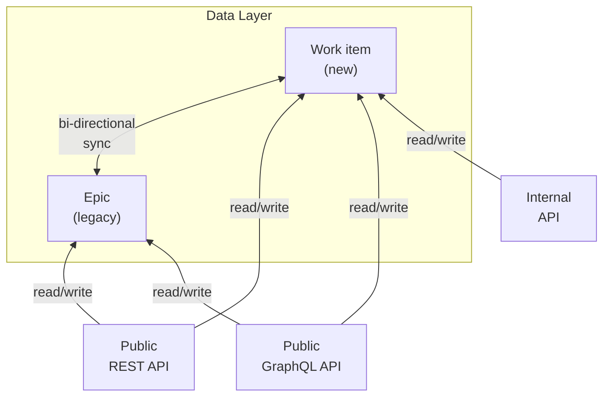
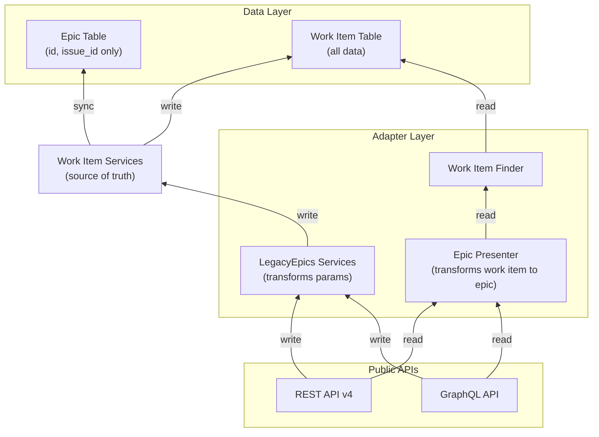



## Summary

To unify issues and epics within one [work item framework](https://docs.gitlab.com/development/work_items/), we migrated the existing epics into work items.
Issues are only on the project level and use the `issues` table. Epics, on the other hand, are on the group level and have their own tables for most features.
Since issues are the foundation of work items, we migrated all epics to the `issues` table and served them through the work item API.
This was accomplished with zero downtime for our users and no breaking changes to the existing APIs.

## Context

**What are work items?** Work items are a unified framework for all work-tracking entities in GitLab (issues, epics, incidents, requirements, test cases, etc.). Before this migration, epics were stored and managed separately from issues, requiring duplicate code and maintenance.

**Why migrate epics?** Epics and issues shared similar functionality but had separate implementations. Their distinct storage and API endpoints meant that any new features or improvements would require parallel development and maintenance for both, creating:

- Duplicate code for every new feature
- Inconsistent user experience
- Difficulty introducing new work item types
- Increased maintenance burden

Migrating epics to the `issues` table and serving them through the work item API reduces technical debt, improves feature velocity, and provides a consistent user experience.

**Current status:** The migration is complete and in production. We are currently in the cleanup phase, removing the bi-directional syncing and consolidating to write-only through work items.

### Goals

- Serve epics through the work item API
- Safe rollout with option to revert to legacy behavior if issues arise
- Zero downtime
- Data consistency
- No breaking changes to the APIs

## Design and implementation details

The migration was organized into 5 separate workstreams:

1. Work item and epic feature parity
2. Epic to work item syncing
3. Backfilling epic data to work items
4. Hybrid sync
5. Cleanup legacy epic code and remove bi-directional syncing

The feature parity and backfilling data from epics to work item tables was a straightforward process.
We therefore only focus on epic to work item syncing, hybrid syncing, and cleanup.

### Epic and work item syncing

Epic: https://gitlab.com/groups/gitlab-org/-/epics/12738

Before backfilling the `epics` to the `issues` table, we implemented a system that syncs epic data to work items.
This was not a 1:1 mapping as some features were implemented differently.

**Syncing strategy:** Every epic gets a corresponding work item in the `issues` table. We added an `issue_id` column to the `epics` table to maintain the relationship. This allows us to keep both tables in sync during the transition.

**Field mapping:** The following table shows how epic fields map to work item tables. Fields marked "Directly synced" are copied as-is. Fields marked "Migrated" are transformed to a new structure. Fields marked "Not synced" are either not needed or handled separately.

| Epic Field | Target Table | Mapping Type | Notes |
|--------|--------|--|--|
| id | - | Reference | Added `issue_id` column to `epics` table to link to work item |
| iid | `issues` | Directly synced | Kept unique within each namespace using `namespace_id` |
| title | `issues` | Directly synced | - |
| description | `issues` | Directly synced | - |
| title_html | `issues` | Directly synced | - |
| description_html | `issues` | Directly synced | - |
| author_id | `issues` | Directly synced | - |
| updated_by_id | `issues` | Directly synced | - |
| last_edited_by_id | `issues` | Directly synced | - |
| last_edited_at | `issues` | Directly synced | - |
| created_at | `issues` | Directly synced | - |
| updated_at | `issues` | Directly synced | - |
| closed_by_id | `issues` | Directly synced | - |
| closed_at | `issues` | Directly synced | - |
| state_id | `issues` | Directly synced | - |
| confidential | `issues` | Directly synced | - |
| cached_markdown_version | `issues` | Auto-generated | Generated when work item is created |
| color | `work_item_colors` | Migrated | Moved to dedicated table |
| group_id | `issues` | Renamed | Called `namespace_id` in issues table |
| parent_id | `work_item_parent_links` | Migrated | Synced with `relative_position` using `work_item_parent_id` |
| relative_position | `work_item_parent_links` | Migrated | Synced with `parent_id` for ordering |
| assignee_id | - | Not synced | Never enabled for epics |
| external_key | `issues` | Removed | Was synced initially but never used |
| lock_version | - | Not synced | See [issue #439716](https://gitlab.com/gitlab-org/gitlab/-/issues/439716) |
| total_opened_issue_weight | - | Not synced | Cached count, not yet implemented |
| total_closed_issue_weight | - | Not synced | Cached count, not yet implemented |
| total_opened_issue_count | - | Not synced | Cached count, not yet implemented |
| total_closed_issue_count | - | Not synced | Cached count, not yet implemented |
| start_date_sourcing_epic_id | `work_item_dates_sources` | Migrated | Synced to `start_date_sourcing_work_item_id` |
| due_date_sourcing_epic_id | `work_item_dates_sources` | Migrated | Synced to `due_date_sourcing_work_item_id` |
| start_date | `work_item_dates_sources` | Migrated | - |
| end_date | `work_item_dates_sources` | Migrated | Synced to `due_date` |
| start_date_sourcing_milestone_id | `work_item_dates_sources` | Migrated | - |
| due_date_sourcing_milestone_id | `work_item_dates_sources` | Migrated | - |
| start_date_fixed | `work_items` + `work_item_dates_sources` | Migrated | Synced to both tables |
| due_date_fixed | `work_items` + `work_item_dates_sources` | Migrated | Synced to both tables |
| start_date_is_fixed | `work_item_dates_sources` | Migrated | - |
| due_date_is_fixed | `work_item_dates_sources` | Migrated | - |

**Related tables:** In addition to the epics table, we also added foreign keys to sync the following tables:

- `related_epic_links` → `issue_links`: Each epic link gets a corresponding issue link. The `related_epic_link.issue_link_id` foreign key ensures consistency.
- `epic_issues` → `work_item_parent_links`: Each epic-issue relationship gets a corresponding parent-child work item link. The `epic_issues.work_item_parent_link_id` foreign key ensures consistency.

#### Bi-directional syncing

**Why bi-directional?** Initially, we considered syncing only from epics to work items. However, this approach had critical downsides:

1. **API rewrite burden:** All epic APIs (REST and GraphQL) would need to be rewritten to use work item data. This would delay user-facing benefits.
2. **No rollback path:** If we only wrote to work items, we couldn't roll back to the legacy epic system in case of bugs.

**Solution:** We implemented bi-directional syncing, where changes to either epics or work items are synchronized to the other. This allowed us to:

- Keep existing epic APIs working without changes
- Gradually migrate to work items at our own pace
- Safely roll back if issues arose

**Implementation:** We synced all attributes from the `issues` table (where `work_item_type = 'Epic'`) back to the `epics` record. We also synced `issue_links` and `work_item_parent_links` back to their epic counterparts (`related_epic_links` and `epic_issues`/`epics.parent_id`).

The syncing was implemented in the epic and work item services using database transactions to guarantee data consistency. If either sync fails, the entire operation rolls back.



#### Hybrid sync

**What is hybrid sync?** Some features were implemented for both epics and issues under the `Issuable` abstraction, and they already used the same database tables:

- `resource_label_events`
- `sent_notifications`
- `resource_state_events`
- `description_versions`
- `award_emoji`
- `events`
- `subscriptions`
- `notes`
- `label_links`

**Why hybrid?** Since these tables already supported both epics and issues through `noteable_type` and `noteable_id` columns, we didn't need to backfill or sync data. Instead, we used UNION queries to read from both epic and work item records simultaneously.

**How it works:** When fetching notes for a work item that represents an epic, we query both:

- Notes where `noteable_type = 'Issue'` and `noteable_id = <work_item_id>`
- Notes where `noteable_type = 'Epic'` and `noteable_id = <epic_id>`

We introduced `UnifiedAssociations` concerns to override Active Record's association fetching. This allows the `has_many :notes` relationship to transparently query both tables.

**Example:** For a work item with `issues.id = 12345` and its corresponding epic with `epics.id = 6789`:

```sql
SELECT "notes".* FROM (
  (SELECT "notes".* FROM "notes" WHERE "notes"."noteable_id" = 12345 AND "notes"."noteable_type" = 'Issue')
  UNION
  (SELECT "notes".* FROM "notes" WHERE "notes"."noteable_id" = 6789 AND "notes"."noteable_type" = 'Epic')
)
```

**Future cleanup:** Once we stop writing to epic tables, we can backfill all data (changing `noteable_type` from 'Epic' to 'Issue' and `noteable_id` to the work item ID). Then we can remove the UNION queries and read only from work item records.

### Cleanup legacy epic code and remove bi-directional syncing

After syncing and backfilling, we were able to use the work item API in the frontend. However, we still have the epic REST and GraphQL APIs to support. We can't remove the REST API, but we're able to deprecate and remove the GraphQL API with major releases.

**Current phase:** We are currently in the cleanup phase. The goal is to remove the bi-directional sync and start reading and writing only from and to the work item tables. The `epics`, `related_epic_links`, and `epic_issues` tables should eventually serve only as references to their correlating work item table.

**Cleanup steps:**

1. Build adapters to write through work items first (work items become the source of truth)
2. Switch epic APIs over to read from work items
3. Remove syncing from work items to epics
4. Delete epic data, but keep IDs for API references

#### Adapters

**Problem:** If we immediately switched epic APIs to read from work items, we'd lose the ability to roll back. We also can't rewrite all epic APIs at once.

**Solution:** We built adapter services that wrap the epic API but delegate to work item services underneath. This allows us to:

- Feature-flag the migration per endpoint
- Reuse existing epic tests to verify compatibility
- Roll back individual endpoints if needed
- Gradually migrate without a big-bang rewrite

**Example:** The epic create endpoint now calls `WorkItems::LegacyEpics::CreateService` instead of `Epics::CreateService`. The adapter transforms epic parameters to work item parameters and calls the work item service.

```ruby
# Epic API endpoint
post ':id/(-/)epics/:epic_iid/epics' do
  ::WorkItems::LegacyEpics::CreateService.new(...).execute
end
```

```ruby
# Adapter service
module WorkItems
  module LegacyEpics
    class CreateService
      def initialize(group:, perform_spam_check: true, current_user: nil, params: {})
        @transformed_params = transform_params(params)
      end

      def execute
        # We can also use the legacy service via a feature-flag if needed
        result = ::WorkItems::CreateService.new(@transformed_params).execute
        transform_result(result)
      end
    end
  end
end
```

**Benefits:**

1. Feature-flagged rollout: Can safely roll back to the old service if issues arise
2. Test reuse: All legacy epic tests still pass, verifying compatibility
3. Gradual migration: Can migrate endpoints one at a time

#### The final architecture

**End state:** Eventually, we will read only from work items and present the data as epics to the APIs. The `epics` table will only contain the `id` for reference purposes and link to its correlating work item by using the `issue_id`.

**Timeline:** We need to keep creating `id`s on the `epics` table until we remove the REST API v4. After that, we can completely delete the `epics` table and all its references.

**Data flow:** The diagram below shows the final architecture after cleanup is complete:



**Key points:**

- Work items are the single source of truth
- Epic APIs are thin adapters that transform data
- The epic table is only a reference for API compatibility
- All writes go through work item services
- All reads are served from work items (presented as epics when needed)
