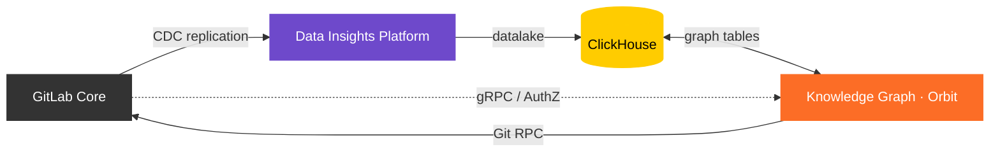



## Overview

The GitLab Knowledge Graph (Orbit) is a Rust service that builds a property graph from GitLab instance data (SDLC metadata and code structure) and exposes it through a JSON-based Cypher-like DSL compiled to ClickHouse SQL. It provides a unified context API for AI systems (via MCP) and human users.

The service indexes two types of data into property graph format:

- **SDLC metadata**: issues, merge requests, CI pipelines, work items, groups, projects, and other GitLab entities streamed via Siphon CDC from PostgreSQL through NATS into ClickHouse.
- **Code**: call graphs, definitions, references, and repository metadata fetched from Gitaly and parsed into ClickHouse graph tables.

## Architecture

## Design documents

The full design documents now live alongside the code in the [knowledge-graph repository](https://gitlab.com/gitlab-org/orbit/knowledge-graph/-/tree/main/docs/design-documents):

- [Overview and architecture](https://gitlab.com/gitlab-org/orbit/knowledge-graph/-/blob/main/docs/design-documents/README.md)
- [Indexing](https://gitlab.com/gitlab-org/orbit/knowledge-graph/-/tree/main/docs/design-documents/indexing) (SDLC and code)
- [Querying](https://gitlab.com/gitlab-org/orbit/knowledge-graph/-/tree/main/docs/design-documents/querying) (graph engine, query language)
- [Data model](https://gitlab.com/gitlab-org/orbit/knowledge-graph/-/blob/main/docs/design-documents/data_model.md)
- [Schema management](https://gitlab.com/gitlab-org/orbit/knowledge-graph/-/blob/main/docs/design-documents/schema_management.md)
- [Security](https://gitlab.com/gitlab-org/orbit/knowledge-graph/-/blob/main/docs/design-documents/security.md)
- [Observability](https://gitlab.com/gitlab-org/orbit/knowledge-graph/-/blob/main/docs/design-documents/observability.md)

## Resources

| Resource | Location |
|---|---|
| Repository | [gitlab-org/orbit/knowledge-graph](https://gitlab.com/gitlab-org/orbit/knowledge-graph) |
| Primary epic | [#19744](https://gitlab.com/groups/gitlab-org/-/work_items/19744) |
| Program page | [internal handbook](https://internal.gitlab.com/handbook/engineering/r-and-d-pmo/programs/knowledge-graph-ga/) |
