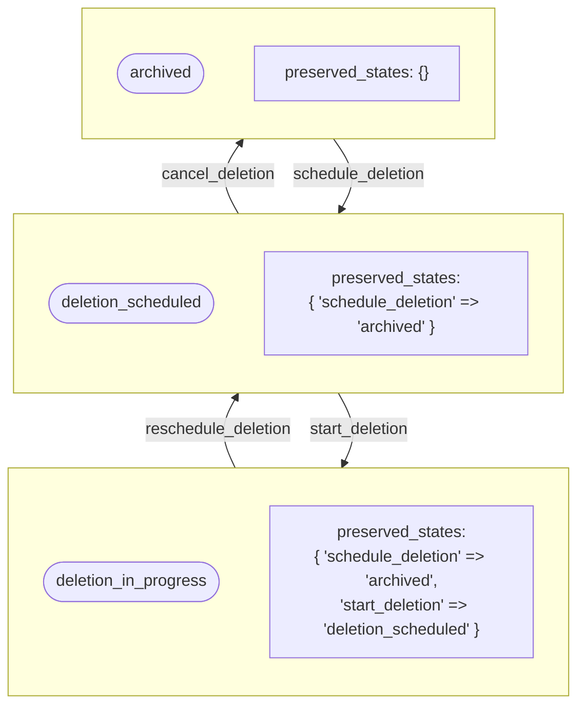
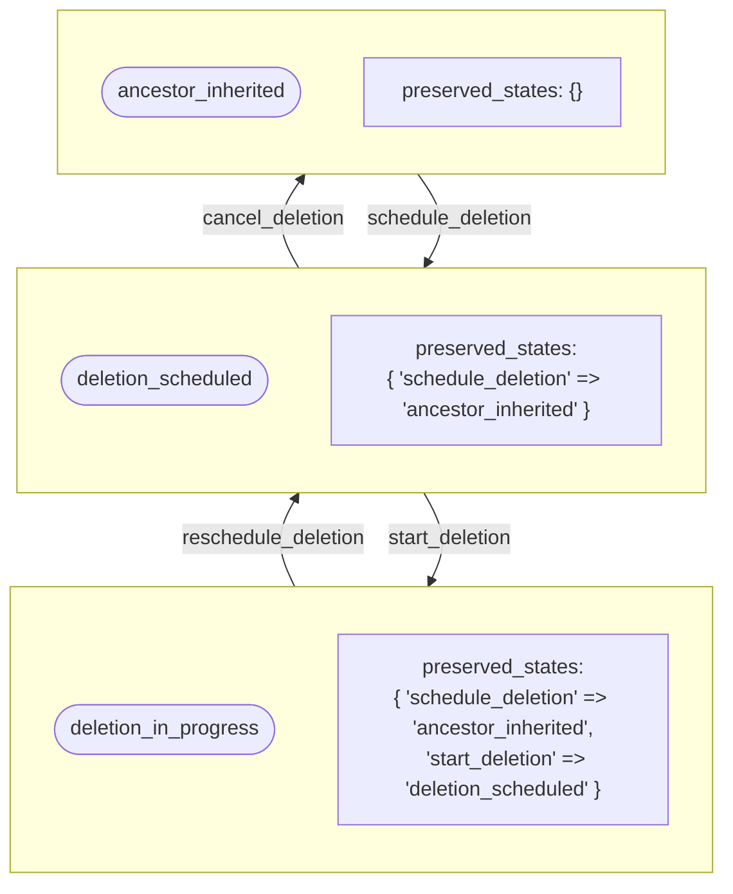

## Context

When performing state transitions, particularly during cancellation or failure recovery scenarios, the system needs to remember what state a namespace was in before a transition occurred. Without this capability, reversing operations loses important context.

For example:

1. A namespace is in `:archived` state
2. User schedules deletion → state becomes `:deletion_scheduled`
3. User cancels deletion → without preservation, state would always return to `:ancestor_inherited`, losing the fact that it was archived

This creates a poor user experience where canceling a deletion of an archived namespace would unexpectedly unarchive it.

## Decision

Implement a **state preservation mechanism** that automatically saves the previous state during specific transitions and restores it when corresponding reverse transitions occur.

### State Memory Configuration

Define which events should preserve state and their corresponding restore events:

```ruby
STATE_MEMORY_CONFIG = {
  schedule_deletion: :cancel_deletion,
  start_deletion: :reschedule_deletion
}.freeze
```

This configuration maps:

- **Preserve events** (keys): Events that trigger state preservation
- **Restore events** (values): Events that trigger state restoration

### Preservation Flow

1. **On Preserve Event** (e.g., `schedule_deletion`):
   - Current state is saved to `state_metadata['preserved_states'][event_name]`
   - Transition proceeds normally

2. **On Restore Event** (e.g., `cancel_deletion`):
   - Preserved state is retrieved from `state_metadata`
   - State machine uses guard conditions to determine correct target state
   - Preserved state is cleared from `state_metadata` after restoration

### Implementation Details

The `StatePreservation` module provides:

- **save_preserved_state(event, state_name)**: Persists the current state before transitioning
- **clear_preserved_state(event)**: Removes the preserved state after restoration
- **preserved_state(event)**: Retrieves the saved state for a given event
- **should_restore_to?(event, target_state)**: Checks if preserved state matches target
- **Guard methods**: `restore_to_archived_on_cancel_deletion?`, `restore_to_ancestor_inherited_on_reschedule_deletion?`, etc.

### State Metadata Structure

Preserved states are stored in the `state_metadata` JSONB column:

```json
{
  "preserved_states": {
    "schedule_deletion": "archived",
    "start_deletion": "deletion_scheduled"
  },
  "last_updated_at": "2025-05-26T10:00:00Z",
  "last_changed_by_user_id": 12345
}
```

### Guard Conditions in State Machine

The state machine uses guard conditions to determine the correct target state during restoration:

```ruby
event :cancel_deletion do
  transition %i[deletion_scheduled deletion_in_progress] => :archived,
    if: :restore_to_archived_on_cancel_deletion?
  transition %i[deletion_scheduled deletion_in_progress] => :ancestor_inherited
  transition ancestor_inherited: :archived, if: :restore_to_archived_on_cancel_deletion?
  transition ancestor_inherited: :ancestor_inherited
end
```

The guard `restore_to_archived_on_cancel_deletion?` checks if the preserved state from `schedule_deletion` is `:archived`, allowing the state machine to route to the correct target state.

## Consequences

### Positive Consequences

- **User Experience**: Canceling operations preserves the original state, preventing unexpected state changes
- **Data Integrity**: Maintains accurate state history without losing context
- **Flexibility**: Supports complex state transitions with proper restoration
- **Auditability**: Preserved states provide additional context for audit trails

### Technical Consequences

- **Metadata Complexity**: Adds complexity to `state_metadata` structure
- **Guard Conditions**: Requires multiple guard conditions in state machine definitions
- **Testing**: Additional test scenarios needed for preservation and restoration flows
- **Migration**: Existing data need migration to populate preserved states

## Alternatives

### Alternative 1: Always restore to default state

- **Pros**: Simpler implementation, no metadata tracking needed
- **Cons**: Poor user experience, loss of context, unexpected state changes

### Alternative 2: Store full state history

- **Pros**: Complete audit trail, ability to restore to any previous state
- **Cons**: Increased storage, more complex queries, potential performance impact

### Alternative 3: Manual state specification

- **Pros**: Explicit control over restoration target
- **Cons**: Requires user input, poor UX, error-prone

## Examples

### Example 1: archived → deletion_scheduled → deletion_in_progress → deletion_scheduled → archived



### Example 2: active → deletion_scheduled → deletion_in_progress → deletion_scheduled → active


