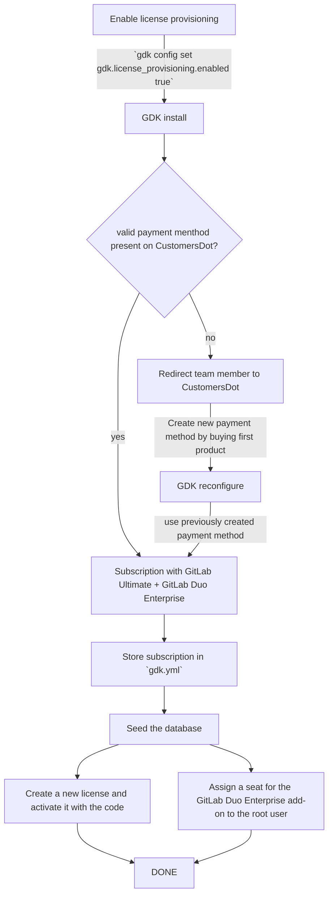
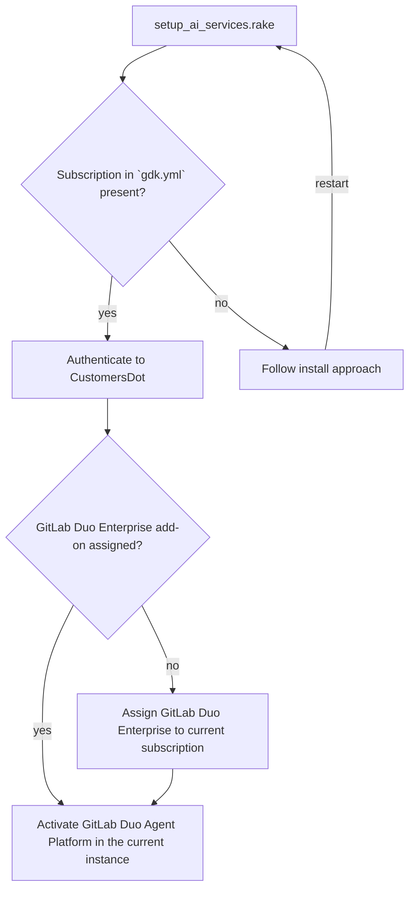
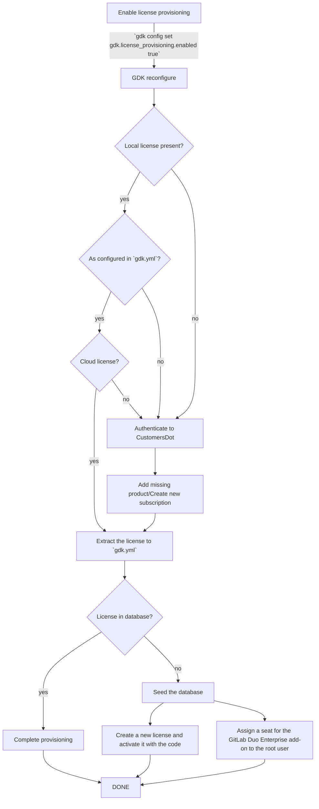

<!-- Design Documents often contain forward-looking statements -->
<!-- vale gitlab.FutureTense = NO -->

<!-- This renders the design document header on the detail page, so don't remove it-->


## Glossary

| Term | Meaning |
| ---- | ------- |
| AI components | Components such as the AI gateway or the GitLab Duo workflow service that need to run in order to be able to use AI features locally. |
| AI features | GitLab features such as the GitLab Agent Platform or GitLab Duo Chat. |
| [CustomersDot](https://gitlab.com/gitlab-org/customers-gitlab-com) | The Customers Portal for managing GitLab subscriptions, billing contacts, payments, and license details. |
| GDK | The [GitLab Development Kit](https://gitlab.com/gitlab-org/gitlab-development-kit/), the development tool to set up local GitLab instances. |
| GitLab EE | The GitLab Enterprise Edition can be activated using an activation code and enables enterprise features. |
| GitLab license | A GitLab license can support a self-managed or dedicated instance while having a tier like Premium or Ultimate. |
| GitLab subscription | The GitLab subscription can be viewed as a bucket holding products. One of the products can be a GitLab license, and another the GitLab Duo Enterprise add-on. |
| GitLab subscription name | The name provided by CustomersDot after purchasing a subscription. For example, 'A-S00012345'. |
| Team members | Team members are GitLab employees and staff who work for GitLab Inc. |
| [Zuora](https://www.zuora.com/) | The application used by GitLab to manage purchases, billing, and subscriptions. |

## Summary

Developing GitLab AI features requires a GitLab subscription with a GitLab Ultimate license and
the GitLab Duo Enterprise add-on.
The GitLab Duo Enterprise add-on is currently provisioned through a manual process that
reduces the productivity of teams and slows down the feature development workflow.

This proposed solution integrates automated provisioning of GitLab licenses with the GitLab Duo Enterprise add-on into the GDK setup
process, enabling team members to immediately access licenses for development and testing without manual intervention.

## Motivation

When developing or reviewing GitLab AI features for the GitLab product using the staging AI gateway,
team members require a GitLab license with the GitLab Duo Enterprise add-on in their local development environment using the GitLab Development Kit (GDK).
As of October 27, 2025, the GitLab Duo Enterprise add-on can only be obtained through manual intervention by the Fulfillment team, creating a significant bottleneck in the development workflow.

There is no self-service provisioning flow available in CustomersDot, GitLab's customer portal, which
means team members must submit requests and wait for a manual add-on assignment, which can take several hours.

This manual process exists because the Subscription Management team has identified the integration
of GitLab Duo Enterprise add-ons into CustomersDot as blocked by the [larger initiative to unify purchase flows](https://gitlab.com/groups/gitlab-org/-/epics/12199).
The estimated timeline for adding GitLab Duo Enterprise add-ons to CustomersDot is after FY27-Q1.

The current [manual provisioning process](https://docs.gitlab.com/development/ai_features/ai_development_license/#duo-enterprise) creates several problems:

- **Developer productivity:** Team members experience delays of several hours waiting for add-on
provisioning, blocking their ability to set up environments and start work.
- **Review quality:** The high friction discourages reviewers from testing AI features locally.
When reviewers cannot easily set up their environments to test changes, they rely more on code review
alone, increasing the likelihood of missed defects.
- **Team load:** The Fulfillment team bears the operational burden of processing individual add-on
requests, creating inefficiency for both requesters and provisioners.

By enabling self-service license provisioning for internal development purposes, we can:

- **Increase development speed** by giving team members immediate access to required licenses and add-ons.
- **Reduce escaped defects ratio** by simplifying the testing of AI features within development environments using GDK.
- **Reduce operational overhead** by eliminating the Fulfillment team bottleneck for internal development add-ons.

This integration will serve as a long-term solution that improves developer experience.

### Goals

- Create an integrated automated self-service process to provision GitLab subscriptions with GitLab Duo add-ons for team members in GDK.

### Non-Goals

- Automatic license generation for community contributors because they don't have access to staging CustomersDot
and require creating a [request](https://gitlab.com/gitlab-org/developer-relations/contributor-success/team-task/-/issues/new?issuable_template=contributor_ee_license_request)
to obtain a license as outlined [here](/handbook/marketing/developer-relations/engineering/community-contributors-workflows/#contributing-to-the-gitlab-enterprise-edition-ee)
- Streamline the purchase flow for customers

## Proposal

During the setup of AI components in GDK, team members will be prompted to specify how they want to setup the AI gateway.
If they decide to use the staging AI gateway over the local AI gateway,
they require a subscription with a staging self-managed GitLab Ultimate license and the GitLab Duo Enterprise add-on.
Instead of manually purchasing a new subscription with a staging self-managed GitLab Ultimate license over staging CustomersDot
and requesting the Fulfillment team to provision the GitLab Duo Enterprise add-on,
GDK will take over purchasing a new subscription with the mentioned products and activate it in the local instance.
This will enable team members to test AI features locally without waiting for manual add-on provisioning from the Fulfillment team.

GDK will then:

- Authenticate through GitLab staging to staging CustomersDot.
- Create a new subscription with a staging self-managed GitLab Ultimate license.
- Automatically attach a GitLab Duo Enterprise add-on to the subscription with a default or specified number of seats.
- Store an encripted copy of the GitLab subscription in the `gdk.yml` file.
- Assign the GitLab subscription to the local GDK instance.
- Assign one of the previously purchased seats to the root user.

### Advantages

- License provisioning happens automatically.
- Reduction of manual steps for developers.
- Easy reproduction.
- When the staging Zuora instance is periodically refreshed, and all the subscription data is reset, new subscriptions can be provisioned without discrepancies.

### Disadvantages

- New dependency on the CustomersDot platform. If CustomersDot is unavailable, automated license provisioning will be blocked.

### Success Metrics

- **End-to-End Provisioning Time:** Time from developer request initiation to license activation.
- **Manual Intervention Rate:** Percentage of provisioning requests requiring manual intervention by the Fulfillment team.

## Design and implementation details

As the automatic license provisioning will only be available for team members, it will need to be enabled manually.
Therefore, add settings to support the different combinations of products for subscriptions:

```yaml
gdk:
  license_provisioning:
    edition: ['self_managed', 'saas'] # 'self_managed' as default since this supports the configuration with the staging AI gateway
    enabled: false # false by default so team members can opt in
    duo:
      seats: 150 # this should be a reasonable number, the default seed creates 68 users
      tier: ['enterprise', 'pro'] # 'enterprise' as default since this supports the configuration with the staging AI gateway
    gitlab:
      seats: 150 # this should be a reasonable number, the default seed creates 68 users
      tier: ['ultimate', 'premium'] # 'ultimate' as default as it covers most use cases
```

### Authentication from GDK to CustomersDot

To directly authenticate team members from GDK to CustomersDot,
every team member would need to set the staging [JWT signing key](https://gitlab.com/gitlab-org/gitlab/-/blob/68d9fb11446cbfe156a8ac437d99ea6ef9c2e510/ee/lib/gitlab/customers_dot/jwt.rb#L37)
in their GDK instance.
This is not a secure practice as it would mean sharing a single confidential credential across multiple team members and staging.

To authenticate team members to CustomersDot more securely, GDK will make a GraphQL request
to GitLab staging using the GitLab staging credentials of the team members.
GitLab staging can then forward the request to staging CustomersDot.

1. Team members will provide their GitLab staging credentials, for example personal access tokens, to GDK.
1. GDK will use the GitLab staging credentials to make a GraphQL request to the `staging.gitlab.com/-/customers_dot/proxy/graphql` endpoint.
1. The GitLab staging server (`staging.gitlab.com`) will forward the request to staging CustomersDot (`customers.staging.gitlab.com`).
1. The request will be forwarded by using the [JWT signing key](https://gitlab.com/gitlab-org/gitlab/-/blob/68d9fb11446cbfe156a8ac437d99ea6ef9c2e510/ee/lib/gitlab/customers_dot/jwt.rb#L37)
and setting the GitLab user ID.

For a more detailed answer regarding the complete authentication process, please visit this [issue](https://gitlab.com/gitlab-org/fulfillment/meta/-/issues/2499).

### Installing a fresh GDK instance

1. Enable license provisioning with `gdk config set gdk.license_provisioning.enabled true`.
1. Authenticate to CustomersDot to check for a valid and active payment method.
A payment method can be set in the [billing account settings](https://customers.staging.gitlab.com/billing_accounts)
and is usually created using the [test credit card](https://gitlab.com/gitlab-org/customers-gitlab-com/#testing-credit-card-information).
If there is no payment method present, team members will be redirected to the browser for them to create
a payment method and buy the first license. This is required since creating a payment method is only possible through the UI.
1. Use the CustomersDot GraphQL API to get the payment method ID of the payment method previously created.
1. Create a new subscription with a self-managed GitLab Ultimate license and add the GitLab Duo Enterprise add-on
with a default or specified number of seats.
1. Store the new subscription encrypted in the `gdk.yml` file.
1. When seeding the database, use the new subscription. In the database:
   1. Create a new license using the activation code. This will store the self-managed GitLab Ultimate license.
   1. Find the related add-on purchase for the GitLab Duo Enterprise add-on.
   1. Assign a seat for the GitLab Duo Enterprise add-on to the root user.
1. This makes sure that team members automatically have a self-managed GitLab Ultimate license with a GitLab Duo Enterprise add-on when setting up their GDK.

The structure of the GitLab subscription in the `gdk.yml` file will be the following key value pairs
with the details about the subscription:

```yml
gitlab_subscription:
  activation_code: "activation_code",
  expiration_date: "2026-11-12",
  edition: "self_managed",
  gitlab_tier: "ultimate",
  duo_tier: "enterprise"
```



### Setting up the local AI development environment with staging AI gateway

1. Use the subscription name and authenticate to CustomersDot to add the GitLab Duo Enterprise add-on to the previously created subscription.
  This can happen inside the `lib/tasks/setup_ai_services.rake` task.
1. While adding the GitLab Duo Enterprise add-on, use default values for the number of seats.
1. Once the GitLab Duo Enterprise add-on is set, activate the GitLab Duo Agent Platform and potentially
other settings needed for local AI development.



### Existing GDK instance

To make sure that team members already using GDK also get a self-managed GitLab Ultimate license with the GitLab Duo Enterprise add-on:

1. Enable license provisioning with `gdk config set gdk.license_provisioning.enabled true`.
1. Because there is a database already existing, check if there is a license present.
1. If there is a license present:
   1. Check if it already fulfills the set configuration in the `gdk.yml`.
   1. Check if it is a cloud license `License.current.cloud?`.
   1. If the previous checks are met, extract the GitLab license encrypted into `gdk.yml` and complete the provisioning.
   1. If the previous checks are not met, authenticate to CustomersDot and check if the team member owns the present license.
   1. If the team member owns the present license:
      1. Authenticate to CustomersDot and add the missing products to the GitLab subscription.
      1. Extract the GitLab license encrypted into `gdk.yml`.
      1. Do a quick database check to verify that the present license is the same as the one stored in `gdk.yml`.
      This can be done by comparing the data of the current license with the `activation_code` stored in `gdk.yml`.
      1. If the present license matches the stored license in `gdk.yml`, the desired license is already in use, and the provisioning is complete.
      1. If the present license does not match the stored license in `gdk.yml`, use the new products. In the database:
         1. Create a new license using the activation code. This will store the self-managed GitLab Ultimate license.
         1. Find the related add-on purchase for the GitLab Duo Enterprise add-on.
         1. Assign a seat of the GitLab Duo Enterprise add-on to the root user.
   1. If the team member doesn't own the present license, it is not possible to add products to the GitLab subscription containing the license. Continue as if no license was present.
1. If there is no license present:
   1. Authenticate to CustomersDot to check for a valid and active payment method.
   A payment method can be set in the [billing account settings](https://customers.staging.gitlab.com/billing_accounts)
   and is usually created using the [test credit card](https://gitlab.com/gitlab-org/customers-gitlab-com/#testing-credit-card-information).
   If there is no payment method present, team members will be redirected to the browser for them to create
   a payment method and buy the first license. This is required since creating a payment method is only possible through the UI.
   1. Use the CustomersDot GraphQL API to get the payment method ID of the payment method previously created.
   1. Create a new subscription with a self-managed GitLab Ultimate license and add the GitLab Duo Enterprise add-on
   with a default or specified number of seats.
   1. Store the new subscription encrypted in `gdk.yml`.
   1. Use the new subscription. In the database:
      1. Create a new license using the activation code. This will store the self-managed GitLab Ultimate license.
      1. Find the related add-on purchase for the GitLab Duo add-on.
      1. Assign a seat for the GitLab Duo Enterprise add-on to the root user.



### Setting up the local AI development environment with staging AI gateway and cells infrastructure

Running GDK with the cells infrastructure enabled requires licenses to be activated on each cell.
This is because the license database table specific to each cell.

1. Check the current settings to determine if GDK is running with cells enabled: `GDK.config.cells.enabled`.
1. Enable license provisioning with `gdk config set gdk.license_provisioning.enabled true`.
1. For the first cell:
   1. If there is a database already existing, check if there is a license present.
   1. If there is a license present:
      1. Check if it already fulfills the set configuration in the `gdk.yml`.
      1. Check if it is a cloud license `License.current.cloud?`.
      1. If the previous checks are met, extract the license encrypted into `gdk.yml`, complete the provisioning for this cell, and mark the license as valid for all other cells.
      1. If the previous checks are not met, check if the team member owns the present license.
      1. If the team member owns the present license, authenticate to CustomersDot and add the missing products to the GitLab subscription.
      1. If the team member doesn't own the present license, it is not possible to add products to the GitLab subscription containing the license. Continue as if no license was present.
   1. If there is no license present:
      1. Authenticate to CustomersDot to check for a valid and active payment method.
      A payment method can be set in the [billing account settings](https://customers.staging.gitlab.com/billing_accounts)
      and is usually created using the [test credit card](https://gitlab.com/gitlab-org/customers-gitlab-com/#testing-credit-card-information).
      If there is no payment method present, team members will be redirected to the browser for them to create
      a payment method and buy the first license. This is required since creating a payment method is only possible through the UI.
      1. Use the CustomersDot GraphQL API to get the payment method ID of the payment method previously created.
      1. Create a new subscription with a self-managed GitLab Ultimate license and add the GitLab Duo Enterprise add-on
      with a default or specified number of seats.
      1. Store the new subscription encrypted in `gdk.yml`.
      1. Use the new subscription, add it to this cell, and mark the license as invalid for all other cells.
1. For every other cell:
   1. If the license is marked as valid:
      1. Do a quick database check to verify that the present license is the same as the one stored in `gdk.yml`.
      This can be done by comparing the data of the current license with the `activation_code` stored in `gdk.yml`.
      1. If the present license matches the stored license in `gdk.yml`, the desired license is already in use.
      1. If the present license doesn't match the stored license in `gdk.yml`, continue as if the license was marked as invalid.
   1. If the license is marked as invalid:
      1. The current license in the database needs to be replaced by the one stored in `gdk.yml`.
      1. In the database:
         1. Delete the current license.
         1. Create a new license using the activation code. This will store the self-managed GitLab Ultimate license.
         1. Find the related add-on purchase for the GitLab Duo add-on.
         1. Assign a seat for the GitLab Duo Enterprise add-on to the root user.

## Alternative solutions

### Share a single GitLab subscription

Have a single GitLab subscription that is shared across all engineering team members in the organization using a password vault.
To cover the use case of developing AI features using the staging AI gateway, provide a subscription with
a self-managed GitLab Ultimate license and the GitLab Duo Enterprise add-on.

With a 1Password vault in place, there are several options to implement:

1. Team members can manually copy the GitLab subscription and add it to their local GDK instance.
1. Create a small Auth service hosting the GitLab subscription that can be reached by GDK.
1. Use the 1Password CLI tool in GDK to retrieve the GitLab subscription from the vault.

Once the GitLab subscription is available in GDK, follow the steps defined in the main proposal
to rotate or directly activate local GitLab licenses with the respective add-on.

**Note**: Sharing a single GitLab subscription will serve as an intermediate solution and
will be implemented following the approach described in 3 as part of the [Streamline AI development environment setup](https://gitlab.com/groups/gitlab-org/quality/tooling/-/epics/86) initiative.
More details are described in this [related issue](https://gitlab.com/gitlab-org/gitlab-development-kit/-/issues/3096).

**Disadvantages**:

- Changes on a shared subscription affect all instances using the same subscription.
- Manual work of rotating the subscriptions if newer versions are established.
- One-time effort to provide the most common combinations of products within subscriptions inside a vault.

Some questions with their answers or for future clarification:

- Q: Who will own the subscription?
A: AI teams will own their subscriptions respectively.
<br>

- Q: How will the subscription be generated?
- A: To start with, AI teams can use the established manual path and store the created subscription in a vault.
<br>

- Q: How do we guarantee a smooth subscription rotation when they expire?
- A: Subscriptions purchased over CustomersDot are already set to auto-renew. This means that as long
as a payment method is present and valid, no rotation of subscriptions is needed.
- A: In the case of a new version of subscriptions, team members can delete their local copy stored
in `gdk.yml` and rerun `gdk reconfigure`.
<br>

- Q: Are there concerns with sharing a single subscription between multiple team members?
- A: As per the Fulfillment team, sharing a single subscription should be fine.
<br>

- Q: Are the seats of cloud subscriptions used for GitLab Duo Enterprise add-ons shared between instances?
- A: As per the Fulfillment team, seats are not shared between instances.

### Purchase flow on CustomersDot

The easiest alternative will be possible once there is a purchase flow on CustomersDot.
Team members can follow manual steps to add a GitLab Duo Enterprise add-on to their GitLab subscription.
A similar approach is already documented in the handbook for obtaining [GitLab licenses](/handbook/support/internal-support/#gitlab-plan-or-license-for-team-members).
This requires the least work to implement, but still involves a significant amount of manual steps for team members.
