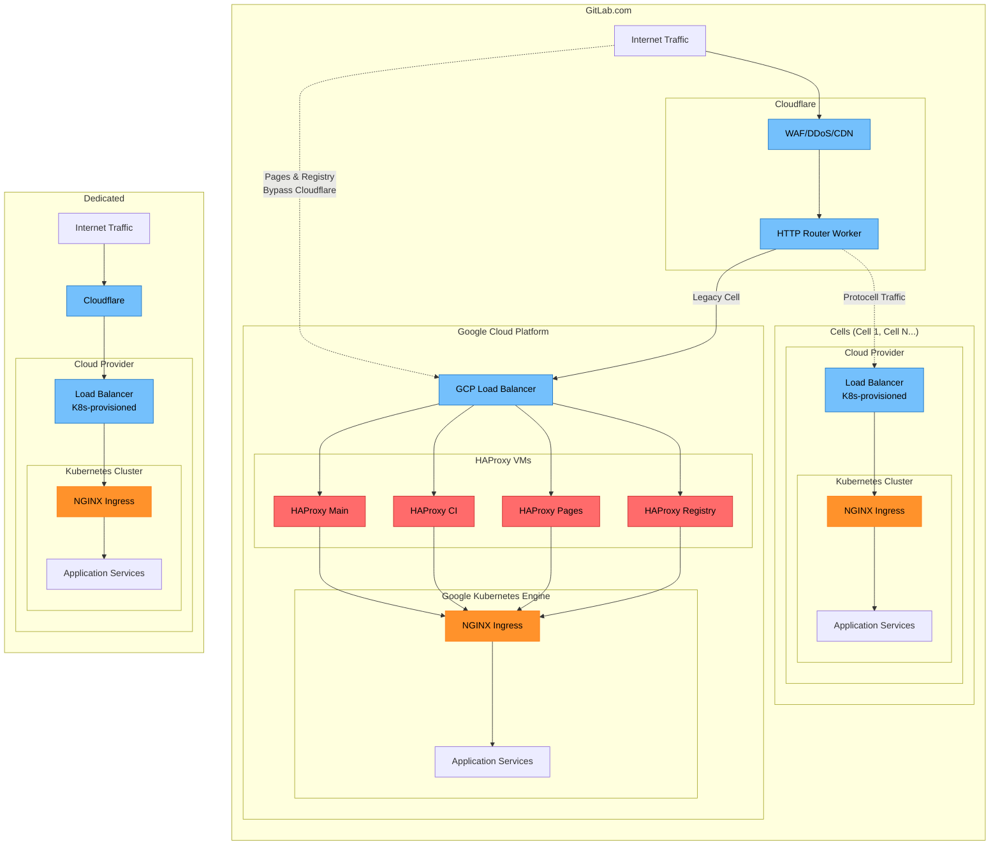
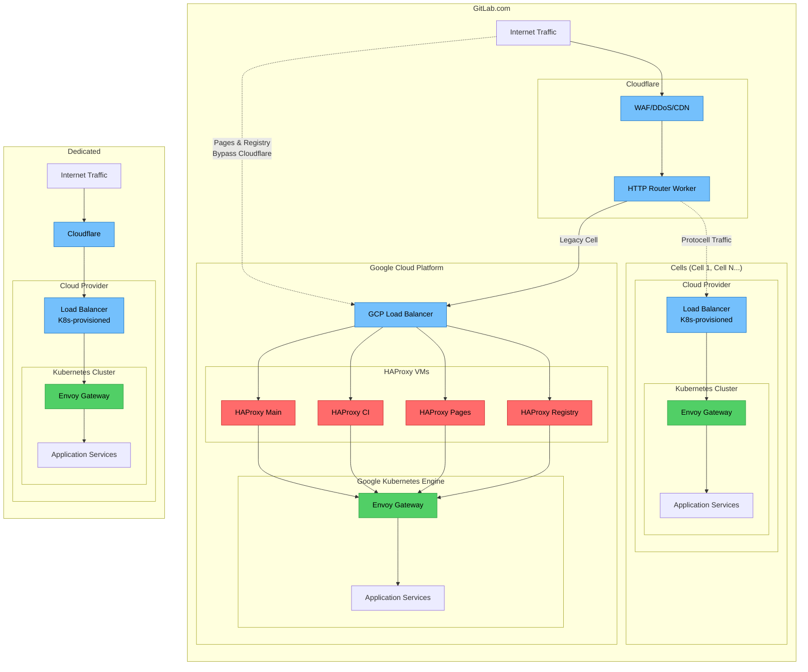
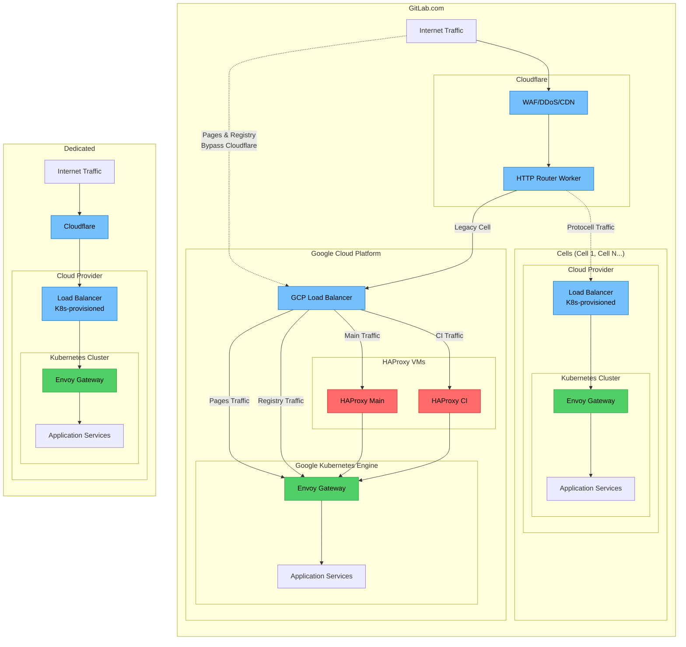
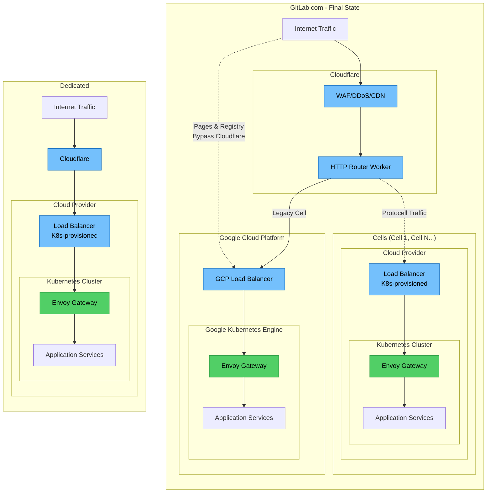

<!-- This renders the design document header on the detail page, so don't remove it-->



## Summary

Establish a standardized gateway layer for GitLab.com that aligns with architectural directions for Dedicated, Cells, and [Cloud-Native Self-Managed installations](../selfmanaged_segmentation/).

This initiative provides production-scale dogfooding of the [Packaged Envoy Gateway solution](https://gitlab.com/gitlab-org/charts/gitlab/-/blob/master/doc/architecture/decisions.md?ref_type=heads#bundling-envoy-gateway) proposed by `Delivery::Operate` as a solution to handle the [NGINX Ingress Retirement](#nginx-retirement) in March 2026, enabling platform standardization across all GitLab deployment models.

See [Gateway API and Self-Managed Considerations](#gateway-api-and-self-managed-considerations) for further detail on understood implications of using a bundled Gateway solution.

> [!important] Key Value
>
> Reduce architectural divergence and operational complexity by establishing a unified gateway layer across all platforms.

## Business Objectives

1. **Architectural Alignment**: Converge on a single gateway pattern across GitLab.com, Dedicated, Cells, and Cloud-Native Self-Managed to reduce maintenance burden and knowledge silos, enabling innovation across multiple platforms.
1. **Production Validation**: Dogfood `Delivery::Operate` team’s gateway solutions at GitLab.com scale, identifying issues in our pre, staging, and production deployments before customers adopt this solution.
1. **Cells Readiness**: Establish unified routing infrastructure across GitLab.com, Dedicated, and Cells to reduce platform divergence during the Cells transition.
1. **Operational Excellence**: Reduce incident response and maintenance complexity by having consistent gateway behavior across all deployment types, with superior observability (metrics, logging, tracing) for faster troubleshooting and incident response.

## Motivation

### Faster Feature Delivery and Platform Standardization

A standardized gateway simplifies our platform offerings by supporting a single ingress configuration that underpins GitLab.com, Dedicated, Cells, and Self-Managed. This reduces duplicate efforts across the organization and enables consistent infrastructure patterns across all deployment models. This offers a centralized mechanism for cross-platform innovation.

By replacing HAProxy's complex configuration model with Envoy Gateway's declarative, Kubernetes-native approach, we also lower the barrier to entry for teams outside infrastructure to contribute routing changes and new features using a pre-defined interface. This enables faster feature delivery to customers by reducing the operational complexity and specialized knowledge required to implement gateway-level changes.

### Reduced Operational Costs and Complexity

Consolidating on a single gateway pattern for ingress eliminates the need for specialized expertise in HAProxy, NGINX and multiple load balancers. This reduces operational costs (see [internal issue](https://gitlab.com/gitlab-com/gl-infra/production-engineering/-/issues/28064) for analysis) and complexity associated with managing these systems, and enabling faster incident response across supported platforms through unified runbooks and observability.

### Improved Reliability and Customer Experience

Dogfooding the gateway solution offered by the [Cloud Native GitLab Helm Chart](https://gitlab.com/gitlab-org/charts/gitlab) provides an opportunity to validate gateway resilience at scale, ensuring that we deliver a reliable, performant, and secure ingress layer to our Self-Managed customers.

## Ownership

At the time of writing, there are three groups at GitLab interested in deploying Envoy Gateway across all our platforms:

- **Production Engineering/ Dedicated** - Responsible for production networking, and interested in simplifying GitLab's networking architecture across GitLab.com, Dedicated Tenants, and Cells Architecture.
- **Auth Group** - Responsible for the Authentication Components. Envoy Proxy is a required component for the NewAuth stack (GATE), deployed separately from this gateway initiative.
- **Operate** - Responsible for the GitLab Helm Chart. Interested in providing a maintained, production-ready Gateway solution to our customers out of the box.

## Glossary

- **Ingress** - incoming traffic entering our network.
- **Ingress resource** - always with an uppercase I, a Kubernetes Ingress resource defines how HTTP and HTTPS routes are exposed. The resource does not define general purpose TCP or SSH.
- **Ingress Controller** - an implementation of a controller that reads Ingress resources and exposes them to the internet through a reverse proxy and a load balancer.
- **Ingress NGINX** - a specific implementation of an Ingress Controller, this is a Kubernetes SIG project that utilises the open source NGINX project. And it is [due to be retired](https://kubernetes.io/blog/2025/11/11/ingress-nginx-retirement/) in March 2026.
- **Gateway API** (the blue print) - An open-source [Kubernetes standard](https://kubernetes.io/docs/concepts/services-networking/gateway/) that defines how advanced traffic routing should work, and enforces role-oriented design principles.
- **Envoy Gateway** (the control plane) - An implementation of the Gateway API standard and supplementary Envoy-specific extensions to the Gateway API. It manages Envoy Proxy configuration declaratively using Kubernetes resources. Think of it as the "manager" that translates routing rules into instructions for Envoy Proxy to execute.
- **Envoy Proxy** (the data plane) - The actual proxy that intercepts requests, enforces policies (like authentication), and proxies traffic to backend services.

## Current State

**Gateway Architecture Across Platforms:**

- **GitLab.com**: Traffic flows through Cloudflare (WAF/DDoS/CDN) and HTTP Router Worker, then to the GCP Load Balancer, through HAProxy VMs (Main, CI, Pages, Registry), and finally to NGINX Ingress for some (but not all) critical components in GKE (Google Kubernetes Engine).
- **Cells**: Traffic flows through Cloudflare HTTP Router Worker to cloud-provisioned load balancers, then to NGINX Ingress in Kubernetes clusters.
- **Dedicated**: Traffic flows through Cloudflare to cloud-provisioned load balancers, then to NGINX Ingress in Kubernetes clusters.
- **Self-Managed**: The GitLab Helm Chart currently supports three proxy offerings (NGINX Ingress, Traefik, and HAProxy) in customer-managed Kubernetes clusters, though customers can **always** bring their own proxy configuration.

**Key Challenges:**

- Multiple ingress technologies require different expertise and operational procedures.
- Separate runbooks, monitoring dashboards, and incident response processes for each platform.
- Proxy-level features must be implemented and maintained separately across platforms, potentially slowing feature releases and time-to-market.
- Architectural divergence creates knowledge silos and limits cross-platform collaboration.

## Implementation Phases

### Phase 1: GitLab.com Non-Production Validation (Estimated 1 Quarter)

- **Objective**: Deploy and validate Envoy Gateway in non-production GitLab.com environments, ensuring it is production ready and meets the requirements for NGINX Ingress replacement.
- **Key Activities**:
  - Deploy Packaged Envoy Gateway to pre-production and staging environments.
  - Test the Envoy Gateway offering from Delivery::Operate team at scale.
  - Develop and implement observability (metrics, logging, tracing) for the new gateway.
  - Conduct performance and reliability testing.
  - Validate compatibility with existing GitLab.com traffic patterns and workloads.
  - Gather feedback and iterate on configuration and operational procedures.
- **Success Criteria**:
  - Envoy Gateway successfully validated in non-production environments.
  - Comprehensive observability and monitoring in place.
  - Performance and reliability meet or exceed current NGINX Ingress baseline.
  - Operational runbooks and documentation created.
  - Graceful degradation validation - confirm Envoy Gateway won't send traffic to failing backends.

### Phase 2: GitLab.com Production Rollout (Estimated 1 Quarter)

- **Objective**: Roll out Envoy Gateway to GitLab.com production, fully replacing NGINX Ingress [which is being retired in March 2026](#nginx-retirement).
- **Key Activities**:
  - Migrate traffic segments progressively to the Envoy Gateway.
  - Decommission NGINX Ingress instances on GitLab.com.
  - Refine operational procedures and incident response for the gateway.
  - Validate production performance and stability.
- **Success Criteria**:
  - NGINX Ingress fully retired from GitLab.com production.
  - All traffic routed through Envoy Gateway.
  - Production performance meets or exceeds NGINX Ingress baseline.
  - Reduced operational overhead compared to previous NGINX Ingress.

### Phase 3: HAProxy Deprecation (Estimated 1 Quarter)

- **Objective**: Deprecate and remove HAProxy VMs from GitLab.com infrastructure using a strangler pattern.
- **Key Activities**:
  - Gradually migrate HAProxy-specific functionality to Envoy Gateway using a strangler pattern.
  - Route increasing portions of traffic through Envoy Gateway while maintaining HAProxy as a fallback.
  - Decommission HAProxy VMs (Main, CI, Pages, Registry) incrementally as traffic migration completes.
  - Simplify the GitLab.com ingress stack.
  - Update operational procedures and runbooks.
- **Success Criteria**:
  - HAProxy fully deprecated and removed from GitLab.com.
  - Simplified, unified gateway architecture in place.
  - No performance or reliability regressions during migration.
  - Zero customer impact during transition.

### Goal State

- **Unified Platform Foundation**: Envoy Gateway being utilized across GitLab.com, Cells, Dedicated, and Self-Managed provides a consistent, cloud-native ingress layer that simplifies operations and enables cross-platform innovation.
- **Operational Excellence**: Eliminates legacy infrastructure (HAProxy deployed on VMs through Chef), reduces configuration complexity, enables autoscaling, and provides superior observability for faster incident response and troubleshooting.
- **Faster Feature Delivery**: Gateway-level features are implemented once and deployed everywhere, unblocking strategic initiatives like Auth Architecture and enabling rapid iteration on security and performance improvements.

#### Targets

- **Platform Convergence** - achieve identical gateway configuration across GitLab.com, Cells, and Dedicated platforms.
- **Eliminate Manual Scaling** - achieve 100% autoscaling coverage for Envoy Gateway pods.
- **Auth Architecture Integration** - 100% of New Auth flows are routed through Envoy Gateway.
- **Reduce configuration rollout time** - from 2-6 hours (current HAProxy) to under 30 minutes.
- **Improved Observability** - establish baseline metrics for request latency, error rates, and connection health.

## Dependent Projects

- **Rate Limiting Opportunities**: Explore [rate limiting configuration](../rate_limiting_simplification/) at the gateway layer for GitLab.com, Dedicated, and Cells. While gateway-level rate limiting cannot replace application-level controls (which must work across all deployment models), the unified gateway provides an opportunity to implement platform-specific strategies that differentiate between authenticated and unauthenticated traffic, complementing existing application rate limits.
- **Opinionated Platform Approach**: Establish an opinionated platform approach that makes rolling out new components easy and consistent, reducing operational burden and accelerating feature delivery.
- **Advanced Features**: Explore and implement advanced gateway features (e.g., advanced routing functionality, request and response filtering, weighted routing for improved canary deployments, etc).

## Considerations

### HAProxy Deprecation - why is this being considered?

HAProxy is a critical piece of legacy infrastructure that presents several operational and strategic challenges:

**Infrastructure and Maintenance:**

- **Chef-managed configuration**: [HAProxy](https://gitlab.com/gitlab-cookbooks/gitlab-haproxy) relies on [Chef](https://gitlab.com/gitlab-com/gl-infra/chef-repo) for configuration management, which is legacy infrastructure that is not well maintained. Removing HAProxy eliminates a critical dependency on Chef, reducing technical debt.
- **Slow configuration rollouts**: HAProxy configuration changes can take between 2-6 hours to rollout across 89 nodes, depending on urgency. All changes require 2 MRs, with variable approval time on each review, and either manual Chef runs or relying on automatic Chef runs every 30-60 minutes to apply changes out across all nodes. This slow feedback loop limits our ability to respond quickly to operational needs.
- **Manual scaling**: HAProxy does not autoscale, requiring manual MRs, reviews, and rollouts to adjust capacity. This often means we are over-provisioned and waste infrastructure resources, which ultimately build up costs overtime in the order of magnitude of hundreds of thousands of dollars per year (for more detail [see this internal analysis](https://gitlab.com/gitlab-com/gl-infra/production-engineering/-/issues/28064)).
- **Gameday and Disaster Recovery**: HAProxy requires [quarterly SRE-led gamedays](https://runbooks.gitlab-static.net/disaster-recovery/recovery-measurements/#haproxytraffic-routing-zonal-outage-dr-process-time) to practice failover scenarios. Envoy Gateway's Kubernetes-native autoscaling and automatic traffic rerouting reduce the need for **this type** of manual disaster recovery exercise.

**Operational and Reliability Challenges:**

- **Platform inconsistency**: HAProxy deployed on VMS is only used on GitLab.com, creating routing logic inconsistencies with Dedicated, Cells, and Self-Managed deployments. This divergence increases operational complexity and limits knowledge transfer across teams.
- **Incident source**: HAProxy is often the cause of unexpected behavior and incidents ([122 incidents reference HAProxy over the past several years](https://gitlab.com/gitlab-com/gl-infra/production/-/issues/?sort=updated_desc&state=all&label_name%5B%5D=incident&search=haproxy&first_page_size=100) at the time of writing this document). Even routine operations become complex and risky; a [recent node upgrade took four hours, required extensive coordination, and ultimately had to be rolled back due to complications](https://gitlab.com/gitlab-com/gl-infra/production/-/work_items/21109). Notable examples of incidents include [unexpected un-draining of Canary](https://app.incident.io/gitlab/incidents/4457) as a primary traffic source, which [can cause cascading failures](https://app.incident.io/gitlab/incidents/4485) and customer impact.
- **Limited observability**: HAProxy has limited observability capabilities. While [some metrics](https://dashboards.gitlab.net/goto/ff6lqokvqvnr4e?orgId=1) and [logs exist](https://runbooks.gitlab-static.net/frontend/haproxy-logging/), they are not useful for investigation. Logs are output to GCS buckets and are difficult to parse, making incident response and troubleshooting networking issues time-consuming.

**Strategic Alignment:**

Deprecating HAProxy aligns with the strategic goal of establishing a single unified base that underpins all platforms. By removing this GitLab.com-specific component, we enable architectural convergence and create a foundation for innovation across multiple platforms. This unified approach reduces maintenance burden, enables faster feature delivery, and allows teams to innovate on a consistent platform rather than managing platform-specific solutions.

#### Gameday Implications - Automatic Recovery

Currently, we conduct a quarterly Gameday to exercise our ability to recover from zonal outages for HAProxy, which requires manual failover procedures and SRE coordination. With the migration to Envoy Gateway, we can shift to validating automated recovery mechanisms instead.

Rather than testing manual failover, the alternative exercise would focus on verifying that Envoy Gateway automatically recovers from zone failures through Kubernetes-native mechanisms: validating that pod rescheduling and traffic rerouting occur without manual intervention, confirming load balancer health checks and Network Endpoint Group (NEG) failover work as expected, and testing graceful degradation under high load. This approach reduces operational overhead by relying on proven Kubernetes automation rather than manual SRE-led procedures, while still ensuring our infrastructure can withstand zone failures.

### Dedicated Timelines

Dedicated is targeting May 2026 to migrate from NGINX Ingress to Envoy Gateway in production, aligning with the GitLab Helm Chart NGINX Ingress retirement. This timeline is driven by the need to address complex requirements including IP allowlisting for both HTTPS and SSH traffic, Cloudflare integration, and FIPS compliance support. By coordinating this migration with GitLab.com's rollout, we can validate the gateway solution across multiple deployment models and ensure a consistent, production-ready experience for all customers. See [Dedicated Issue](https://gitlab.com/groups/gitlab-com/gl-infra/gitlab-dedicated/-/work_items/858) (internal only) and [Dedicated Envoy Migration Blueprint](https://gitlab.com/gitlab-com/gl-infra/gitlab-dedicated/team/-/merge_requests/1850) (internal only) for further details.

### Originally Considered: Auth Architecture Integration

Initially, this initiative was scoped to address Auth Architecture requirements, NGINX Ingress retirement, and aligning Gateway technologies across platforms simultaneously. The rationale was compelling: Auth requires Envoy Proxy for GATE, Envoy Gateway simplifies Envoy Proxy management, Operate is offering Envoy Gateway in the helm chart, and Production Engineering wanted to align GitLab.com networking with Dedicated and Cells.

However, after further analysis, we identified a fundamental coupling problem: deploying Envoy Gateway for dual purposes (infrastructure gateway replacement + Auth-specific Envoy Proxy) would conflict with the Gateway API principle of allowing customers to choose their own gateway server. This would force Envoy Gateway to be mandatory for Self-Managed customers, which is not aligned with our platform strategy.

**Decision**: We have decoupled these concerns. The Auth team will own a separate, [mandatory Envoy Proxy deployment for GATE requirements](https://gitlab.com/gitlab-org/architecture/auth-architecture/design-doc/-/blob/main/decisions/005_adopt_envoy.md), while Infrastructure Platforms owns gateway selection and deployment strategy independently. This allows:

- Gateway API to remain optional for Self-Managed customers
- Auth to deliver GATE with the Envoy Proxy guarantees it needs
- Infrastructure teams to deprecate NGINX/HAProxy on their own timeline without forcing a specific gateway
- Cleaner separation of concerns and ownership

For details on this decision and the rationale, see [gitlab-org#588561](https://gitlab.com/gitlab-org/gitlab/-/work_items/588561).

### NGINX Retirement

[NGINX Ingress is being retired in March 2026](https://kubernetes.io/blog/2025/11/11/ingress-nginx-retirement/), however it is currently used across all GitLab platforms (GitLab.com, Cells, and Dedicated) in some manner. The `Delivery::Operate` team has committed to [shipping Envoy Gateway as the replacement](https://gitlab.com/gitlab-org/charts/gitlab/-/merge_requests/4666) in the GitLab Helm Chart, with ongoing discussions for what this means for [Dedicated](https://gitlab.com/gitlab-com/gl-infra/software-delivery/operate/team-tasks/-/work_items/15). This initiative aligns with and supports those retirement efforts by ensuring a path to production validation for replacing NGINX Ingress with Envoy Gateway for GitLab.com.

[Related Breaking Change Exception Request - Migrate to Gateway API](https://gitlab.com/gitlab-com/Product/-/work_items/14384)

### Premature Network Terminations

Some customer jobs have been stuck running indefinitely after the upgrade of GKE clusters to Google Dataplane V2 in August 2025 [introduced a significant problem](https://gitlab.com/gitlab-com/gl-infra/production/-/issues/20469) due to API and Git transfers being prematurely terminated. When readiness probes fail (caused by Puma workers being overloaded with slow requests), Cilium terminates in-flight connections before NGINX has a chance to send responses. This is particularly problematic for CI runners, where GitLab thinks a job is running but the runner never receives the HTTP response because the network connection was terminated.

While a partial solution was implemented by moving `/api/jobs/v4/requests` to a separate `ci-jobs-api` deployment, the root cause remains: readiness probes fail when Puma workers are overloaded. Envoy Gateway provides a more robust solution through:

- **Better load balancing**: Envoy Gateway can implement intelligent load balancing that directs traffic to available workers rather than relying on simple readiness probes.
- **Connection management**: Superior handling of long-lived connections and graceful connection draining.
- **Load shedding**: Built-in mechanisms to shed load before connections are terminated.
- **Observability**: Better visibility into connection health and termination events.

Adopting Envoy Gateway would [help address this architectural issue](https://gitlab.com/groups/gitlab-com/gl-infra/-/epics/1773) and prevent premature connection terminations across all platforms.

The root cause requires addressing in multiple ways:

- **Optimization**: Speed up commonly-used endpoints through better caching or smarter implementations
- **Rate-limiting**: Limit some of these calls to prevent overload
- **Load-shedding**: Implement mechanisms to shed load before connections are terminated
- **Intelligent load balancing**: Direct traffic to free threads/workers rather than using simple round-robin
- **Cilium improvements**: Verify that upstream patches resolve the connection termination issue

### Gateway API and Self-Managed Considerations

Bundling Envoy Gateway intentionally diverges from the [Gateway API](https://gateway-api.sigs.k8s.io/) intended persona separation, where infrastructure providers (not applications) would install controllers and cluster operators would provision Gateways separately from application deployments.

For GitLab customers, bundling Envoy Gateway is justified because:

- Many cloud providers' Gateway implementations do not support TCPRoutes, which are required to expose GitLab for SSH traffic.
- It provides FIPS-compliant (Federal Information Process Standards) customers (including Dedicated for Government) a path to migrate from the bundled NGINX Ingress.
  - **Note:** While Envoy Gateway and Envoy Proxy can be built for FIPS, no official FIPS builds are available. We can approach FIPS by either self-building or using third-party vendor images (see more detail [here](https://gitlab.com/gitlab-com/gl-infra/software-delivery/operate/team-tasks/-/work_items/16))
- It streamlines adoption across GitLab-managed infrastructure and simplifies the transition from existing bundled Ingress controllers.
- It enables adoption of Envoy, which other GitLab functionalities (including Auth Architecture) depend on.

For Self-Managed deployments, [the direction is to provide customers with the choice to select their own Gateway API controller](https://gitlab.com/gitlab-org/charts/gitlab/-/merge_requests/4666) provided it meets the requirements (primarily TCPRoute support). Customers with special or unusual configuration requirements for their Gateways should be able to manage and configure the Gateway themselves. This aligns with Gateway API's intended persona separation and respects the operational autonomy of Self-Managed customers.

### IPv6 Support

GitLab.com currently lacks [comprehensive IPv6 support](https://gitlab.com/groups/gitlab-com/gl-infra/-/epics/1656). Adopting Envoy Gateway would essentially provide this functionality for free, as Envoy Gateway has native IPv6 support, enabling GitLab.com to serve IPv6 traffic and improve accessibility for users and organizations operating in IPv6-first environments. This has been a highly requested feature for [registry.gitlab.com](https://gitlab.com/gitlab-com/gl-infra/production-engineering/-/issues/18058), providing additional incentive to proceed with this solution.

### Support for Routing Across Zonal Clusters

GitLab.com (legacy cell) consists of four GKE clusters: one regional, and three zonal. Using [Network Endpoint Groups](https://docs.cloud.google.com/load-balancing/docs/negs/zonal-neg-concepts) (NEGs) we can expose the Envoy Gateway pods across each cluster. The GCP Load Balancer can then reference those NEGs and route traffic to the appropriate cluster based on the routing logic and healthchecks, ensuring traffic is only routed to healthy Envoy Gateway deployments.

Currently the zonal routing is handled by HAProxy deployed on VMs external to our Kubernetes clusters, and when we reach the stage of HAProxy deprecation, then we have options available that will allow us to continue routing across our existing clusters.

## Alternative Solutions

### Custom Rollout of Envoy Gateway for GitLab.com

Deploying Envoy Gateway to GitLab.com as an isolated custom offering without aligning with the broader Cloud Native GitLab Helm Chart, might work initially. However, this approach risks creating divergence between platforms and introducing configuration, observability, and operational maintenance challenges as we attempt to align the gateway over time. See [cost of divergence analysis](https://gitlab.com/gitlab-com/gl-infra/production-engineering/-/issues/28064) (Internal only) for further detail.

### Utilising ArgoCD

Production Engineering has been [migrating existing Kubernetes workloads to ArgoCD](https://gitlab.com/groups/gitlab-com/gl-infra/platform/runway/-/work_items/32). If we were to adopt the Envoy Gateway chart directly for GitLab.com, instead of using the bundled Envoy Gateway within the GitLab Helm Chart then we could benefit from this standardisation of infrastructure deployment mechanisms.
However, using the GitLab Helm Chart provides the opportunity to standardise the configuration of the Envoy Gateway to reduce discrepancies between platforms, which is a bigger benefit to our customers.

### GKE-managed Gateway

Google Cloud Platform (GCP) offers a [Google Kubernetes Engine (GKE) Gateway](https://docs.cloud.google.com/kubernetes-engine/docs/how-to/migrate-ingress-gateway) that uses Envoy under the hood. An alternative to offering our own gateway using the [open-source Envoy Gateway](https://gateway.envoyproxy.io/) in the GitLab Helm Chart would be to use this out of the box; however that would not provide the replicability and dogfooding that we are intended to achieve to ensure the deployment is suitable across all platforms, and not only GitLab.com.

The GCP Implementation does not support TCP nor gRPC routes. TcpRoutes are requirement to expose GitLab's SSH daemon, and gRPC will provide flexibility for future functionality, such as KAS (Kubernetes Agent Server) features.

### Alternative Proxy Options

While other proxy solutions exist (Istio, Kong, etc.), we are not pursuing them at this time. The [Auth Architecture team has already standardized on Envoy Proxy](https://gitlab.com/gitlab-org/architecture/auth-architecture/design-doc/-/merge_requests/39) as the foundation for the unified authentication and authorization layer. Additionally, the Delivery::Operate team has committed to shipping [Envoy Gateway with the Cloud Native GitLab Helm Chart](https://gitlab.com/gitlab-org/charts/gitlab/-/merge_requests/4666). Given these strategic decisions and the alignment they provide, further investigation into alternative proxies would introduce unnecessary divergence and delay critical initiatives without providing additional value.

Envoy does solve the problem at a reasonable level of inspection, but this approach trades speed of delivery over a more comprehensive analysis of all available proxy options. We are accepting this trade-off to unblock the Auth Architecture initiative and align with existing strategic commitments.
