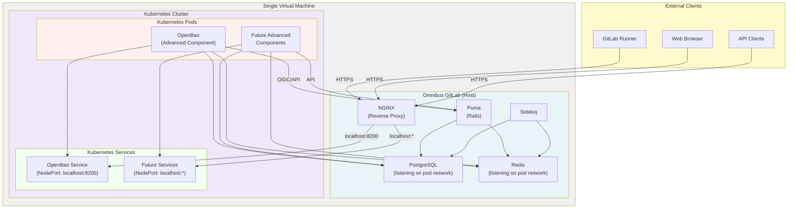

<!--
Document statuses you can use:

- "proposed"
- "accepted"
- "ongoing"
- "implemented"
- "postponed"
- "rejected"

-->

<!-- Design Documents often contain forward-looking statements -->
<!-- vale gitlab.FutureTense = NO -->



## Summary

Omnibus-Adjacent Kubernetes (OAK) is a transitional architecture designed to bridge the gap between traditional Omnibus GitLab deployments and cloud-native GitLab. It enables self-managed customers to run GitLab Omnibus alongside a lightweight Kubernetes distribution on the same virtual machine, allowing them to leverage cloud-native components (such as OpenBao for secrets management) without requiring a full cloud-native deployment.

This design document captures the findings from our discovery phase, where we successfully validated that three lightweight Kubernetes distributions—k3s, k0s, and microk8s—can be integrated with Omnibus GitLab on a single node. We demonstrated end-to-end functionality by deploying OpenBao (a secrets management solution) on Kubernetes and integrating it with Omnibus GitLab's secrets manager feature.

OAK serves as a stepping stone for the [Segmentation proposal](../selfmanaged_segmentation/_index.md), enabling Early Self-Managed customers to adopt advanced features that require cloud-native components while maintaining the operational simplicity of Omnibus.

## Motivation

### Problem Statement

GitLab's product roadmap includes advanced features (such as native secrets management) that are architected for cloud-native deployments. However, many self-managed customers are not ready to migrate to a full cloud-native setup due to operational complexity, cost, or infrastructure constraints. This creates a gap where customers cannot access these advanced features without a complete architectural overhaul.

Additionally, the Segmentation proposal requires a transitional offering for Early Self-Managed Advanced component tier customers. OAK provides this transition path by allowing customers to run both Omnibus and Kubernetes on the same infrastructure, enabling them to adopt cloud-native components incrementally.

### Goals

- **Enable advanced features for self-managed customers**: Allow customers to use cloud-native GitLab features (like secrets management) without requiring a full cloud-native deployment.
- **Provide a clear transition path**: Establish OAK as a stepping stone toward eventual cloud-native adoption, reducing friction for customers considering migration. Omnibus core components could also run in OAK before a final migration to a cloud provider.
- **Establish operational patterns**: Document proven patterns for service interconnection, network configuration, and deployment procedures that can guide future implementations.
- **Support Segmentation proposal**: Enable the Early Self-Managed Advanced tier offering by providing a viable deployment architecture for Omnibus users that don't want to do a full cloud-native deployment.

## Decisions

- [ADR-001: Don't package or bless any kubernetes distributions](./decisions/001_dont_package_or_bless_kubernetes_distros.md)
- [ADR-002: OAK Testing and Integration Ownership](./decisions/002_oak_testing_and_integration_ownership.md)

## Proposal

### Architecture Overview

OAK consists of the following components:

1. **Omnibus GitLab**: Running on the host VM, providing the core GitLab application, PostgreSQL, Redis, and other services.
2. **Lightweight Kubernetes Distribution**: Running on the same VM, providing a container orchestration platform for cloud-native components.
    - Deployed by the user.
3. **Cloud-Native Components**: Services like OpenBao deployed on Kubernetes, integrated with Omnibus through well-defined APIs.
4. **Network Isolation**: Network policies and kube-proxy configuration to ensure Kubernetes services are only accessible from the host (localhost), preventing external access.

### Validated Kubernetes Distributions

Based on our discovery work, we have validated that 3 small kubernetes
distributions work for this purpose: `k0s`, `k3s`, and `microk8s`.

For more details on the finding for each for them, refer to the [OAK milestone 1 epic](https://gitlab.com/groups/gitlab-com/gl-infra/software-delivery/-/work_items/30).

### Service Interconnection Pattern

Our discovery work established a proven pattern for integrating Kubernetes services with Omnibus. When
adding Omnibus automation, we should consider these patterns:

1. **PostgreSQL Exposure**: Configure Omnibus PostgreSQL to listen on the Kubernetes pod network interface (for example, CNI bridge IP), allowing Kubernetes pods to connect using credentials.
   - Different kubernetes distributions provide different network interfaces. `microK8s` supports VXLAN , while `k3s` and `k0s` deploys a bridge. They use different IPs, so the user needs to inform Omnibus about those.
2. **Service Access**: Kubernetes services should be exposed through NodePort, bound to localhost only by using kube-proxy configuration. We're initially avoiding a LoadBalancer setup, as this would require more resources from a single node VM. 
3. **NGINX Reverse Proxy**: Omnibus NGINX acts as a reverse proxy, forwarding external requests to Kubernetes services on localhost.
4. **Authentication**: Services like OpenBao use OIDC/JWT authentication with GitLab as the identity provider.

### Network Security Model

- **Kubernetes services are isolated to localhost**: NodePort services are configured to listen only on `127.0.0.1`, preventing external access directly to Kubernetes services.
- **Omnibus acts as the gateway**: All external traffic to Kubernetes services flows through Omnibus NGINX, which can apply additional security controls. Omnibus automation needs to be implemented to provide automatic NGINX configuration.
- **Pod-to-host communication**: Kubernetes pods can communicate with Omnibus services (PostgreSQL, Redis) through the pod network interface.
- **No external Kubernetes API exposure**: The Kubernetes API server is not exposed externally; management is done locally on the VM.
- **TLS**: To support external communication to the advanced components, imagine possibly a runner trying to talk directly to OpenBao, we need to support some level of TLS. This can be achieved by configuring Omnibus NGINX SSL offloading. We should also consider our Let's Encrypt certificate generation the same way [we have for core components](https://docs.gitlab.com/omnibus/settings/ssl).

## Beta Implementation Proposal

Based on discussions with the team, the following represents a proposed Beta implementation of OAK. This Beta phase focuses on establishing a minimal viable product that enables single-node customers to adopt advanced components while intentionally introducing some friction to encourage eventual migration to cloud-native architectures.

### Beta Goals

- **Enable advanced component adoption**: Allow single-node Omnibus customers to deploy and use advanced cloud-native components (e.g., OpenBao for secrets management).
- **Establish operational patterns**: Validate the service interconnection patterns and deployment workflows with real customers.
- **Gather customer feedback**: Understand customer pain points and preferences for automation levels.

### Beta Scope: What's Included

#### 1. Omnibus Automation

Omnibus will provide **limited, focused automation** for OAK setup:

- **NGINX configuration generation**: Omnibus automatically generates NGINX reverse proxy configurations for exposed Kubernetes services (e.g., OpenBao). This is the highest-value automation that reduces the most common source of configuration errors.
- **PostgreSQL network exposure**: When OAK is enabled, Omnibus automatically configures PostgreSQL to listen on the Kubernetes pod network interface (determined by the user-provided network IP). This enables Kubernetes components to access the database without manual configuration.
- **Helm values generation**: Omnibus generates pre-configured Helm values files for advanced components, including:
  - Database connection details (host, port, credentials)
  - Service node port assignments
  - GitLab integration endpoints (for bi-directional communication)
  - Network configuration details

#### 2. Deployment Workflow (Ordered Steps)

The Beta implementation follows a deliberate three-step workflow that introduces minimal friction while maintaining clear separation of concerns:

**Step 1: User installs Kubernetes**

- User selects and installs a lightweight Kubernetes distribution (k3s, k0s, or microk8s) on the same VM as Omnibus.
- User provides the Kubernetes pod network IP/CIDR to Omnibus (e.g., `10.42.0.0/16` for k3s).
- This step is intentionally manual because our ADR 001 informs that we won't be Kubernetes distributors.

**Step 2: User reconfigures Omnibus**

- User runs `omnibus-ctl reconfigure` with OAK enabled and the Kubernetes network information.
- Omnibus performs the following automatically:
  - Configures PostgreSQL to listen on the Kubernetes pod network interface
  - Configures Redis to listen on the Kubernetes pod network interface (if needed by advanced components)
  - Generates NGINX configuration files for each advanced component
  - Generates Helm values files for each advanced component
- Omnibus outputs the generated Helm values files to a well-known location (e.g., `/etc/gitlab/oak/helm-values/`).

**Step 3: User installs Helm charts manually**

- User manually installs Helm charts using the generated values files.
- Example: `helm install openbao gitlab/openbao -f /etc/gitlab/oak/helm-values/openbao.yaml`
- This step is intentionally manual to:
  - Ensure users learn Helm basics (required for eventual cloud-native migration)
  - Maintain clear separation between Omnibus and Kubernetes management
  - Initially, avoid creating implicit support contracts for Helm automation. To be considered for future automation.

#### 3. Service Interconnection in Beta

For Beta, service interconnection follows these patterns:

- **PostgreSQL access**: Kubernetes pods access Omnibus PostgreSQL using the pod network IP and standard PostgreSQL credentials. Omnibus exposes PostgreSQL on the pod network interface when OAK is enabled.
- **Redis access**: Similar to PostgreSQL, Redis is exposed on the pod network interface when needed.
- **External service access**: Kubernetes services are exposed through NodePort (bound to localhost only) and accessed by Omnibus NGINX, which acts as the reverse proxy for external traffic.
- **Bi-directional communication**: For components like OpenBao that need to communicate back to GitLab (e.g., for OIDC), Omnibus provides the GitLab endpoint URL in the generated Helm values.

##### Architecture Diagram

**Key architectural points:**

- **Single VM**: Both Omnibus and Kubernetes run on the same virtual machine
- **Network isolation**: Kubernetes services are bound to localhost only, preventing direct external access
- **NGINX gateway**: All external traffic to Kubernetes services flows through Omnibus NGINX
- **Pod network access**: Kubernetes pods can access Omnibus PostgreSQL and Redis via the pod network interface
- **Bi-directional communication**: Advanced components can communicate back to GitLab (Puma) for authentication and API calls

#### 4. NGINX Configuration

Omnibus generates NGINX configuration files that:

- Expose Kubernetes services on specific ports or subdomains (e.g., `openbao.gitlab.example.com` or `gitlab.example.com:8200`).
- Forward traffic to the Kubernetes service on localhost using the NodePort.
- Support TLS termination using existing Omnibus SSL certificate management.
- Are placed in a dedicated directory (e.g., `/etc/gitlab/nginx/conf.d/oak-services.conf`) for easy management.

Users can customize these configurations if needed, but Omnibus provides sensible defaults.

#### 5. Helm Values Generation

Omnibus generates Helm values files that include:

- **Database configuration**: Host, port, username, password for PostgreSQL/Redis access.
- **Service configuration**: NodePort assignments, service type (NodePort), and any required node selectors.
- **GitLab integration**: GitLab endpoint URL, authentication tokens, and other integration details.
- **Network configuration**: Pod network CIDR, any required network policies.

These values files are generated based on:

- The Kubernetes network information provided by the user
- The advanced component's requirements (determined by the component team)
- Omnibus configuration and secrets

#### 6. Documentation and Support

Beta documentation includes:

- **Step-by-step guides**: For each advanced component on how to enabled them using OAK.
- **Troubleshooting guides**: Common issues and how to debug them.
- **Architecture diagrams**: Showing the service interconnection patterns.
- **Helm chart documentation**: Links to official Helm chart documentation for each advanced component.

#### 7. Object Storage Requirements

Advanced components deployed in OAK may have different storage requirements:

- **Stateless components** (e.g., OpenBao): These components store state in external databases (PostgreSQL, Redis) provided by Omnibus. No additional object storage is required.
- **Stateful components requiring disk**: Any advanced component that requires persistent disk storage (beyond what can be stored in PostgreSQL/Redis) must use object storage. Omnibus administrators deploying such components must migrate to object storage for all data that would otherwise be stored on local disk.

**Key principle**: Kubernetes components should not rely on local disk storage. Instead, they should either:

1. Store state in Omnibus-provided or PostgreSQL or Redis
2. Use object storage (S3-compatible, GCS, Azure Blob Storage, etc.) for file-based data

This ensures that components can be properly scaled, backed up, and migrated in the future. Omnibus administrators should plan for object storage adoption as they deploy advanced components that require persistent data storage beyond databases.

### Beta Scope: What's NOT Included

The following are explicitly deferred from Beta and will be addressed in future phases:

- **Automatic Helm installation**: Omnibus does not automatically run `helm install` commands. Users must do this manually.
- **Multi-node Kubernetes clusters**: Beta focuses on single-node Kubernetes clusters only. Multi-node Kubernetes clusters (for high availability and zero-downtime upgrades) are deferred to future phases.
- **Multi-node Omnibus deployments**: Beta focuses on single-node Omnibus deployments. Multi-node Omnibus with OAK is deferred to future phases and requires significant design work around how Helm values are distributed across multiple Omnibus nodes.
- **Zero-downtime upgrades**: Not supported/validated in Beta; upgrades require downtime.
- **Air-gapped deployments**: Not supported/validated in Beta; internet access is required.
- **Automatic service discovery**: Service addresses are statically configured via `gitlab.rb` values.
- **Separate VM support**: Kubernetes must run on the same VM as Omnibus in Beta. In the future, we'll validate the scenario of Kubernetes running on a separate VM. This requires network configuration by the network admin.
- **Mutual TLS**: Not implemented in Beta; components communicate over localhost without mTLS. This will be required when Kubernetes is on a separate node.
- **Kubernetes tool distribution**: Users must install Helm, kubectl, and other tools themselves.

### Beta Success Criteria

The Beta phase is considered successful when:

1. **Functionality**: Single-node customers can successfully deploy and use at least one advanced component (OpenBao) with OAK.
2. **Documentation**: The following documentation artifacts are created and published:
   - **Runbook**: Step-by-step deployment guide for OAK with OpenBao (covering k3s, k0s, and microk8s)
   - **Troubleshooting guide**: Common issues, error messages, and resolution steps
   - **Recorded demo**: Video walkthrough showing end-to-end installation (Kubernetes distribution → Omnibus → OpenBao)
3. **Customer feedback**: We have feedback from at least 2-5 beta customers on the setup experience and automation level.
4. **Operational patterns**: The service interconnection patterns are validated and documented.
5. **Support readiness**: Support team has access to:
   - Runbook and troubleshooting guides
   - Recorded demo for reference
   - Two AMA (Ask Me Anything) sessions scheduled during Beta to address customer questions. Be open to more AMAs on-demand.
6. **Security review**: AppSec has reviewed the architecture and implementation.

### Transition from Beta to GA

The transition from Beta to GA will include:

- **Automation expansion**: Based on customer feedback, we may expand Omnibus automation (e.g., automatic Helm installation).
- **Multi-node support**: Validate/Implement support for Kubernetes running on a separate VM/multi-node Kubernetes clusters.
- **Zero-downtime upgrades**: Validate zero-downtime upgrade procedures.
- **Air-gapped support**: Implement comprehensive air-gapped deployment support. There needs to be a definition of what/how we want to support it.
- **Tool distribution**: Determine and implement distribution of Kubernetes related tools.
- **FIPS compliance**: Evaluate and implement FIPS compliance if required.

### Rationale for Beta Approach

The Beta approach balances several competing concerns:

- **Customer experience**: Omnibus automation for NGINX and Helm values generation significantly reduces setup complexity compared to fully manual configuration.
- **Maintenance burden**: By keeping Helm installation manual, we avoid creating a complex automation system that would require ongoing maintenance.
- **Learning opportunity**: Requiring manual Helm installation ensures customers learn Kubernetes fundamentals, preparing them for eventual cloud-native migration.
- **Clear boundaries**: Separating Omnibus and Kubernetes management maintains clear operational boundaries and reduces support surface area.
- **Feedback gathering**: The manual steps provide natural points where customers can provide feedback on what automation would be most valuable.

## Next Steps

### Immediate Actions (Design Document Phase)

1. **Stakeholder alignment**: Present this design document to technical leaders, product managers, and engineering managers to align on the open questions.
2. **Decision documentation**: Document decisions made on new ADRs for each open question and update this design document accordingly. Can/should be done in subsequent follow-up MRs. This will help us to split the work and provide a cleaner focused discussion on each topic.
3. **Detailed requirements**: Based on decisions, create detailed requirements for the implementation phase.
4. **Architecture refinement**: Refine the architecture based on stakeholder feedback and decisions.

### Implementation Phase (Following Design Document Approval)

1. **Omnibus automation**: Implement Omnibus configuration and automation for OAK setup as described in the Beta proposal.
2. **Helm values generation**: Implement the Helm values generation system for advanced components.
3. **NGINX configuration**: Implement automatic NGINX configuration generation.
4. **Documentation**: Extend OpenBao documenation to guide users on how to deploy it with OAK.
5. **Testing and validation**: Have a CI pipeline automated test. 
6. **Security review**: AppSec review of the architecture and implementation.
7. **Beta release**: Release OAK as a beta feature for early adopters.

### Open Questions & Design Decisions Needed for future iterations

These should be addressed through technical discussions with stakeholders and documented in subsequent iterations of this design document.

#### 1. Air-Gapped Deployment Support

**Question**: Should we support air-gapped deployments where VMs have no internet access?

**Options**:

- **No air-gapped support**: Require internet access for pulling container images and Helm charts.
- **Partial air-gapped support**: Provide tooling to pre-download and bundle artifacts, but require manual setup.
- **Full air-gapped support**: Provide comprehensive tooling and documentation for completely air-gapped deployments.

**Impact**: Air-gapped support significantly increases complexity and requires additional tooling (skopeo, artifact bundling, etc.).

**Related findings**: All three distributions have documented air-gapped installation procedures, but we haven't tested them in our discovery phase.

**Additional consideration**: Air-gapped deployments require careful design of delivery patterns for distributing container images, Helm charts, and Kubernetes tools. This includes evaluating approaches such as OCI bundles embedded within system packages, which would enable customers to deploy advanced components without external internet access. This design work is deferred to a future phase.

#### 2. Supported Kubernetes Architecture

**Question**: What Kubernetes architectures should we support?

**Options**:

- **Single-node only**: Only support single-node clusters on a single VM (current discovery scope).
- **Single-node with multi-VM option**: Support single-node clusters, but allow them to run on separate VMs from Omnibus.
- **Multi-node clusters**: Support multi-node Kubernetes clusters for high availability and zero-downtime upgrades.

**Impact**: Multi-node support enables zero-downtime upgrades and higher availability but significantly increases operational complexity and resource requirements.

**Related findings**: All three distributions support multi-node deployments, but we've only tested single-node configurations. Zero-downtime upgrades require multi-node setups with proper pod draining.
OAK is not limited to these distributions in the future. Discovery was limited to these, as we already know PaaS providers work well.

#### 3. FIPS Compliance

**Question**: What level of FIPS compliance is required for OAK deployments?

**Options**:

- **No FIPS requirement**: OAK deployments don't need to be FIPS-compliant.
- **Partial FIPS**: Omnibus components are FIPS-compliant, but Kubernetes components are not required to be.
- **Full FIPS**: All components (Omnibus and Kubernetes) must be FIPS-compliant.

**Impact**: FIPS compliance may require specific Kubernetes distributions or configurations and could limit available options.

**Related findings**: We haven't evaluated FIPS compliance for any of the three distributions in our discovery phase.

#### 4. Zero-Downtime Upgrades

**Question**: Should OAK support zero-downtime upgrades for both Omnibus and Kubernetes components?

**Options**:

- **No zero-downtime support**: Upgrades require downtime.
- **Omnibus only**: Support zero-downtime upgrades for Omnibus, but not Kubernetes.
- **Both components**: Support zero-downtime upgrades for both Omnibus and Kubernetes.

**Impact**: Zero-downtime upgrades require multi-node Kubernetes clusters and sophisticated orchestration, significantly increasing complexity.

**Related findings**: k0s and microk8s have documented upgrade procedures; k0s supports `k0sctl` for orchestrated upgrades. All require multi-node setups for true zero-downtime.

#### 5. Distribution of Tools and Artifacts

**Question**: How should we distribute Kubernetes tools (kubectl, helm, skopeo, cosign) and container images?

**Options**:

- **No distribution**: Customers install tools themselves.
- **Omnibus packages**: Include tools directly in Omnibus packages.
- **OCI bundles**: Distribute tools and images as OCI artifacts with supplemental packages.
- **Hybrid approach**: Distribute some tools with Omnibus, others with OCI bundles.

**Impact**: This decision affects package size, update frequency, and customer experience. Requires coordination with the Build group.

**Related findings**: Our discovery work used externally installed tools (helm, kubectl). We haven't tested bundling approaches.

#### 6. Should we implement helm automation

**Question**: Should Omnibus install the charts automatically?

**Options**:

- **No**: Omnibus provides documentation and examples; customers deploy charts manually.
- **Yes with Helm**: Omnibus automatically deploy charts with Helm.
- **Yes with Helmfile**: We use Helmfile to automate installing chart and chart dependencies.

**Impact**: Higher automation improves user experience, but increases Omnibus complexity and maintenance burden.

#### 7. Monitoring and Logging

**Question**: How should customers monitor and collect logs from advanced components running in OAK?

**Current State**: Omnibus provides Prometheus metrics and logging capabilities for core GitLab components. Since both Omnibus and Kubernetes run on the same VM, the existing Omnibus Prometheus instance could potentially scrape metrics from Kubernetes components running on localhost or the pod network.

**Considerations**:

- **Metrics export**: Advanced components running in Kubernetes may expose Prometheus metrics on localhost ports or the pod network. The Omnibus Prometheus instance could be configured to scrape these metrics directly, providing unified metrics collection.
- **Omnibus Prometheus as aggregator**: Leveraging the existing Omnibus Prometheus infrastructure reduces the need for customers to set up separate monitoring solutions.
- **Log aggregation**: Kubernetes components generate logs that need to be collected and aggregated alongside Omnibus logs. Customers may use solutions like ELK, Loki, or other log aggregation tools.
- **Observability gap**: Currently, there is no documented or supported approach for customers to monitor and log OAK components. This creates an observability gap that could impact customer experience and troubleshooting.

**Options**:

- **No monitoring support**: Monitoring and logging are customer responsibility. Document that customers must implement their own monitoring solution for Kubernetes components.
- **Basic monitoring guidance**: Provide documentation on how to configure Omnibus Prometheus to scrape metrics from Kubernetes components on localhost/pod network. This leverages existing infrastructure without requiring new automation.
- **Omnibus Prometheus integration**: Implement automation to configure Omnibus Prometheus to automatically discover and scrape metrics from advanced components. Omnibus would generate Prometheus scrape configurations for each deployed component.
- **Full monitoring integration**: Implement tooling to automatically export metrics and logs from Kubernetes components to Omnibus monitoring infrastructure, including log aggregation.

**Impact**: 

- **No support**: Customers must implement their own monitoring, creating operational overhead.
- **Basic guidance**: Reduces friction by leveraging existing Omnibus Prometheus, but requires manual configuration.
- **Omnibus Prometheus integration**: Provides unified metrics collection with minimal customer effort, but requires Omnibus automation to discover and configure scrape targets.
- **Full integration**: Most user-friendly but adds significant complexity and maintenance burden.

**Recommendation for Beta**: During the Beta phase, experiment with monitoring options.

#### 8. Multi-Node Scenarios (PoC Opportunity)

**Question**: How should OAK support multi-node deployments, and what should we validate in a PoC?

**Current State**: Beta focuses on single-node Omnibus with single-node Kubernetes. However, there are two distinct multi-node scenarios that require different approaches:

**Scenario 1: Multi-node Omnibus + Single-node Kubernetes**

- Omnibus runs on multiple VMs (e.g., separate Rails, PostgreSQL, Redis nodes)
- Kubernetes runs on a separate VM
- **Challenge**: Helm values generation becomes complex. Which Omnibus node is authoritative for connection details? How do we distribute configuration across multiple nodes?
- **Options**:
  - Designate one node (e.g., Rails) as authoritative for all configuration
  - Use shared storage (Object Storage, shared filesystem) for configuration distribution
  - Each node generates its own values, users aggregate them

**Scenario 2: Single-node Omnibus + Multi-node Kubernetes**

- Omnibus runs on a single VM
- Kubernetes runs on multiple nodes (for high availability and zero-downtime upgrades)
- **Challenge**: Minimal - Omnibus doesn't need to change. Kubernetes handles its own multi-node orchestration.
- **Opportunity**: Validate that multi-node Kubernetes works without additional Omnibus automation. This could enable zero-downtime upgrades for advanced components.

**Recommendation for Future**: 

- **Scenario 2 (Single Omnibus + Multi-node K8s)**: Validate in a PoC to understand if there are unexpected limitations. This is lower-risk and could enable zero-downtime upgrades.
- **Scenario 1 (Multi-node Omnibus + Single K8s)**: Requires significant design work on configuration distribution. Defer to GA phase with clear design decisions on how to handle multiple authoritative sources.

#### 9. Resource Requirements and Sizing

**Question**: Do we want to provide some sort of Reference Architecture or minimum requirements guidelines?

Providing such recommendation can incur a considerable maintenance burden. Some Kubernetes distribution performed
very differently than others. For example, `microk8s` was the only one which experienced problems on a 16 GB RAM machine
with OpenBao connected to Omnibus.

## References

- [Parent Epic: Omnibus Adjacent Kubernetes (OAK) - Operate Implementation](https://gitlab.com/groups/gitlab-com/gl-infra/software-delivery/-/work_items/22)
- [Completed Discovery Phase: Milestone 1](https://gitlab.com/groups/gitlab-com/gl-infra/software-delivery/-/work_items/30)
  - [k3s Discovery Issue](https://gitlab.com/gitlab-org/omnibus-gitlab/-/work_items/9525)
    - [k3s Documentation](https://docs.k3s.io/)
  - [k0s Discovery Issue](https://gitlab.com/gitlab-org/omnibus-gitlab/-/work_items/9526)
    - [k0s Documentation](https://docs.k0sproject.io/)
  - [microk8s Discovery Issue](https://gitlab.com/gitlab-org/omnibus-gitlab/-/work_items/9527)
    - [microk8s Documentation](https://canonical.com/microk8s)
- [Design Document Phase Epic](https://gitlab.com/groups/gitlab-com/gl-infra/software-delivery/-/work_items/33)
- [GitLab Segmentation Proposal](../selfmanaged_segmentation/_index.md)
