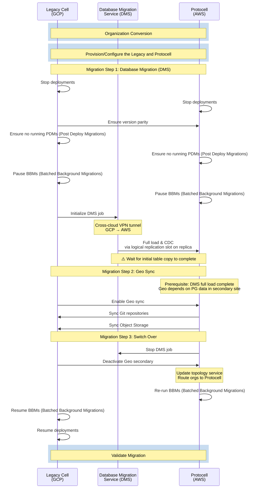

## Summary

Cohort 0 represents the initial migration of 100 Top Level Groups (TLGs) from the Legacy Cell to the Protocell. First, 100 TLGs will be converted to Organizations (1:1 mapping), then these Organizations will be migrated to the Protocell.
This cohort serves as the foundation for establishing and validating the migration patterns that will be used for subsequent cohorts.

**Note**: Since Cohort 0 contains only test accounts and test users, there is no rollback plan or plan to switch back to the legacy cell. The migration is designed as a forward-only, repeatable process that can be tested multiple times (provision, migrate, destroy). Rollback strategies will be evaluated in later cohorts with production data.

## Migration Process

## Migration Phases

### Preparation Step 1: Organization Conversion (well in advance of the migration)

This step converts the selected Top Level Groups to Organizations, enabling organization-scoped migration capabilities. We will convert 100 newly created test TLGs to 100 Organizations with a 1:1 mapping.

Steps:

1. **Convert 100 TLGs to 100 Organizations (1:1 mapping)** - For details on the Organization conversion process, see [../organization/_index.md](../organization/_index.md)

### Preparation Step 2: Protocell Provisioning and Configuration (well in advance of the migration)

This step provisions the Protocell and configures Geo on both cells for the migration. This is completed well before the migration window.

1. **Configure DDL lock date range** in [`database_upgrade_ddl_lock.yml`](https://gitlab.com/gitlab-org/gitlab/blob/22cc389a054b0920a6182f2a58b242f97fa6f948/config/database_upgrade_ddl_lock.yml) to prevent DDL statements during the migration window

**Protocell:**

1. **Provision the protocell** with Geo (Geo tracking DB and DMS)
1. **Configure DMS filter queries** for the organizations being transferred
1. **Configure protocell node name**: Ensure that `gitlab_rails['geo_node_name'] = '<site_name_here>'` in `gitlab.yml`
1. **Configure db_key_base**: Ensure that `db_key_base` is configured on the protocell and set to the same value as the legacy cell
1. **Set protocell feature flags**:
   - `geo_selective_sync_by_organizations`
   - `org_migration_target_cell`

**Legacy Cell:**

1. **Set legacy cell feature flag**: `geo_selective_sync_by_organizations`
1. **Enable metrics worker and checksumming** in production [with feature flags](https://gitlab.com/groups/gitlab-org/-/work_items/16643)
1. **Provision replicas for main, CI, and sec databases** to support the migration process
1. **Create logical replication slot on a dedicated database replica** (not primary). This replica will not be used for load balancing or receive production traffic, but will be dedicated for DMS replication
1. **Add secondary site** (via API or admin), but do not yet enable Geo sync
1. **Add organization list** (via API or admin), but do not yet enable Geo sync

### Migration Step 1: Database Migration (DMS) (migration window)

Uses AWS Database Migration Service (DMS) to transfer PostgreSQL data from the Legacy Cell to the Protocell.
This migration happens over a cross-cloud VPN connection between GCP (Legacy Cell) and AWS (Protocell).

Steps:

1. **Stop automatic deployments** on both legacy and protocell
1. **Ensure version parity**: Verify both cells are at the same application version, deploy if necessary so they match
1. **Ensure no outstanding Post Deploy Migrations (PDMs)** on both cells
1. **Pause Batched Background Migrations (BBMs)** on both cells
1. **Initialize the DMS job** that will start to sync the database from the legacy to the protocell DB
1. **Monitor DMS dashboard** for job status and errors
1. **Wait for DMS initial table copy to complete** before proceeding to Migration Step 2

Key aspects:

- Organization-level filtering for selective migration
- Migrates 3x database clusters (main, ci, sec) - these DBs are consumed by the Rails monolith
- Full load (includes filtering) and ongoing replication (CDC) using logical replication slot on a replica
- Cross-cloud VPN provides secure encrypted tunnel (GCP HA VPN → AWS Transit Gateway)
- Target throughput: 6-9 MB/s
- Parallel table loading (16 tables simultaneously)
- Data is copied through the migration process
- **The initial table copy must complete before Geo sync can begin in Migration Step 2**

For detailed information on the DMS migration strategy, see the DMS blueprint (to be documented)

### Migration Step 2: Geo Sync (migration window)

Leverages the [Geo feature](https://docs.gitlab.com/administration/geo/) to selectively sync Git repositories and Object Storage data to the Protocell.

Steps:

1. **Verify Migration Step 1 DMS initial table copy is complete**
1. **Enable Geo sync** for the site that was added previously on the legacy cell
1. **Monitor Geo dashboard** for status and errors
1. **Resolve all checksumming failures** on legacy cell. Reference: [Geo Synchronization and Verification Troubleshooting](https://docs.gitlab.com/administration/geo/replication/troubleshooting/synchronization_verification)

Key aspects:

- Git repository data synchronized to Protocell
- Object Storage (uploads, artifacts, etc.) synchronized to Protocell
- Incremental sync continues until cutover
- **Note**: Container Registry is out of scope for Cohort 0. Test organizations should not upload any container registry images.

### Migration Step 3: Switch Over (migration window)

Final steps to complete the migration and route traffic to the Protocell.

Steps:

1. **Stop the DMS job** to replicate PG data on the protocell
1. **Deactivate the Geo secondary** to stop Geo replication (via legacy cell admin interface or API)
1. **Update topology service** org mapping so the transferred organizations are routed to the protocell
1. **Re-run Batched Background Migrations (BBMs)** on the protocell
1. **Resume BBMs** on the legacy cell
1. **Resume deployments** on the legacy cell

### Validation

Verify the migration was successful.

Steps:

1. **Manual testing of the test organizations**: Git repository access and project features, uploads, exports, etc.
1. **Account access and login**: Validate routing

## Monitoring

### PostgreSQL Data Replication (DMS)

AWS DMS provides monitoring capabilities through CloudWatch. We will update the [GitLab Dedicated Instrumentor CloudWatch exporter configuration](https://gitlab.com/gitlab-com/gl-infra/gitlab-dedicated/instrumentor/-/blob/main/aws/jsonnet/kube-stack-chart-mixins/cloudwatch-exporter.libsonnet?ref_type=heads) to make these metrics available in the tenant Grafana instance and create dashboards with them:

- **Replication Metrics**:
  - `CDCLatencySource`: Lag between source and replication (seconds)
  - `CDCLatencyTarget`: Lag between replication and target (seconds)
  - `FullLoadThroughputBandwidthTarget`: Data transfer throughput (KB/s)
  - `FullLoadThroughputRowsTarget`: Row transfer rate (rows/s)
- **Task Metrics**:
  - Task state and progress
  - Table statistics (loaded, loading, queued, errored)
  - Replication slot lag (for logical replication)

### Git & Object Storage Replication (Geo)

Geo provides comprehensive monitoring through multiple interfaces:

#### Admin UI Dashboard

- Primary site's Admin area (Admin > Geo > Sites)
- Real-time synchronization status
- Per-organization replication progress

#### Geo Dashboard (Grafana)

We will create a Geo dashboard using Prometheus metrics:

- **General Geo Metrics**:
  - `geo_cursor_last_event_id`: Last processed event log ID
  - `geo_cursor_last_event_timestamp`: Last processed event timestamp
  - `geo_db_replication_lag_seconds`: Database replication lag
- **Per-Data-Type Metrics** (e.g., `project_repositories`, `lfs_objects`):
  - `geo_<type>`: Total count on primary
  - `geo_<type>_synced`: Successfully synced count
  - `geo_<type>_failed`: Failed sync count
  - `geo_<type>_verified`: Successfully verified count

## Success Criteria

Cohort 0 is considered successful when:

1. All 100 TLGs are successfully converted to Organizations
2. All Git repositories and Object Storage data for Cohort 0 organizations are synchronized to the Protocell
3. All PostgreSQL data for Cohort 0 organizations is migrated with zero data loss
4. Data integrity validation passes (row counts, checksums)
5. All Batched Background Migrations complete successfully on the Protocell
6. Organizations are operational on the Protocell
7. Migration results are documented for future cohorts

## References

- [Organization Migration Overview](_index.md)
- [Organization Conversion Process](../organization/_index.md)
- DMS Migration Blueprint (to be documented)
