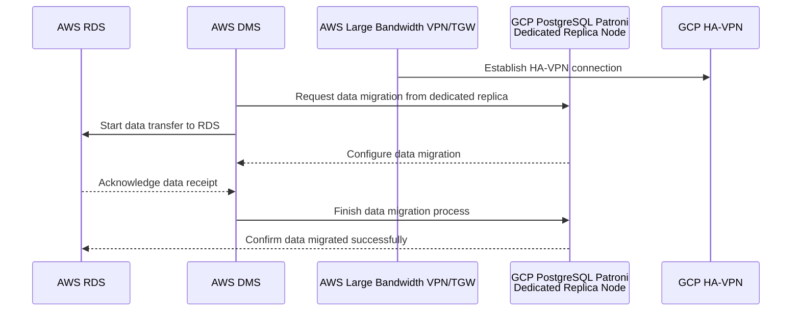
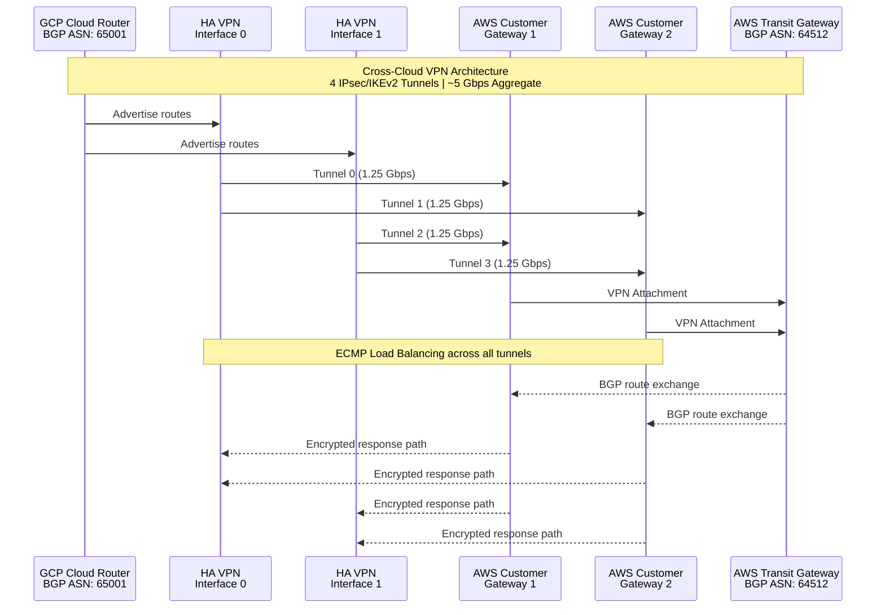
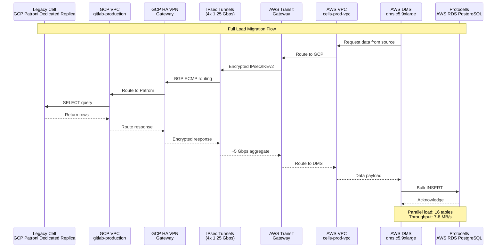

## Summary

This blueprint outlines the Cohort A strategy for migrating GitLab's organization data from our legacy cell in Google Cloud Platform (GCP) to our new cell architecture running on Amazon Web Services (AWS). We are moving PostgreSQL data from a dedicated replica node added to our GCP Patroni cluster to the Protocells (AWS RDS instance). The migration leverages AWS Database Migration Service (DMS). This is made possible by the cross-cloud VPN connectivity we've already established between GCP and AWS, which provides a secure encrypted tunnel for data transfer.

> [!note]
> **Replication Strategy:** We initially evaluated logical replication slots on a [standby replica](https://gitlab.com/gitlab-com/gl-infra/tenant-scale/tenant-services/team/-/work_items/351) but encountered `hot_standby` vacuum bloat concerns and limitations with DDL changes not being migrated (DMS cannot create audit tables on a replica). We then [explored logical replication configuration on the primary node](https://gitlab.com/gitlab-org/database-team/team-tasks/-/work_items/585), and based on that evaluation and follow-up analysis ([note](https://gitlab.com/gitlab-org/database-team/team-tasks/-/issues/585#note_3105418538)), we converged on using a dedicated Patroni standby replica for logical replication. Our current plan is to add a dedicated replica node to the existing Patroni cluster and configure logical replication slots on that replica for CDC, so that replication traffic and slot management are isolated from the production primary while still avoiding the `hot_standby` issues observed on shared replicas. As part of this approach, we do **not** rely on DDL replication via DMS; instead, we enforce a DDL freeze for the migrating organization(s) during the migration window while allowing DML writes to continue and be captured via logical replication.

This document serves as the foundational reference for our first cohort of organization data migration and establishes repeatable patterns that we can apply to subsequent cohorts. We are also evaluating alternative tools like Siphon for future migrations, but DMS is our chosen approach for Cohort A.

## Goals

Our primary objectives for this migration are:

- Successfully migrate PostgreSQL data from the dedicated GCP Patroni replica node to the AWS Protocells RDS instance
- Take advantage of the existing cross-cloud VPN infrastructure (specifically the GCP HA VPN connected to AWS Transit Gateway) to securely transfer data
- Achieve a consistent data transfer rate of approximately 6-9MB/s during the full load phase. This estimate is based on our POC results where we transferred 20GB in 2 hours (~2.78 MB/s) using a single VPN tunnel. With the upgrade to Large VPN with 4 tunnels (from 2 tunnels without ECMP load balancing), we estimate throughput to increase to 6-9 MB/s when accounting for all network hops and ECMP load balancing across tunnels.
- Create a repeatable and well-documented migration pattern that we can use for future cohort migrations
- Validate data integrity both before and after the migration to ensure no data loss or corruption

### Scope

This blueprint covers the following areas:

- How the cross-cloud network is structured (GCP HA VPN connecting to AWS Large VPN/Transit Gateway)
- How we configure AWS DMS to perform the migration
- How we prepare both the source database (dedicated GCP Patroni replica node) and target database (AWS RDS) for migration
- How we monitor the migration process, validate the results, and determine when migration is complete

### Out of Scope

This blueprint does not cover:

- Application-level changes needed for multi-cloud operation
- DNS cutover and how traffic gets routed to the new infrastructure
- Migration of non-PostgreSQL organization data stores

## Requirements

For this migration to succeed, we need to meet several key requirements:

**Network and Performance**: We need a minimum of 3-5 Gbps of sustained throughput between GCP and AWS to move data efficiently. The inter-cloud VPN infrastructure must be capable of handling this volume.

**Time Window**: We have a 12-18 hour window to complete the full load migration. This estimate is derived from [our POC results](https://gitlab.com/gitlab-com/gl-infra/tenant-scale/tenant-services/team/-/work_items/329#note_2986582882) and planned infrastructure upgrades:

- POC baseline: 20GB migrated in 2 hours using dms.c5.xlarge = 10GB/hour (~2.78 MB/s)
- Upgrading to dms.c5.9xlarge provides 12Gbps network baseline, but cross-cloud VPN is limited to ~5 Gbps (4 tunnels × 1.25 Gbps each)
- Expected improvement: ~3x throughput increase with dms.c5.9xlarge, yielding ~9 MB/s
- Additional optimization: Increasing MaxFullLoadSubTasks from default 8 to 16 enables loading 16 tables simultaneously instead of 8, further reducing migration time
- Combined optimizations should allow completing the migration within the 12-18 hour window

**Data Integrity**: Every row of data must be accurately transferred. We'll validate that checksums match between source and target to ensure nothing was corrupted or lost during transfer.

**Source Isolation**: The migration must read from a dedicated replica node added to the Patroni cluster, never from the production primary or existing replicas serving live traffic. This dedicated replica node ensures we don't impact live traffic while providing a consistent data source. The DBRE team has advised against using the production primary due to performance and saturation concerns. This replica is where we configure logical replication slots for CDC.

**DDL Freeze for Migrating Organizations**: During the full-load + CDC migration window, we enforce a DDL freeze (no schema changes) for the affected organization(s) on the source, while allowing DML writes to continue so they can be captured and replicated via logical replication.

**Concurrent Organization Transfer**: We need to determine how many organizations can be transferred concurrently per DMS task. Based on our [analysis](https://gitlab.slack.com/archives/C06TF40SAG4/p1769172175936049), we are still finalizing our strategy. The key constraints we need to define are the maximum number of orgs per DMS job and the maximum number of projects per org.

**Sharding keys**: In the context of organization data migration, there are four sharding key types we care about:

- `organizations` ID (there is exactly one per cohort)
- `namespaces` ID (1-unlimited per organization)
- `projects` ID (1-unlimited per namespace)
- `users` ID (1-unlimited per organization)

These keys drive how we segment data for migration filtering (for example, which projects and namespaces belong to a given organization) and how we reason about blast radius and concurrency limits.

Optimization strategies further include:

- Pre-migration staging with filter tables containing org/project IDs for batch selection
- Partitioned migrations using multiple smaller DMS tasks instead of one large filtered task
- Range-based filtering using `WHERE project_id BETWEEN x AND y` for sequential IDs instead of large IN clauses

These limits should be validated with realistic data volumes in testing before production migrations.

**Security**: All data crossing between clouds must be encrypted using VPN tunnels. No unencrypted data should traverse the internet.

**Monitoring**: We need real-time visibility into migration progress, throughput, and any errors that occur.

**Repeatability**: The process must be well-documented so we can repeat it for subsequent cohorts without reinventing the wheel.

## Non-Goals

We're explicitly not trying to achieve:

- Zero-downtime migration with Change Data Capture (not sure, but that _might be a_ future consideration)
- Bi-directional or ongoing replication between clouds
- Direct migration from the production primary database

---

## Architecture Overview

### Understanding the Migration Flow

Before diving into the technical diagrams, let's understand what happens during the migration at a high level. AWS DMS acts as the orchestrator. It connects to our dedicated GCP Patroni replica node through the VPN tunnel, reads data in parallel from multiple tables, and writes that data into our AWS RDS instance. The VPN provides the secure encrypted path for all this data to travel between clouds. DMS handles the complexity of reading from the source, transforming the data if needed, and writing to the target in an optimized way.

### High-Level Migration Architecture

This diagram shows the main components involved in the migration and how they communicate:



### Cross-Cloud VPN Architecture

Our network connectivity between GCP and AWS is built on a sophisticated VPN setup. Let me explain what's happening here: GCP's Cloud Router (which uses [BGP](https://en.wikipedia.org/wiki/Border_Gateway_Protocol) to manage routing) connects to AWS's Transit Gateway through four separate [IPsec](https://en.wikipedia.org/wiki/IPsec) tunnels. These tunnels are distributed across two HA VPN interfaces on the GCP side and two Customer Gateways on the AWS side. This redundancy means if one tunnel fails, traffic automatically reroutes through the others. BGP with ECMP (Equal-Cost Multi-Path) routing ensures that traffic is load-balanced across all four tunnels, giving us approximately 1.25 Gbps per tunnel for a total of 5 Gbps aggregate capacity.



**Key VPN Configuration Details:**

On the GCP side, we have an HA VPN Gateway with a Cloud Router that uses [BGP](https://en.wikipedia.org/wiki/Border_Gateway_Protocol) ASN 65001 to advertise routes. On the AWS side, we have a Transit Gateway with BGP ASN 64512 and two Customer Gateways for redundancy. The four tunnels provide high availability that is if one fails, the others continue operating. All traffic is encrypted using IKEv2 with AES-256-GCM, which is a strong encryption standard. BGP with ECMP automatically distributes traffic across all available tunnels, so we get the full 5 Gbps capacity.

### AWS DMS Migration Flow

This diagram shows the complete data path from the dedicated GCP Patroni replica node all the way to the AWS RDS instance. When DMS needs data, it sends a query through the VPN tunnel. The data comes back through the same encrypted tunnel and gets written to RDS. DMS can read from multiple tables in parallel (we're using 16 tables at a time) to maximize throughput and let traffic flow through multiple tunnels speeding up the overall migration. The entire dataset flows through this path, with DMS handling the orchestration and optimization.



---

## Design and Implementation Details

### Source Database: Dedicated Patroni Replica Node

We are not migrating directly from our production primary database or existing replicas serving live traffic. Instead, we add a dedicated replica node to the existing Patroni cluster specifically for migration purposes. This approach has several important benefits:

1. **Production Isolation**: The dedicated replica node is separate from the replicas serving production read traffic, ensuring migration I/O doesn't impact live systems
2. **Logical Replication Configuration**: We can configure logical replication on this dedicated replica without affecting the production primary or other replicas
3. **Flexibility**: The dedicated node can be sized appropriately for migration workloads and decommissioned after migration completes
4. **No Impact on Existing Infrastructure**: Adding a new replica to the Patroni cluster doesn't require changes to the primary or existing replicas

The dedicated replica node is added to the existing Patroni cluster and streams data from the primary like any other replica. It runs on a GCP VM with sufficient memory to handle the read workload from DMS. The storage is provisioned with SSD for optimal read performance, and it sits in a private network within the GCP VPC. Only the DMS migration user has access to this replica, and that user has read-only permissions. Once the migration cohort is complete, this dedicated replica can be removed from the cluster.

### Target Database: AWS Aurora PostgreSQL

Our target is an RDS PostgreSQL cluster running on AWS. RDS is a managed database service that provides high availability and automatic scaling. We still need to decide the instance class which should ideally give us plenty of compute and memory to handle the bulk inserts from DMS. RDS's storage auto-scales, so we don't need to pre-allocate all storage upfront. We have enabled Multi-AZ deployment for high availability, and the cluster sits in private subnets within our cells-prod-vpc.

### DMS Task Configuration

The DMS task is where we define how the migration should work. We are using a full-load migration type because this is a one-time copy with no ongoing replication. We configure DMS to load up to 16 tables in parallel, which maximizes throughput while staying within the resource limits of our DMS instance (a c5.9xlarge). For large objects (LOBs) like text fields, we use limited mode with a 64KB threshold since this balances performance with proper handling of large data. We enable batch apply, which groups multiple inserts together for better write performance. The target table preparation is set to DO_NOTHING because we pre-create the schema using pg_dump before the migration starts. Finally, we set the commit rate to 50,000 rows, which is optimized for bulk inserts.

**Data Filtering Strategy:**

DMS source filters allow us to selectively migrate specific organizations. Key considerations:

1. **Single task with multiple orgs vs. one task per org**: Using a single task with multiple organizations (via IN clause or multiple filter conditions) results in fewer tasks to manage, lower overhead on the replication instance, but creates a single point of failure which means that if the task fails, all orgs in that batch are affected. One task per org provides granular control with the ability to pause, resume, or retry individual orgs independently, but increases management overhead.

2. **Filter execution location**: Filters are applied at the source query level, not after data transfer. DMS adds a WHERE clause to the SELECT query, and if the filter criteria is selective enough to use an index, performance can be significantly faster than transferring all data.

3. **Query logic limitations**: There are edge cases where filtering might not be applied optimally, particularly with complex queries or certain data types. Range-based filtering (`WHERE project_id BETWEEN x AND y`) typically performs better than large IN clauses for sequential IDs.

4. **Example filter configuration**: For organization-based filtering, a task configuration might include:

```json
{
  "rules": [
    {
      "rule-type": "selection",
      "rule-id": "1",
      "rule-name": "org-filter",
      "object-locator": {
        "schema-name": "public",
        "table-name": "projects"
      },
      "rule-action": "include",
      "filters": [
        {
          "filter-type": "source",
          "column-name": "organization_id",
          "filter-conditions": [
            {
              "filter-operator": "ste",
              "value": "100"
            }
          ]
        }
      ]
    }
  ]
}
```

### Handling DDL During Migration

We intentionally avoid relying on DDL replication through DMS for this migration. While DMS can replicate some DDL statements, support is incomplete and can lead to inconsistent schema states on the target if unsupported or filtered DDL is applied mid-migration. Instead, we:

- Treat PostgreSQL data migration as full-load + CDC for DML only.
- Place the migrating organization(s) under a **DDL freeze** during the migration window (no `CREATE TABLE`, `ALTER TABLE`, `DROP TABLE`, or other schema changes that would affect the migrated objects).
- Continue to allow DML writes (INSERT/UPDATE/DELETE) for the migrating organization(s); these are captured via logical replication slots on the dedicated Patroni replica and applied to the target.

This approach reduces the blast radius of the migration, keeps schema evolution explicit and controlled, and aligns with the decision documented in the DDL/CDC discussion in [!17967](https://gitlab.com/gitlab-com/content-sites/handbook/-/merge_requests/17967#note_3106206581).

### Pre-Migration Checklist

Before we start the migration, we need to prepare both the source and target databases, as well as verify the network is ready. Below we distinguish between **automated** and **manual** steps.

**On the Source (Dedicated GCP Patroni Replica Node) - Mixed:**

Adding the dedicated replica node to the Patroni cluster is performed as close to the migration start time as practical. The replica streams data from the primary and stays in sync until we're ready to migrate. Next, we create a dedicated DMS migration user with SELECT permissions on all tables, this user should ideally have minimal privileges for security. If using logical replication, we configure the necessary replication slots on this dedicated replica. We verify that the DMS instance can actually reach the replica through the VPN tunnel by testing the connection. Finally, we document the row counts for all tables so we can validate that the same number of rows made it to the target.

**On the Target (AWS Protocells RDS) - Mixed:**

The RDS cluster is created via Terraform with the appropriate security groups and subnet configuration (automated). Before DMS starts writing data, we manually pre-create the schema using pg_dump with the -s flag (schema only) from the source database to ensure the table structure, indexes, and constraints are already in place. We disable foreign key constraints and triggers during the migration because they can slow down bulk inserts and cause errors if data arrives out of order. We create a DMS migration user with write permissions on all tables.

**Network Verification - Mixed:**

Cross-cloud VPN peering between GCP and AWS may require manual intervention or tweaking directly via the console. While we automate the majority of our infrastructure, there could be edge cases that need hands-on attention. Our setup uses GCP BGP dynamic routing (required for GCP HA VPN), which differs from static routing approaches. We are exploring whether the Dedicated team's IPSec VPN setup can be adapted for GCP, which would simplify cross-cloud peering in Instrumentor.

We verify that all four VPN tunnels are in the UP state. We check that BGP routes are being advertised correctly from both sides. We run iperf3 to test the actual bandwidth available. We are targeting 5 Gbps, _but actual bandwidth might come out to be around 3-5 Gbps._ Finally, we confirm that the DMS instance can reach both the source and target databases by testing connections.

---

## DMS Pre-Migration Assessment

- Get database size and per-table distribution
- Validate 5 Gbps bandwidth (GCP <> AWS)
- Test migration with 1-2 small tables to verify connectivity and throughput
- Confirm dedicated replica node has capacity for DMS read load
- Verify target schema pre-created, FK constraints and triggers disabled

---

## Validation Strategy

### During Migration

While the migration is running, we continuously monitor the DMS CloudWatch metrics to track progress. We watch the throughput (rows per second and MB per second) to ensure we're on track to complete within the 12-18 hour window. We monitor latency to detect any network issues. We watch for any table failures or errors that might indicate data corruption or connectivity issues. We set up CloudWatch alarms to alert us immediately if throughput drops below expected levels or if any errors occur.

To integrate DMS monitoring with our observability stack, we will need a CloudWatch exporter that ships metrics to Prometheus, enabling visualization via Grafana dashboards alongside our existing tenant monitoring. This may require custom tooling to bridge CloudWatch metrics into our observability platform.

We track which tables have completed and which are still in progress. If a table fails, DMS can usually restart from where it left off, but we need to monitor this carefully. We also monitor the source and target databases to ensure they're not becoming bottlenecks or running out of resources.

### Post-Migration

After the migration completes, we run comprehensive validation queries to ensure data integrity.

First, we run row count validation on both source and target:

```sql
-- Row count validation (run on both source and target)
SELECT schemaname, relname, n_live_tup 
FROM pg_stat_user_tables 
ORDER BY n_live_tup DESC;
```

This query shows us the number of live rows in each table. If the counts match between source and target, we know the migration was successful.

For large tables, we run checksum validation to ensure the data wasn't corrupted:

```sql
-- Checksum validation (sample large tables)
SELECT md5(string_agg(md5(t::text), '')) 
FROM (SELECT * FROM table_name ORDER BY id LIMIT 100000) t;
```

This query computes a checksum of the data. If the checksums match between source and target, we know the data is identical.

We also run application-level validation to ensure the data makes sense from a business perspective. For example, we might check that all foreign key relationships are intact, that sequences are at the correct values, and that any computed columns or views return the expected results.

Once validation is complete and the migration is successful, the dedicated replica node can be removed from the Patroni cluster.

### Monitoring

We track several key metrics throughout the migration:

**FullLoadThroughputRowsSource**: This metric shows how many rows per second DMS is reading from the source. We expect this to be at least 1000 rows/sec. If it drops below this, we investigate for network or source database issues.

**FullLoadThroughputRowsTarget**: This metric shows how many rows per second DMS is writing to the target. We expect this to match the source throughput. If it's lower, the target database might be the bottleneck.

**VPN Tunnel Status**: We monitor the status of all four VPN tunnels. If any tunnel goes DOWN, we investigate immediately and may need to restart the migration.

**DMS Task Status**: We monitor the overall status of the DMS task. If it enters an error state, we investigate and may need to restart.

**Network Throughput**: We monitor the actual network throughput between GCP and AWS to ensure we are achieving the expected 3-5 Gbps.

### Rollback Strategy

There's no real "rollback" concept in DMS because there's nothing to roll back to, since the source was never modified in the first place.
DMS doesn't remove anything from the source. Our dedicated Patroni replica node remains completely intact with all its data after the migration completes.
It would just read from the source and writes to the target, functioning essentially as a replication tool rather than a "move" operation.

---

## Security Considerations

Security is paramount when moving data between clouds. All cross-cloud traffic is encrypted using [IPsec](https://en.wikipedia.org/wiki/IPsec) VPN tunnels with IKEv2 encryption. The DMS instance runs in a private subnet with no public internet access, so it can only reach the source and target through the VPN tunneling. Database credentials could be stored securely in AWS Secrets Manager on the AWS side and GCP Secret Manager on the GCP side. The DMS migration user has minimal required permissions, read-only on the source and write-only on the target. We don't use the production database credentials; instead, we create dedicated migration users with limited privileges.

We also ensure that the dedicated replica node is isolated from production traffic and that only the DMS instance can access it. We monitor all access to the migration user accounts to detect any unauthorized activity.

---

## Future Considerations

This migration establishes a pattern that we'll reuse for subsequent cohorts. We're planning to build Terraform modules that automate the creation of DMS tasks, making it faster and easier to migrate future cohorts. We are also evaluating [Siphon](/handbook/engineering/architecture/design-documents/siphon/) as an alternative migration tool for the next cohorts, as it might offer better performance or features for certain scenarios.

For very large migrations, we might consider upgrading to AWS Dedicated Interconnect, which provides higher bandwidth and lower latency than VPN.

**Logical Replication Support**: Based on the [primary node evaluation](https://gitlab.com/gitlab-org/database-team/team-tasks/-/work_items/585) and follow-up analysis ([note](https://gitlab.com/gitlab-org/database-team/team-tasks/-/issues/585#note_3105418538)), future iterations build on the pattern of using PostgreSQL logical replication slots configured on the dedicated replica node for CDC (Change Data Capture), with an explicit DDL freeze on the source side for the migrating organization(s) during the migration window.

---

## References

- [AWS DMS Documentation](https://docs.aws.amazon.com/dms/latest/userguide/Welcome.html)
- [GCP HA VPN Documentation](https://cloud.google.com/network-connectivity/docs/vpn/concepts/ha-vpn)
- [AWS Transit Gateway Documentation](https://docs.aws.amazon.com/vpc/latest/tgw/what-is-transit-gateway.html)
- [Internal: Migration POC Results](https://gitlab.com/gitlab-com/gl-infra/tenant-scale/tenant-services/team/-/issues/329)
- [Internal: Cross-cloud peering VPN Setup](https://gitlab.com/gitlab-com/gl-infra/tenant-scale/tenant-services/team/-/issues/335)
- [Internal: Standby Replica Evaluation](https://gitlab.com/gitlab-com/gl-infra/tenant-scale/tenant-services/team/-/work_items/351)
- [Internal: Primary Node Evaluation](https://gitlab.com/gitlab-org/database-team/team-tasks/-/work_items/585)
