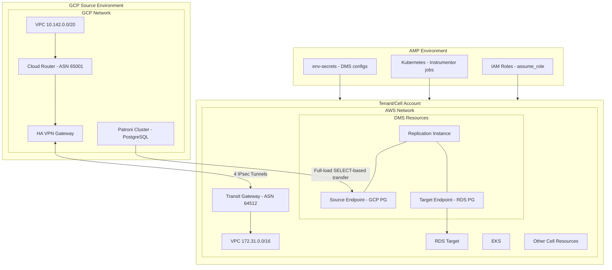

## Summary

This design document proposes integrating AWS Database Migration Service (DMS) into GitLab Dedicated's infrastructure tooling: [Instrumentor](https://gitlab.com/gitlab-com/gl-infra/gitlab-dedicated/instrumentor), [AMP](https://gitlab.com/gitlab-com/gl-infra/gitlab-dedicated/amp), and [Tenant Model Schema](https://gitlab.com/gitlab-com/gl-infra/gitlab-dedicated/tenant-model-schema), to automate Organization database replication from GCP-hosted Patroni cluster to AWS-hosted Cells.

> [!note]
> In this document, we use "Cell" to refer to a GitLab instance provisioned to be part of GitLab.com where multiple customers are served through a single tenant. A Cell is built on top of the [Dedicated tenant infrastructure](../cells/infrastructure/cell_arch_tooling.md), and every Cell is a tenant. For consistency, we use "Cell" throughout this document. For more details on Cells terminology, see the [Cells Glossary](../cells/goals.md#glossary).

## Motivation

The [Cells architecture](../cells/_index.md) requires migrating users and [Organizations](../cells/goals.md#organizations) from the [Legacy Cell](../cells/goals.md#legacy-cell) (source as Patroni cluster/replica) on GCP to Cells on AWS. We need an automated database replication mechanism that can be:

1. Provisioned through the standard Cell deployment workflow (see [Cell Deployment Process](../cells/_index.md#deployment-process) and [Instrumentor Stages](../cells/infrastructure/deployments.md))
2. Configured per-Cell with source-specific parameters
3. Managed via existing [Instrumentor](https://gitlab.com/gitlab-com/gl-infra/gitlab-dedicated/instrumentor) stages
4. Reused for other scenarios, such as Dedicated Commercial inbound migrations from Self-Managed

AWS DMS fits this need well. It can perform full-load data transfers from PostgreSQL sources (including Patroni clusters on GCP VMs) to RDS PostgreSQL targets on AWS; essentially serving as an alternative to traditional pgdump/restore workflows.

For more context on Organization migration, see the [Organization Migration design document](/handbook/engineering/architecture/design-documents/organization-data-migration/).

## Goals

1. **Automated DMS Provisioning**: Provision DMS resources (replication instances, endpoints, tasks) automatically as part of Cell deployment through [Instrumentor](https://gitlab.com/gitlab-com/gl-infra/gitlab-dedicated/instrumentor) stages.

2. **Configuration Flexibility**: Support DMS configuration through either Tenant Model (for cell-specific settings) or [AMP env-secrets](https://gitlab.com/gitlab-com/gl-infra/gitlab-dedicated/amp/-/tree/main/modules/aws/env-secrets) (for environment-wide shared settings).

3. **Reusability**: Keep the design generic enough for both Cells (Protocells migration) and Dedicated Commercial (inbound Geo migrations).

4. **Separation of Concerns**: Build DMS Terraform resources as an external module (similar to `tenant-observability-stack`) that can be versioned and consumed by Instrumentor independently.

> [!note]
> **Replication Strategy:** We initially evaluated logical replication slots on a [standby replica](https://gitlab.com/gitlab-com/gl-infra/tenant-scale/tenant-services/team/-/work_items/351) but encountered `hot_standby` vacuum bloat concerns and limitations with DDL changes not being migrated (DMS cannot create audit tables on a replica). We are currently [exploring logical replication configuration on the primary node](https://gitlab.com/gitlab-org/database-team/team-tasks/-/work_items/585). Until this evaluation is complete, we are not yet certain whether we will leverage replication slots on the standby replica or primary node or maybe just rely solely on SELECT-based full-load transfers without using logical replication slots itself.

### Future Considerations

While the immediate focus is on migrating Organizations from the Legacy Cell to AWS-hosted Cells, the DMS integration is designed with flexibility for future use cases:

- **Cells to Dedicated Migration**: Organizations on GitLab.com (legacy or Cells) could potentially be migrated to a Dedicated instance using the same DMS infrastructure
- **Cross-Platform Organization Portability**: The long-term vision aligns with enabling seamless Organization migration between different GitLab offerings (Dedicated, .com, Cells, Self-Managed) as described in [ADR-007: Self-Managed and Dedicated Single Organization](/handbook/engineering/architecture/design-documents/organization/decisions/007_self_managed_dedicated_single_organization/)

These future capabilities are not in scope for the initial implementation but inform the design decisions to maintain flexibility.

## Non-Goals

1. **DMS Task Management**: Operational aspects like starting, stopping, or monitoring DMS replication tasks will be handled separately. We have a separate DMS blueprint for that.

2. **Schema Migration**: DMS handles data transfer; schema migrations and application-level changes are out of scope.

## Proposal

### Architecture Overview



DMS requires network connectivity between the GCP-hosted Patroni cluster (source) and the AWS-hosted Cell (target). This is achieved through a hybrid cloud VPN setup:

**GCP Side:**

- VPC: Hosts the Patroni cluster with a dedicated CIDR range (e.g., 10.142.0.0/20)
- Cloud Router: Configured with [BGP](https://en.wikipedia.org/wiki/Border_Gateway_Protocol) ASN 65001 for dynamic route exchange
- HA VPN Gateway: Provides redundant VPN tunnels for high availability

**AWS Side:**

- Transit Gateway: Central hub for network connectivity, configured with [BGP](https://en.wikipedia.org/wiki/Border_Gateway_Protocol) ASN 64512
- VPC: Hosts the Cell resources including DMS, RDS, and EKS (e.g., 172.31.0.0/16)

**Connectivity:**

- 4 [IPsec](https://en.wikipedia.org/wiki/IPsec) tunnels between GCP HA VPN Gateway and AWS Transit Gateway provide redundant, encrypted connectivity
- [BGP](https://en.wikipedia.org/wiki/Border_Gateway_Protocol) is used for dynamic route advertisement between clouds
- This setup ensures DMS can reach the Patroni cluster's private IP for data transfer(via logical replication slots).

> [!note]
> **Network Compatibility:** Investigation confirmed no CIDR range overlaps between Dedicated AWS environments and GitLab.com GCP environments ([see analysis](https://gitlab.com/gitlab-com/gl-infra/tenant-scale/tenant-services/team/-/issues/352#note_3057804063)), ensuring VPN connectivity can be established without address conflicts.

### Component Design

#### 1. External Terraform Module: `tenant-dms`

We'll create a new module at `gitlab-com/gl-infra/terraform-modules/tenant-services/tenant-dms`, following the pattern established by [`tenant-observability-stack`](https://gitlab.com/gitlab-com/gl-infra/terraform-modules/observability/tenant-observability-stack).

**Module Structure:**

```plaintext
tenant-dms/
├── main/
│   ├── main.tf           # Main module composition
│   ├── variables.tf      # Input variables
│   ├── outputs.tf        # Output values
│   └── versions.tf       # Provider requirements
├── modules/
│   ├── aws/
│   |    ├── replication-instance/
│   |    ├── endpoints/
│   |    └── tasks/
|   └── aws-vpn/
|        ├── main.tf       # AWS VPN resources
|        ├── variables.tf  # Input variables (from GCP)
|        └── outputs.tf    # Tunnel IPs for GCP
└── README.md
```

GCP side VPN configs will be part of [config-mgmt](https://ops.gitlab.net/gitlab-com/gl-infra/config-mgmt) since source in case of migrations, will be our .com environment, which is being managed via config-mgmt.

**Key Resources:**

- [`aws_dms_replication_subnet_group`](https://registry.terraform.io/providers/hashicorp/aws/latest/docs/resources/dms_replication_subnet_group) - Subnet group for the DMS instance
- [`aws_dms_replication_instance`](https://registry.terraform.io/providers/hashicorp/aws/latest/docs/resources/dms_replication_instance) - The replication instance itself
- [`aws_dms_endpoint`](https://registry.terraform.io/providers/hashicorp/aws/latest/docs/resources/dms_endpoint) (source) - Connection to GCP Patroni/PostgreSQL
- [`aws_dms_endpoint`](https://registry.terraform.io/providers/hashicorp/aws/latest/docs/resources/dms_endpoint) (target) - Connection to RDS PostgreSQL
- [`aws_dms_replication_task`](https://registry.terraform.io/providers/hashicorp/aws/latest/docs/resources/dms_replication_task) - Task configuration for full-load migration
- [`aws_security_group`](https://registry.terraform.io/providers/hashicorp/aws/latest/docs/resources/security_group) - Network security for DMS

#### 2. Instrumentor Integration

We'll add DMS module consumption in the appropriate [Instrumentor](https://gitlab.com/gitlab-com/gl-infra/gitlab-dedicated/instrumentor) stage:

```hcl
module "tenant_dms" {
  source = "gitlab.com/gitlab-com/tenant-services/tenant-dms"

  count = var.dms.enabled ? 1 : 0

  enabled                    = var.dms.enabled
  prefix                     = var.prefix
  vpc_id                     = local.vpc_id
  subnet_ids                 = local.dms_subnet_ids
  replication_instance_class = var.dms.replication_instance_class
  allocated_storage          = var.dms.allocated_storage
  multi_az                   = var.dms.multi_az
  kms_key_arn                = module.kms_alias_resolver.key_ref["rds"]

  source_endpoint = var.dms.source_endpoint
  target_endpoint = {
    server_name   = module.get.rds_postgres_host
    port          = module.get.rds_postgres_port
    database_name = var.dms.target_database_name
    # Credentials from secrets
  }
}
```

#### 3. Tenant Model Schema Changes

Rather than creating a separate top-level `dms` schema, we'll extend the existing [`GeoInboundMigrationConfigSchema`](https://gitlab.com/gitlab-com/gl-infra/gitlab-dedicated/tenant-model-schema/-/blob/main/json-schemas/tenant-model.json#L1811) to include DMS configuration. This approach:

- Avoids overlapping fields with existing inbound migration configuration
- Reuses the VPN configuration already defined in `vpn_migration`
- Treats DMS as a special flavor of geo inbound migration
- Maintains consistency with existing Dedicated tooling patterns

**Proposed Schema Extension:**

```json
{
  "GeoInboundMigrationConfigSchema": {
    "type": "object",
    "description": "Schema for inbound migration configuration.",
    "properties": {
      "external_db_replica_host": {
        "type": "string",
        "description": "The endpoint for the external primary streaming replica."
      },
      "external_db_replica_port": {
        "type": "integer",
        "description": "The port for the external primary streaming replica."
      },
      "dms": {
        "type": "object",
        "description": "AWS DMS configuration for database migration (alternative to streaming replication).",
        "properties": {
          "enabled": {
            "type": "boolean",
            "default": false,
            "description": "Enable AWS DMS for database replication instead of streaming replication"
          },
          "replication_instance_class": {
            "type": "string",
            "default": "dms.t3.medium",
            "description": "DMS replication instance class"
          },
          "allocated_storage": {
            "type": "integer",
            "default": 50,
            "description": "Allocated storage in GB"
          },
          "multi_az": {
            "type": "boolean",
            "default": false,
            "description": "Enable Multi-AZ deployment"
          },
          "migration_type": {
            "type": "string",
            "enum": ["full-load", "full-load-and-cdc"],
            "default": "full-load",
            "description": "DMS migration type"
          },
          "target_database_name": {
            "type": "string",
            "default": "gitlabhq_production",
            "description": "Target database name for DMS replication"
          }
        }
      },
      "vpn_migration": {
        "$ref": "#/$defs/VpnMigrationSchema"
      }
    }
  }
}
```

#### 4. Configuration Sources

There are two configuration sources, namely Tenant Model and Amp's environmental secrets. We will use both for DMS, similar to [how SMTP credentials work in multi-tenant environments](https://gitlab.com/gitlab-com/gl-infra/gitlab-dedicated/team/-/blob/main/runbooks/custom-smtp.md#sharing-smtp-credentials-in-a-multi-tenant-environment):

- **Tenant Model**: DMS enablement flag, instance sizing, Cell-specific source endpoint overrides, and Cell-specific configuration
- **AMP env-secrets**: Sensitive credentials (passwords) and environment-wide defaults for source endpoint configuration

This allows Cell-specific overrides when needed while maintaining environment-wide defaults.

**Source A: Tenant Model (Cell-specific configuration)**

For settings that vary per Cell, we extend the tenant model schema:

```json
{
  "dms": {
    "enabled": true,
    "replication_instance_class": "dms.r5.large",
    "allocated_storage": 100,
    "multi_az": true,
    "endpoints": [
      {
        "engine_name": "postgres",
        "region": "us-east-1",
        "endpoint_id": "source-main-db",
        "endpoint_type": "source",
        "database_name": "gitlabhq_production",
        "secret_name": "main-db-qeHamH"
      },
      {
        "engine_name": "postgres",
        "region": "us-east-1",
        "endpoint_id": "source-ci-db",
        "endpoint_type": "source",
        "database_name": "gitlabhq_production",
        "secret_name": "ci-db-qeHamH"
      },
      {
        "engine_name": "postgres",
        "region": "us-east-1",
        "endpoint_id": "target-main-db",
        "endpoint_type": "target",
        "database_name": "gitlabhq_production",
        "secret_name": "main-db-qeHamH"
      },
      {
        "engine_name": "postgres",
        "region": "us-east-1",
        "endpoint_id": "target-ci-db",
        "endpoint_type": "target",
        "database_name": "gitlabhq_production",
        "secret_name": "ci-db-qeHamH"
      }
    ]
  }
}
```

**Note:** [secrets_manager_access_role_arn](https://registry.terraform.io/providers/hashicorp/aws/latest/docs/resources/dms_endpoint#secrets_manager_access_role_arn-1) is to be part of instrumentor and `secret_name` is used to construct [secrets_manager_arn](https://registry.terraform.io/providers/hashicorp/aws/latest/docs/resources/dms_endpoint#secrets_manager_arn-1).

**Source B: Amp's environmental secrets (environment-wide configuration)**

For settings shared across all Cells in an environment e.g.

```yaml
# In AMP env-secrets
dms_source_main_db_secret_name: "main-db-qeHamH"
dms_source_ci_db_secret_name: "ci-db-qeHamH"
```

Where db secret names are shared between cells.

### Implementation Phases

#### Phase 1: External Module Development

1. Create the `tenant-dms` repository
2. Implement core DMS Terraform resources
3. Set up CI/CD with semantic versioning

#### Phase 2: Tenant Model Schema Update

1. Update [tenant model schema](https://gitlab.com/gitlab-com/gl-infra/gitlab-dedicated/tenant-model-schema) with DMS configuration
2. Document configuration options
3. Validate schema changes

#### Phase 3: AMP env-secrets Update

1. Add DMS secret variables to [AMP env-secrets module](https://gitlab.com/gitlab-com/gl-infra/gitlab-dedicated/amp/-/tree/main/modules/aws/env-secrets)
2. Configure environment-wide DMS defaults
3. Document secret management procedures

#### Phase 4: Instrumentor Integration

1. Add DMS variables to [Instrumentor](https://gitlab.com/gitlab-com/gl-infra/gitlab-dedicated/instrumentor)
2. Create Jsonnet helpers for tenant model transformation
3. Add the DMS module reference in the appropriate stage
4. Update IAM policies for DMS permissions

#### Phase 5: Deploy to target Cell environment

1. Configure DMS settings in CellsDev [AMP](https://gitlab.com/gitlab-com/gl-infra/gitlab-dedicated/amp) environment (pass in secret values and deploy)
2. Provision a test Cell with DMS enabled
3. Validate full-load transfer from a staging GCP source

### Security Considerations

1. **Encryption**: All DMS resources use KMS encryption (customer keys where applicable)
2. **Network Isolation**: DMS instances are deployed in private subnets only
3. **Credentials Management**: Source database credentials (PostgreSQL username/password) are stored in AWS Secrets Manager via AMP env-secrets. DMS connects to PostgreSQL using standard database authentication over the VPN, not IAM authentication.
4. **IAM Least Privilege**: IAM permissions are required for AWS service-level operations, not database connectivity. This includes:
   - **DMS Service Role** : Allows DMS to create network interfaces in the VPC, access CloudWatch for logging/metrics, and use KMS keys for encryption at rest
   - **Instrumentor Execution Role**: Allows Terraform to provision DMS resources (replication instances, endpoints, tasks, security groups, pre-migration assessments)
5. **SSL/TLS**: SSL is enforced for all endpoint connections

### Alternatives Considered

#### Alternative 1: Direct Instrumentor Implementation

Implement DMS resources directly in Instrumentor without an external module.

**Pros:**

- Simpler initial implementation
- No external dependency management

**Cons:**

- Harder to version and test independently
- Doesn't follow established patterns (tenant-observability-stack)
- Less reusable across different use cases

**Decision:** Rejected in favor of an external module for better separation of concerns and reusability.

#### Alternative 2: Standalone DMS Tooling

Create completely separate tooling for DMS management outside of Instrumentor, with its own deployment pipeline and infrastructure management.

**Pros:**

- Complete independence from Dedicated tooling
- Flexibility in implementation

**Cons:**

- Duplicates infrastructure management patterns already established in Instrumentor
- Doesn't integrate with the existing Cell provisioning workflow (see [Cell Deployment Process](../cells/_index.md#deployment-process))
- Additional operational overhead for managing separate tooling
- Inconsistent with the [Cell Architecture and Tooling](../cells/infrastructure/cell_arch_tooling.md) philosophy of centralized tooling

**Decision:** Rejected because DMS should be part of the automated Cell provisioning workflow.

### References

- [AWS DMS Documentation](https://docs.aws.amazon.com/dms/latest/userguide/Welcome.html)
- [Instrumentor Repository](https://gitlab.com/gitlab-com/gl-infra/gitlab-dedicated/instrumentor)
- [AMP Repository](https://gitlab.com/gitlab-com/gl-infra/gitlab-dedicated/amp)
- [Tenant Model Schema](https://gitlab.com/gitlab-com/gl-infra/gitlab-dedicated/tenant-model-schema)
- [Tenant Observability Stack](https://gitlab.com/gitlab-com/gl-infra/terraform-modules/observability/tenant-observability-stack) (reference implementation)
- [Cells Networking Blueprint](../cells/infrastructure/networking.md)
- [GeoInboundMigrationConfigSchema](https://gitlab.com/gitlab-com/gl-infra/gitlab-dedicated/tenant-model-schema/-/blob/main/json-schemas/tenant-model.json#L1811)
- [ADR-007: Self-Managed and Dedicated Single Organization](/handbook/engineering/architecture/design-documents/organization/decisions/007_self_managed_dedicated_single_organization/)
- [CIDR Range Investigation](https://gitlab.com/gitlab-com/gl-infra/tenant-scale/tenant-services/team/-/issues/352)
- [ADR-016: Cross Cloud Dependencies](../cells/decisions/016_cross_cloud_dependecies.md)
- [Dedicated Architecture](https://gitlab-com.gitlab.io/gl-infra/gitlab-dedicated/team/architecture/Architecture.html)
- [Inbound Geo Migrations](https://gitlab-com.gitlab.io/gl-infra/gitlab-dedicated/team/engineering/inbound-geo-migrations.html)
- [Component Ownership Model](/handbook/engineering/infrastructure-platforms/production/component-ownership-model/)
- [Cell Architecture and Tooling](../cells/infrastructure/cell_arch_tooling.md)
- [Cells Infrastructure](../cells/infrastructure/_index.md)
- [Organization Migration](/handbook/engineering/architecture/design-documents/organization-data-migration/)
- [ADR Issue](https://gitlab.com/gitlab-com/gl-infra/tenant-scale/tenant-services/team/-/work_items/339)
