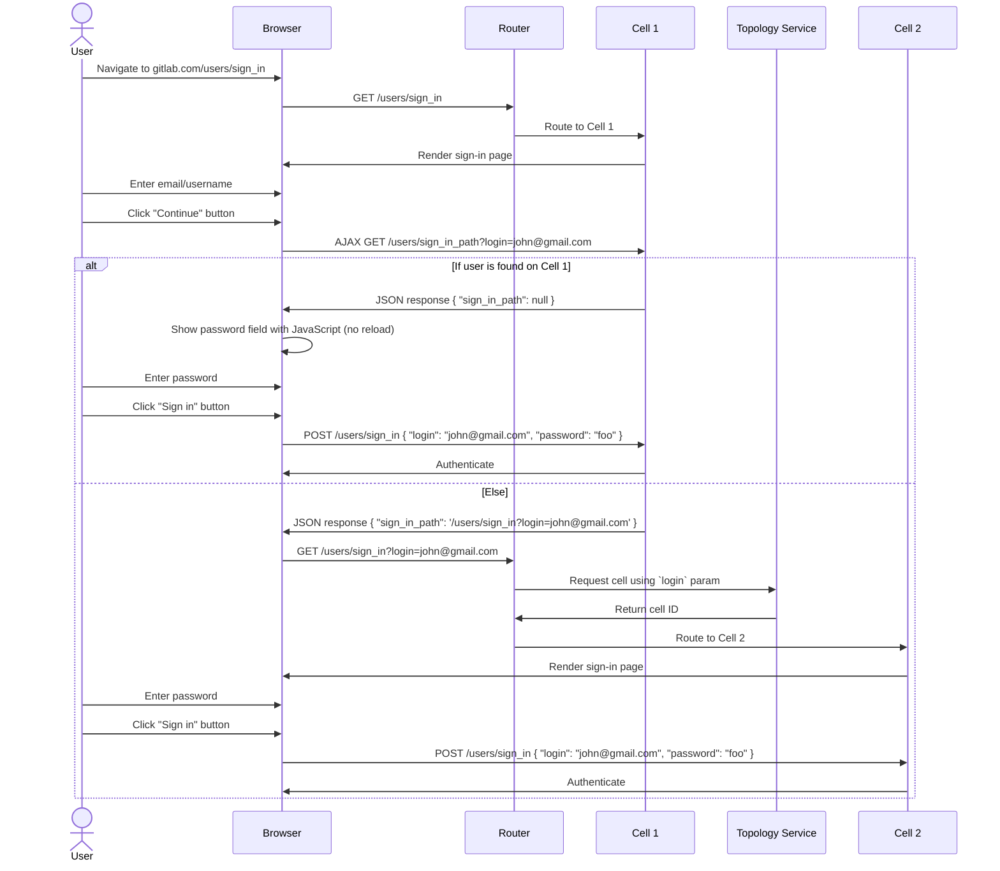
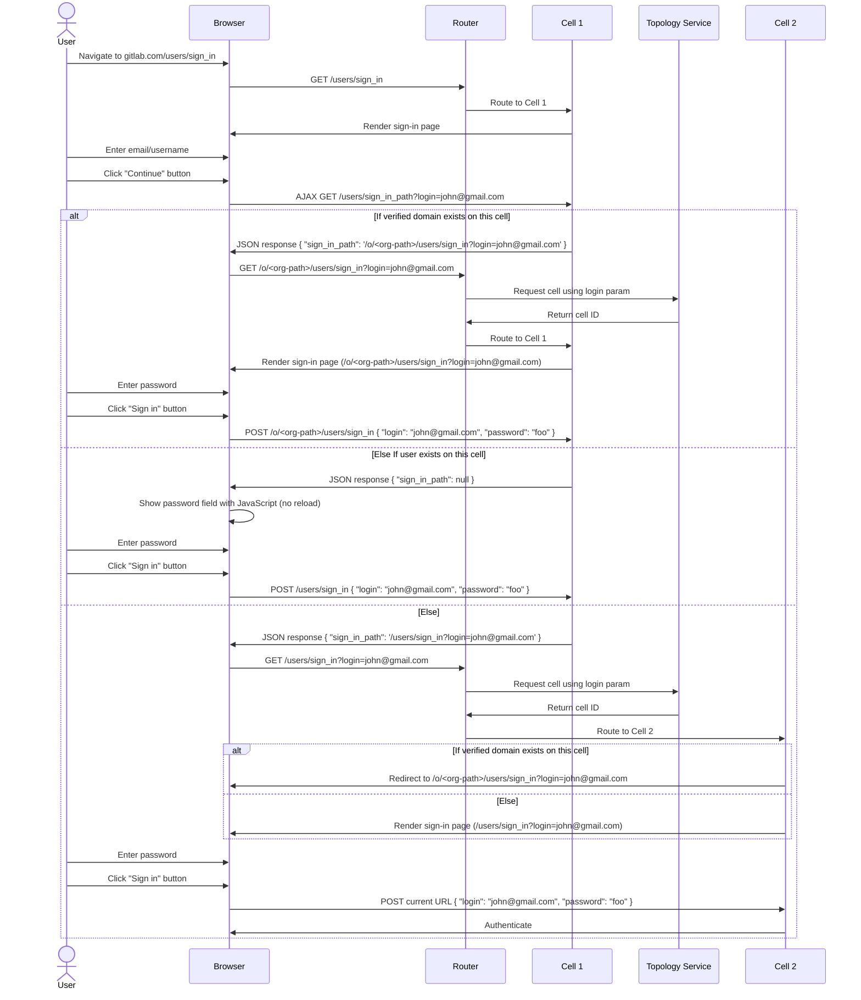

## Context

GitLab currently uses a single-step authentication process where users enter both email/username and password on the same page. This approach has several limitations:

- No organization-specific branding or authentication policies
- Limited support for organization-specific authentication methods (SAML, custom IdPs)
- No routing based on user's organizational context
- All users authenticate through the same generic endpoint

Modern enterprise applications like Google Workspace, Slack, and Microsoft 365 use multi-step authentication flows that first identify the user's organization context, then route them to organization-specific authentication experiences. This enables branded login pages, organization-specific authentication methods, and better user experience.

With the introduction of Organizations in GitLab, we need to implement a similar pattern to support organization-specific authentication while maintaining backward compatibility for existing users.

## Decision

We will implement a multi-step authentication flow that separates user identification from authentication:

### Step 1: User Identification

Users will go through the sign in flow on the global sign in page (`/users/sign_in`) and be routed to the correct cell by the Typology service using the `login` query param. In the future when organizations support [verified domains](https://docs.gitlab.com/user/project/pages/custom_domains_ssl_tls_certification), users with a verified domain will be redirected to branded organization sign in pages (e.g. `/o/<org-path>/users/sign_in`).

#### Without verified domains



#### With verified domains

In the future when organizations support [verified domains](https://docs.gitlab.com/user/project/pages/custom_domains_ssl_tls_certification) we will redirect users with a verified domain to branded organization sign in pages (e.g. `/o/<org-path>/users/sign_in`).



#### AJAX GET /users/sign_in_path

##### Request

```http
GET /users/sign_in_path
Host: gitlab.com
Content-Type: application/json

{
  "login": "john@gmail.com",
}
```

##### Response

###### User exists on current cell

**Status:** `200 OK`

**JSON body:**

```json
{
  "sign_in_path": null
}
```

###### User does not exist on current cell

**Status:** `200 OK`

**JSON body:**

```json
{
  "sign_in_path": "/users/sign_in?login=john@gmail.com"
}
```

###### User is in an organization with a verified domain

**Status:** `200 OK`

**JSON body:**

```json
{
  "sign_in_path": "/o/<organization>/users/sign_in?login=john@example.com"
}
```

#### OmniAuth

Users that are not on the current cell must first enter their email/username before the OmniAuth options (e.g Google, SAML, etc) will work. If they try to use the OmniAuth options before entering their email/username they will get an error message. We will adjust the error message to explain they need to first enter their email/username.

This will be superseded by [OpenID/OAuth Client](../oauth_client_auth.md).

#### Signing in with a passkey

Since passkeys will be stored on the specific cell you are signing into we first need to route the user to the cell they are signing into. The `Sign in with passkey` button will be shown after the user enters their email/username and they have been routed to the cell they are signing into.

For Self-Managed and Dedicated, Passkey will be available without entering email/username first. 

### Step 2: Organization-Specific Authentication

- Users authenticate using organization-configured methods (password, SAML, etc.)
- Organization branding and specific authentication policies are applied
- If 2FA is required, it appears as a separate screen after primary authentication

### Backward Compatibility

- Username-based login continues to work on the legacy `/users/sign_in` page
- All existing OAuth and SAML callback paths are preserved
- Direct organization access via `gitlab.com/o/<org-path>/users/sign_in` is supported

### Email Uniqueness

- Each email address belongs to exactly one organization across all GitLab instances
- Email domains can be restricted to specific organizations
- The Topology Service provides deterministic routing based on email domain mapping

### Alternative Access

- Users can directly access organization login pages via `gitlab.com/o/<org-path>/users/sign_in`
- Private organizations redirect anonymous users to their login page
- Public organizations show their page immediately with sign-in options

## Consequences

### Positive Consequences

- **Organization Branding**: Organizations can provide branded login experiences with custom logos and styling
- **Flexible Authentication**: Organizations can configure specific authentication methods (SAML-only, password + 2FA, etc.)
- **Scalable Architecture**: Supports distributed cell architecture with organization-specific authentication policies

### Technical Consequences

- **Legacy Cell Compatibility**: The `/users/sign_in` page continues to be served by the Legacy Cell or any Cell at later point
- **Topology Service Integration**: Rails integration required for email classification and organization routing
- **Callback Preservation**: All existing OAuth (`/oauth/callback`) and SAML (`/groups/my-group/-/saml/callback`) callback paths remain unchanged
- **Username Support**: Username-based authentication continues to work for backward compatibility
- **Password managers**: When signing into an organization that is not on the current cell we will be required to reload the sign in page after entering email/username. This means that some password managers may require an extra click to fill the password in the second step. Users on the current cell will not require a page reload.

## Alternatives

### Subdomain-Based Routing

We evaluated using subdomains like `acme.gitlab.com` for organization-specific login. This was rejected because:

- Complex DNS management and SSL certificate requirements
- Not compatible with all GitLab services (SSH, API endpoints)
- Would break existing integrations and bookmarks
- Difficult to implement across all deployment models (SaaS, Self-Managed, Dedicated)

## Implementation Notes

### URL Patterns

- Organization login: `gitlab.com/o/<org-path>/users/sign_in`
- Legacy login: `gitlab.com/users/sign_in` (unchanged)
- Organization pages: `gitlab.com/o/<org-path>` (private orgs redirect to login)

### Future Enhancements

- Custom alias domains: `gitlab.company.com` routing to organization pages
- Organization-scoped SAML callbacks: `gitlab.com/o/org-path/-/saml/callback`
- Enhanced organization branding and customization options
