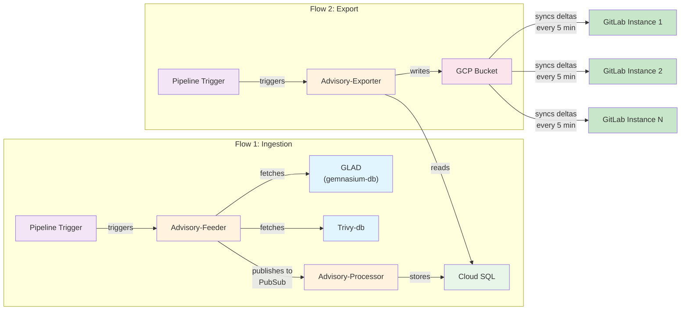

---
# This is the title of your design document. Keep it short, simple, and descriptive. A
# good title can help communicate what the design document is and should be considered
# as part of any review.
title: "PMDB advisory ingestion"
status: implemented
creation-date: "2023-03-19"
authors: [ "@nilieskou" ]
coaches: [ ]
dris: [ "@ifrenkel", "@nilieskou" ]
owning-stage: "~devops::secure"
participating-stages: []
# Hides this page in the left sidebar. Recommended so we don't pollute it.
toc_hide: true
---

<!-- This renders the design document header on the detail page, so don't remove it-->


## Summary

This document describes the architecture for ingesting security advisories from multiple sources ([GLAD/gemnasium-db](https://gitlab.com/gitlab-org/security-products/gemnasium-db) and trivy-db) into the Package Metadata Database (see [repo](https://gitlab.com/gitlab-org/security-products/license-db/deployment)). The ingested advisories are then exported to GCP buckets for consumption by the GitLab Rails backend to support [Continuous Vulnerability Scanning](https://docs.gitlab.com/user/application_security/continuous_vulnerability_scanning/).

## Problem Statement

GitLab needs to keep the Rails backend's `vulnerability_advisories` table in sync with external advisory databases to enable timely vulnerability scanning. Previously, advisories were manually seeded into the database, but this approach doesn't scale for ongoing updates.

### Goals

1. **Ingest advisories from multiple sources:** GLAD (GitLab Advisory Database) for application and trivy-db for OS advisories
2. **Keep data synchronized:** Automatically sync new and updated advisories
3. **Support self-managed instances:** Allow offline instances to ingest advisories from local copies of advisory databases with minimal configuration
4. **Normalize data:** Convert different advisory formats into a unified export format
5. **Scale efficiently:** Handle thousands of advisories and affected packages without excessive resource consumption

### Non-Goals

1. **Delete advisories**: PMDB can add or update advisories but cannot delete

## Proposal

The PMDB advisory ingestion system consists of two independent data flows that synchronize security advisories across GitLab instances.

* In Flow 1 (Ingestion), two separate scheduled pipelines trigger the Advisory-Feeder: one pipeline fetches advisories from GLAD for application layer advisories, while another pipeline fetches from Trivy-db for OS layer advisories. Both sources are published to PubSub where the Advisory-Processor consumes them and stores the data in Cloud SQL.

* In Flow 2 (Export), another scheduled pipeline triggers the Advisory-Exporter to read advisories from Cloud SQL, transform them into a unified format, and write them to a GCP Bucket. Finally, GitLab instances (both SaaS and self-managed) connect to the advisory bucket on a scheduled interval to check whether the instance advisory data is up to date for continuous scanning.

## Architecture Overview

### High-Level Data Flow

### Components

#### 1. Advisory-Feeder

**Purpose:** Extracts new and updated advisories from source databases and publishes them to PubSub.

**Key Responsibilities:**

* Monitor GLAD and trivy-db sources for changes
* Parse advisory data from YAML (gemnasium-db) and JSON (trivy-db) formats
* Keep raw data advisories
* Publish messages to PubSub for downstream processing
* Track cursor position for incremental updates

**Design Decisions:**

| Decision | Rationale | Alternatives Considered |
|----------|-----------|-------------------------|
| **Conversion in Exporter** | Feeder keeps raw advisories as is and let the exporter do the format processing. This approach is benefitial because we always have raw data in the database | Converting data in the feeder |
| **Cursor-based Incremental Updates** | Efficient for ongoing syncs; reduces data transfer and processing | Full re-ingestion would be resource-intensive for large databases |

#### 2. Advisory-Processor

**Purpose:** Consumes PubSub messages and stores advisories in Cloud SQL.

**Key Responsibilities:**

* Consume messages from PubSub
* Validate advisory data
* Store advisories in Cloud SQL with no transformation

#### 3. Advisory-Exporter

**Purpose:** Exports advisories from Cloud SQL to GCP buckets in a format consumable by the Rails backend.

**Key Responsibilities:**

* Query advisories from Cloud SQL
* Join trivy-db data (CVEs + affected packages) to match GLAD structure
* Normalize data to unified export format
* Write to GCP buckets organized by PURL type
* Support both full and incremental exports

### Database Schema

The PMDB uses a flexible schema to store advisories as-is without transformation:

**Key Tables:**

* `trivy_db_advisories`: Stores trivy-db specific advisory data
* `trivy_db_affected_packages`: Maps advisories to affected packages with version ranges
* `glad_db_advisories`: Stores glad advisories (combined CVE + affected package)

## Additional Design Decisions

### 1. Store Raw Advisories, Transform During Export

**Decision:** Store advisories in Cloud SQL exactly as they come from the source (GLAD or trivy-db) without any transformation, and perform all format normalization in the Advisory-Exporter.

**Rationale:**

* **Decoupling:** Feeder and processor don't need to understand export format requirements
* **Flexibility:** Export format can evolve (e.g., v1 to v2) without re-ingesting all data
* **Auditability:** Raw data is preserved in the database for debugging and validation
* **Iterative improvements:** Can optimize export logic without touching ingestion pipeline
* **Source fidelity:** Maintains original data structure for potential future use cases

**Alternatives Considered:**

* Normalize in feeder: Would couple feeder to export format and require re-ingestion on format changes. We would not have a SSOT in the database.

### 2. Export Format Evolution (v1 to v2: CSV to NDJSON)

**Decision:** Implement a new export format (v2) that transitions from CSV to NDJSON (newline-delimited JSON) to better support advisory data with complex nested structures.

**Rationale:**

* **Structured data:** NDJSON better represents advisory metadata with multiple references, CVSS vectors, and affected versions
* **Scalability:** NDJSON allows streaming processing without loading entire files into memory
* **Flexibility:** JSON structure accommodates both GLAD and trivy-db data without flattening
* **Backward compatibility:** v1 format can coexist with v2 during transition period
* **Future extensibility:** JSON schema can evolve to support additional advisory sources and metadata

**Alternatives Considered:**

* Keep CSV format: Would require flattening complex nested data, losing information or creating redundant rows
* Use XML: More verbose than JSON, harder to stream process
* Use Protocol Buffers: More efficient but less human-readable and harder to debug

### 3. Separate Pipelines for GLAD and Trivy-db Ingestion

**Decision:** Use two separate scheduled pipelines to trigger the Advisory-Feeder: one for GLAD (gemnasium-db) and another for trivy-db.

**Rationale:**

* **Independent scheduling:** Each source can have different update frequencies based on their release cycles
* **Failure isolation:** If one source has issues, the other can continue ingesting independently
* **Resource optimization:** Can tune each pipeline's resources based on source-specific characteristics
* **Clear ownership:** Makes it explicit which pipeline handles which advisory source
* **Easier debugging:** Simpler to identify which source caused issues in the ingestion pipeline

**Alternatives Considered:**

* Single pipeline for both sources: Would require complex branching logic and make it harder to debug source-specific issues
* Manual triggering: Would not scale for continuous advisory updates

## Scalability Considerations

### Data Volume

* **gemnasium-db:** ~50,000 advisories
* **trivy-db:** ~1,000,000+ advisories and affected packages
* **Total PubSub messages:** ~1,000,000+ full initial ingestion

### Resource Usage

**Database:**

* Initial ingestion consumes ~50% of Cloud SQL resources
* Scales well with Cloud Run auto-scaling
* Incremental updates have minimal impact

**PubSub:**

* Handles 1M+ messages efficiently
* Automatic scaling handles load spikes

**GCP Buckets:**

* Organized by PURL type for efficient querying
* Supports both full and incremental exports

## Self-Managed Air-gapped Instance Support

**Approach:** Users can manually copy advisory database repositories and configure GitLab to ingest from local paths.
