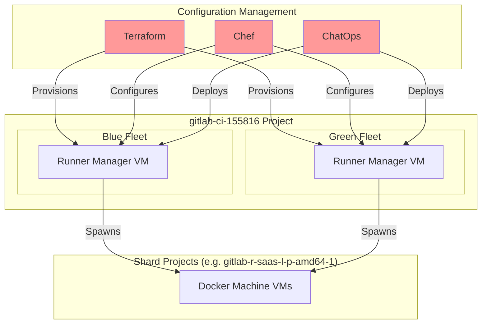
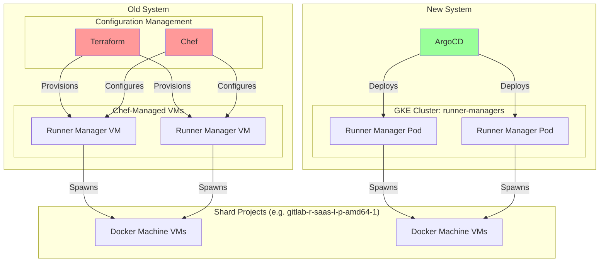
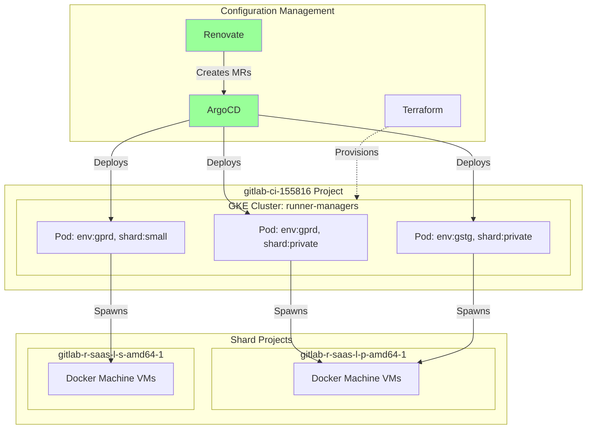

<!-- vale gitlab.FutureTense = NO -->



## Summary

We propose migrating GitLab.com hosted runner managers from Chef-managed VMs to Kubernetes-managed deployments. Our current infrastructure requires 2 engineer-days per month for manual deployments, batching 30-50 runner changes into **a single risky release per month**. This deployment bottleneck **limits the pace of innovation** for 40+ engineers across 5 teams working on runner infrastructure and products that depend on it.

This migration delivers immediate value by **enabling daily deployments**. Configuration changes that currently take weeks can be deployed same-day. Version updates become automated via Renovate. The 2 engineer-days per month currently spent on deployment toil can be redirected to higher-value work.

Additionally, consolidating configuration from the current Terraform/Chef split into a single ArgoCD-managed system makes the infrastructure easier to reason about and maintain. Managing 12 shards is operationally infeasible today, forcing us to reject custom shard requests from [Duo Workflow](https://gitlab.com/gitlab-org/gitlab-runner/-/issues/38539), [Runner Core](https://docs.google.com/document/d/1sDMsoUAidRv_U-vHdeDyASkeyDMkiOBUPbHYdRzM-DM/edit), and [Secure stage](https://gitlab.com/gitlab-org/gitlab/-/issues/571010). This migration removes the deployment bottleneck.

The migration is low-risk: it's a lift-and-shift that keeps the same executor architecture, runs both systems in parallel, and can roll back anytime.

## Motivation

Our current runner manager infrastructure is Chef-managed VMs in a blue/green deployment model. This consumes roughly **2 engineer-days per month** in deployment toil, but the strategic cost is far greater: it limits the pace of innovation for **40+ engineers across 5 teams** (Runner Core, CI Functions Platform, Runners Platform, and the Duo Agent Platform product teams).

**Deployment velocity mismatch:** GitLab Runner sees 30-50 merges per month (1-2 per day average), but our monthly deployment cadence batches all these changes into a single risky deployment per month. This prevents rapid iteration on features and improvements.

**Following GitLab's own principles:** GitLab development depends heavily on CI infrastructure—not just for stability, but for continuous innovation in features, performance, and developer experience. GitLab champions continuous deployment: [GitLab.com deploys 12 times per day](https://about.gitlab.com/blog/continuously-deploying-the-largest-gitlab-instance/) with far higher development velocity. Our runner infrastructure should follow the same principle: frequent, low-risk deployments enable rapid iteration while maintaining stability.

**Pain points:**

- **Manual deployment process**: Change management issues, ChatOps draining, blue/green coordination
- **Split configuration**: VMs provisioned with Terraform ([config-mgmt](https://ops.gitlab.net/gitlab-com/gl-infra/config-mgmt)), configured with Chef ([chef-repo](https://gitlab.com/gitlab-com/gl-infra/chef-repo)) — fragmented and hard to reason about
- **Unmanaged infrastructure between deploys**: We disable Chef on the non-active fleet to prevent runner managers from starting, leaving those hosts unmanaged (no SSH key updates, user access changes, system configuration updates) until the next deployment
- **Rejected custom configurations**: The operational complexity of maintaining 12 existing shards forces us to reject new shard requests from teams including [Duo Workflow](https://gitlab.com/gitlab-org/gitlab-runner/-/issues/38539), [Runner Core](https://docs.google.com/document/d/1sDMsoUAidRv_U-vHdeDyASkeyDMkiOBUPbHYdRzM-DM/edit), and [Secure stage](https://gitlab.com/gitlab-org/gitlab/-/issues/571010), directly blocking strategic product initiatives

### Goals

- **Daily deployments** with minimal manual intervention (down from ~2 engineer-days per deployment)
- **Consolidated configuration** in ArgoCD, eliminating the Terraform/Chef split
- **Automated version updates** with Renovate
- **Foundation for future automation**: shard creation, custom configurations, maybe autoscaling

### Non-Goals

- **Changing executor architecture**: We keep Docker Machine for now; the separate Kata/Firecracker/gVisor evaluation is out of scope
- **Modifying runner functionality**: No changes to how runners execute jobs or interact with GitLab
- **Immediate Chef deprecation**: While this reduces our Chef footprint, it does not address Chef usage elsewhere in GitLab.com infrastructure
- **Automating shard creation**: GCP projects, quotas, and runner tokens still require manual provisioning

## Proposal

A **lift-and-shift migration** of runner managers from Chef-managed VMs to Kubernetes. We keep Docker Machine executors unchanged — only the runner manager deployment changes.

### Relation to Unified Runners Platform v5

This work is a subset of the broader [Unified Runners Platform v5](https://gitlab.com/groups/gitlab-com/gl-infra/-/epics/1611) initiative, specifically part of [Block 0: Design and Foundation](https://gitlab.com/groups/gitlab-com/gl-infra/ci-runners/-/work_items/2). This establishes the foundation for deploying runners going forward. We are extracting it into its own scope to ship value quickly rather than waiting for the full v5 rollout.

**Why incremental?** Decoupling runner manager deployment from executor changes lets us deliver immediate value while limiting risk. A combined migration would increase complexity and delay benefits.

**Why this is low-risk:**

- Ephemeral Job VMs stay in the same networks; we only need to validate runner manager to executor connectivity
- Run both runner manager architectures side-by-side during migration; control traffic using replica counts and concurrency settings
- [Two-way-door decision](/handbook/values/#make-two-way-door-decisions): roll back to Chef VMs anytime if issues arise

**What changes:**

- Deploy runner managers using ArgoCD + GitLab Runner Helm chart (with Docker Machine support)
- Automated version updates with Renovate (merge MR → deploy)
- No more manual blue/green coordination

### Deployment Method Selection

We use the GitLab Runner Helm chart for Kubernetes deployment. This is the industry-standard method for deploying applications on Kubernetes and the most widely adopted approach for runners on Kubernetes.

**Why Helm chart:**

- **Dogfooding:** Using what customers use for runners on Kubernetes. We also use Helm to deploy GitLab itself. See [Dogfooding Strategy](#dogfooding-strategy) below.
- **Industry standard:** Helm is the de facto standard for Kubernetes application packaging.
- **Proven maturity:** Production-validated with extensive documentation and community support.
- **Executor flexibility:** Supports all executors including Docker Machine, allowing us to decouple deployment mechanism changes from executor migration.

**Evaluation:**

| Method | Kubernetes | Maturity | Adoption | Dogfooding Value | Notes |
|--------|------------|----------|----------|------------------|-------|
| **Helm Chart** | Native | High | High | High - benefits most k8s users | Selected approach |
| **Operator** | Native | Low | Low (OpenShift-focused) | Low - limited user base | Less mature. Future consideration if custom autoscaling needed. |
| **GRIT** | Via Operator | Medium (VMs), Low (k8s) | Low | Low - limited user base | VM-first, not Kubernetes-native. No Docker Machine support. |
| **Omnibus** | No | High | High (VMs) | N/A - not k8s | Current approach. Manual deployment orchestration, no native rolling deploys. |

See the alternatives section below for detailed analysis.

**Note on adoption metrics:** Quantitative adoption data does not exist for any deployment method. Assessments are based on qualitative indicators such as documentation positioning and community engagement.

**Future flexibility:** Using Helm today enables migration to the GitLab Runner Operator in the future if requirements emerge. If the Operator provides a Helm chart, we have a clear migration path.

**Future executor migration:** [Docker Machine is deprecated](https://docs.gitlab.com/runner/executors/docker_machine/) and scheduled for removal in GitLab 20.0 (May 2027). This migration simplifies a future move away from Docker Machine, whether to [docker-autoscaler](https://docs.gitlab.com/runner/executors/docker_autoscaler/) or a [Kubernetes-based executor](https://gitlab.com/groups/gitlab-com/gl-infra/ci-runners/-/epics/6).

### Dogfooding Strategy

The Runner Platform is Runner Core's "Customer-0". By using the GitLab Runner Helm chart for this migration, we dogfood what self-managed customers use for Kubernetes deployments. Many of our customers are up against the same operational challenges we face—deployment velocity, operational complexity, and scale. This approach ensures that any problems we encounter at GitLab.com scale will benefit all customers, not just internal tooling.

Operating runners at scale with the Helm chart validates it for advanced use cases and feeds improvements back to the broader GitLab community. This demonstrates consistency: we use [Helm charts to deploy GitLab on GitLab.com](https://about.gitlab.com/blog/continuously-deploying-the-largest-gitlab-instance/), and GitLab Dedicated uses Helm charts to deploy GitLab. Using Helm for runners extends this pattern across our infrastructure.

This deployment approach also enables faster iteration on new runner features. With continuous deployment and significantly lower deployment friction, we can test experimental configurations daily and validate new runner capabilities at GitLab.com scale before general availability. Early adoption surfaces edge cases and performance characteristics that benefit all customers, while giving Runner Core immediate feedback on real-world behavior at scale.

### Risks

- **Network connectivity**: Runner managers in Kubernetes must maintain proper network access to existing Docker Machine subnets
- **Performance and scaling**: Kubernetes deployments may exhibit different behavior under high load; validation required
- **Configuration parity**: Exact parity between old and new systems during migration is critical. Post migration the old system will be allowed to gather dust, and then eventually deleted from config.
- **Single cluster blast radius**: Cluster-wide issues could affect multiple shards. Mitigated by multi-AZ cluster. If needed, we can deploy multiple clusters - ArgoCD supports multi-cluster management natively
- **Kubernetes operational complexity**: Pod-specific failure modes (out-of-memory kills, image pull failures, evictions) require Kubernetes-specific troubleshooting expertise
- **Shallow health checks**: Existing health checks primarily verify the process is running. The Helm chart additionally calls `gitlab-runner verify`, but this doesn't catch issues like invalid tokens or configuration problems that prevent job processing. For continuous deployment, deeper health checks are needed—ideally verifying that a runner has successfully processed a real job before considering it healthy.
- **Cilium health check bug**: GKE clusters with Cilium have a [bug](https://gitlab.com/gitlab-org/build/CNG/-/merge_requests/2653#note_2791709931) where pods with flapping health checks lose network connectivity. [Upstream fix](https://github.com/cilium/cilium/pull/42170) merged but not yet in GKE. Workaround: ensure stable health checks
- **Pod ephemeral storage**: If a pod dies, in-progress jobs are abandoned (not transferable). Orphaned VMs cleaned up by [ci-project-cleaner](https://ops.gitlab.net/gitlab-com/gl-infra/ci-project-cleaner/)

## Design and implementation details

### Architecture Overview

The following diagrams illustrate the current state, migration phase, and target state of the runner manager infrastructure.

#### Current State (Before)



#### During Migration

Note: Old system continues to use ChatOps for deployment. New system uses Terraform to provision the GKE cluster, ArgoCD for deployments.



#### Target State (After)



### Infrastructure

**GKE Cluster:**

- Name: `runner-managers`
- GCP Project: `gitlab-ci-155816` (existing project)
- Network access to existing Docker Machine subnets

**Cost Impact:**

GKE adds a flat ~$80/month cluster management fee. While [Docker Machine job VMs represent the bulk of our CI/CD infrastructure spending](https://gitlab.com/gitlab-com/gl-infra/production-engineering/-/issues/27820), the current runner manager fleet itself represents significant cost: **58 c2-standard-30 machines at ~$50k/month**.

Recent analysis shows these machines are heavily underutilized: CPU never exceeds 30% and memory typically uses ≤10%. This suggests the runner managers were over-provisioned when [introduced 5 years ago](https://gitlab.com/gitlab-com/gl-infra/production-engineering/-/issues/12574), and workload distribution has since evolved. Kubernetes right-sizing could deliver substantial savings beyond the operational benefits.

**Deployment Structure:**

- One runner manager deployment per `(environment, shard, project)` tuple
- Shards may contain multiple projects for horizontal scaling
- Docker Machine executors continue to provision VMs in shard-specific GCP projects:
  - `gitlab-r-saas-l-p-amd64-1` for private runners
  - `gitlab-r-saas-l-s-amd64-1` for amd64-small shard
  - Network configuration in shared `gitlab-ci-155816` project

### Configuration Management

- Single ArgoCD application in [argocd/apps](https://gitlab.com/gitlab-com/gl-infra/argocd/apps), separate config per `(environment, shard)`
- Uses official [GitLab Runner Helm chart](https://docs.gitlab.com/runner/install/kubernetes.html) with Docker Machine support
- The Helm chart calls `gitlab-runner register` which generates config from a template, rather than using a stable config file we manage directly. This requires careful validation during migration
- Renovate creates MRs for version updates; human review and merge triggers deploy (fully automated deploys may come later as we gain confidence)
- Configure Renovate to track pre-release images — nightly releases are currently pushed to [packagecloud](https://packages.gitlab.com/runner/unstable) ([migrating to Pulp](https://gitlab.com/groups/gitlab-org/-/epics/20018)), and nightly image tags per commit are available in the [container registry](https://gitlab.com/gitlab-org/gitlab-runner/container_registry/29383)

**Per-shard configuration tuning:**

- `request_concurrency`: Controls job request parallelism (currently varies from 10-15 across shards)
- Kubernetes `terminationGracePeriodSeconds`: Must exceed max job timeout for the shard (see Rolling Deploys section)
- Deployment rollout parameters: `maxUnavailable`/`maxSurge` (see Rolling Deploys section)

### Rolling Deploys and Graceful Shutdown

Unlike the [legacy rolling deployment approach](https://gitlab.com/gitlab-org/ci-cd/runner-tools/grit/-/blob/main/docs/designs/rolling-deployments/README.md), Kubernetes handles [rolling deploys natively](https://kubernetes.io/docs/concepts/workloads/controllers/deployment/#rolling-update-deployment) using `maxSurge`/`maxUnavailable` settings.

**Graceful shutdown timing:**

The current VM-based deployment uses a 2-hour systemd timeout (`TimeoutStopSec=2h`, configured in [cookbook-wrapper-gitlab-runner](https://ops.gitlab.net/gitlab-cookbooks/cookbook-wrapper-gitlab-runner)) for graceful shutdown.

**Recommendation:** Set `terminationGracePeriodSeconds` to the shard's max job timeout plus 5 minutes for cleanup overhead. For private gitlab-org small, this means **14700s** (4h 5m); for most other shards, **11100s** (3h 5m).

**Idle VM cleanup adds shutdown time:** Runner managers sequentially remove idle VMs on stop. High-capacity shards (e.g., 600 idle VMs on small-amd64) could add 20-30 minutes to shutdown. Consider setting `remove_machines_on_stop: false` and relying on ci-project-cleaner for orphan cleanup.

**Configuration:**

- **Shutdown signal**: Must be `SIGQUIT` for graceful runner shutdown (already set in Helm chart defaults)
- **Termination grace period**: Set per-shard based on maximum job timeout (see timing above)
- **maxSurge**: Set to 100% to mirror current blue/green behavior — new pods come up before old pods drain. This avoids capacity reduction during deploys
- **maxUnavailable**: Set to 0 during rollout to maintain capacity
- **Monitoring**: The GitLab Runner Helm chart [sets `publishNotReadyAddresses: true`](https://gitlab.com/gitlab-org/charts/gitlab-runner/-/merge_requests/532) on the metrics Service, ensuring Prometheus continues scraping metrics from terminating pods during graceful shutdown

**ArgoCD and long-running deploys:** ArgoCD does not block new syncs while pods are terminating — rapid successive deploys may cause resource pressure (multiple pod generations running). Renovate's MR-based workflow provides a natural gate.

### Docker Machine VM Cleanup on Shutdown

The current VM-based deployment includes a post-shutdown cleanup mechanism that is **not part of gitlab-runner itself**. It's implemented as a systemd `ExecStopPost` script that removes stale Docker Machine VMs after the runner manager stops:

```bash
#!/bin/bash
set -eo pipefail
parallel=${1:-1}
export MACHINE_STORAGE_PATH=${MACHINE_STORAGE_PATH:-/root/.docker/machine}
ls ${MACHINE_STORAGE_PATH}/machines/ | xargs -n 1 -P ${parallel} docker-machine rm -f
```

This script only starts **after** the gitlab-runner process has finished processing all of it's assigned jobs, which could take anywhere between few minutes to few hours. It runs with a concurrency of 3, which is slow for high-capacity shards (e.g., 600 idle VMs on small-amd64 could take 20-30 minutes). When implementing the entrypoint wrapper, increase concurrency to reduce cleanup time.

**Kubernetes limitation:** Unlike systemd's `ExecStopPost`, Kubernetes has no "post-mortem" hook. The `preStop` hook runs *before* SIGQUIT is sent, not after. Once the container terminates (gracefully or via SIGKILL after grace period), there's no built-in mechanism to run cleanup commands.

**Kubernetes implementation options:**

1. **Build into docker+machine executor.** Implement cleanup logic directly in the docker+machine executor's shutdown sequence ([gitlab-runner!6330](https://gitlab.com/gitlab-org/gitlab-runner/-/merge_requests/6330)). This is the cleanest solution: the executor knows which machines are in-use vs idle, allowing it to delete idle machines early rather than waiting for full job drain. No external wrapper needed.

2. **Entrypoint wrapper.** Wrap gitlab-runner with a script that traps the shutdown signal, forwards it to gitlab-runner, waits for it to exit, then runs cleanup. This mimics systemd's `ExecStopPost` behavior. Constraint: cleanup must complete within `terminationGracePeriodSeconds` (shared with job drain time).

3. **External cleanup.** Clean up orphaned VMs asynchronously via a separate process (e.g., a CronJob or controller that periodically removes stale Docker Machine VMs). Trade-off: potential cost from VMs running longer than necessary.

4. **Persistent state with StatefulSet.** Use a Kubernetes StatefulSet with persistent volumes to preserve docker-machine state across pod restarts. New pods inherit the state and continue managing existing VMs. Trade-off: StatefulSets scale down in reverse ordinal order—Kubernetes always removes the highest-ordinal pod first, regardless of job load. This means rollouts must wait for that specific pod to drain, even if other pods are idle, making deploys much slower.

**Recommendation:** Option 1 (build into docker+machine executor) is the preferred approach. It provides the cleanest integration and can optimize cleanup by deleting idle machines early. Option 3 (external cleanup) is a nice-to-have safety net for edge cases where pods crash or get OOM-killed before cleanup completes.

**Idle pool churn on deploys:** Docker-machine state is ephemeral in Kubernetes, so each deploy drains and recreates the idle VM pool. The Chef-based setup preserves state on disk, allowing config changes without cycling VMs. More frequent deploys means more churn—added cost and GCP API pressure. This is a trade-off of increased deployment velocity.

### Secrets Management

- Runner tokens already in Vault; provision fresh tokens for new runners
- One token per `(environment, shard)` instead of one per host

### GCP Authentication

Runner managers need GCP credentials to provision Docker Machine VMs. Currently, Chef-managed VMs use a shared, long-lived service account key file on disk (`/etc/gitlab-runner/service-account.json`, using `runners-cache@gitlab-ci-155816.iam.gserviceaccount.com`).

For Kubernetes, we use [Workload Identity](https://cloud.google.com/kubernetes-engine/docs/how-to/workload-identity) to map Kubernetes ServiceAccounts to GCP service accounts. This eliminates long-lived keys and allows pods to authenticate to GCP APIs using short-lived, automatically rotated credentials.

### Production Change Lock (PCL)

Integrate with [change-lock](https://gitlab.com/gitlab-com/gl-infra/change-lock) to prevent deployments during freeze periods. See [PCL guide](https://gitlab-org.gitlab.io/release/docs/release_manager/pcl-guide/).

### GKE Node Upgrades

GKE node upgrades evict pods, which is problematic with termination grace periods of 4+ hours. Use [blue/green node pool upgrades](https://cloud.google.com/kubernetes-engine/docs/concepts/node-pool-upgrade-strategies#blue-green-upgrade-strategy) with soak time >= termination grace period. Configure [PodDisruptionBudgets](https://kubernetes.io/docs/tasks/run-application/configure-pdb/) to control eviction rate. Blue/green upgrades can run beyond the maintenance window, be cancelled/resumed/rolled back, and respect PDBs and termination grace periods.

Unlike our current blue/green VM deployments, GKE blue/green node pool upgrades are fully automated and transparent to the application — no manual coordination required.

### Monitoring and Observability

- Configure Prometheus/Mimir for the new cluster
- Enable metrics and debugging endpoints by setting `metrics.enabled: true` in Helm chart (exposes `/metrics`, `/debug/pprof/`, and `/debug/jobs/list` on port 9252)
- Enable JSON logging and ship logs to Elasticsearch
- Update CI dashboards in [runbooks](https://gitlab.com/gitlab-com/runbooks) to support both fleets during migration
- Consider adding process-exporter to monitor docker-machine processes (not currently in place for VM-based runner managers, not a blocker)

### Migration Execution

**Migration order:** Start with a low-risk shard (e.g., `tamland`) for initial validation, then gradually migrate larger shards.

1. Create GKE cluster, deploy first runner manager with minimal capacity, validate connectivity, monitoring, and deploys
2. Gradually deploy additional shards, increase capacity, validate parity with Chef-managed fleet
3. Decommission Chef-managed VMs; clean up [config-mgmt](https://ops.gitlab.net/gitlab-com/gl-infra/config-mgmt) and [chef-repo](https://gitlab.com/gitlab-com/gl-infra/chef-repo)

### Rollback Procedures

**During migration:** Reduce Kubernetes replica count to 0, increase Chef-managed VM capacity. Runner managers are stateless.

**After full migration:**

- **Version/config rollback:** Revert the MR in Git; ArgoCD syncs the previous state automatically
- **Emergency (return to Chef VMs):** Scale down Kubernetes deployments to 0, re-enable Chef-managed VMs. This path remains viable as long as Chef configuration is maintained

### Process Updates

Internal processes that need to be updated or replaced:

- Update or replace [ChatOps runner commands](https://gitlab.com/gitlab-com/gl-infra/ci-runners/deployer)
- Update [CI runbooks](https://runbooks.gitlab.com/ci-runners/)
- Update [deployment process](https://gitlab.com/gitlab-org/ci-cd/shared-runners/infrastructure/-/work_items/303) (see also [runner-rollout-gen](https://gitlab.com/dbickford/runner-rollout-gen))
- Update [gameday template](https://gitlab.com/gitlab-com/gl-infra/production/-/blob/master/.gitlab/issue_templates/gameday_cirunners_zonal.md)

Note: [ci-project-cleaner](https://ops.gitlab.net/gitlab-com/gl-infra/ci-project-cleaner/) for stale VM cleanup remains unchanged.

### Open Questions

- Runner manager pod sizing: Current VMs vary significantly — private and shared-gitlab-org shards use `n2d-standard-4`, while the bulk of the fleet uses `c2-standard-30`. Metrics suggest significant right-sizing opportunity. Need to determine appropriate resource requests/limits per shard.
- Validate Kubernetes deployment compatibility with the docker-machine executor.
- GKE Autopilot compatibility: GKE Autopilot limits `terminationGracePeriodSeconds` to 600 seconds (10 minutes), which is incompatible with our 3-4 hour job timeouts. [Extended-duration pods](https://cloud.google.com/kubernetes-engine/docs/how-to/extended-duration-pods) can run up to 7 days with an annotation, but it's unclear whether this extends the grace period limit. Investigate if Autopilot is viable.
- Scope: macOS and Windows shards use different executors (instance/fleeting and custom/autoscaler). macOS runs on AWS bare metal via fleeting and requires VPN connectivity to the GKE cluster, adding complexity around network wiring and potential IP conflicts. Windows runner managers currently run on Windows VMs but should be deployable on Linux with some code changes, allowing them to use the same Kubernetes deployment approach. Determine whether they are in scope for this migration or handled separately.

### Current Shard Configuration

| Shard | Executor | Instance Type | Concurrent | Limit | IdleCount | Runner Count | Privileged | MaxBuilds | DiskSize | Job Timeout |
|-------|----------|---------------|------------|-------|-----------|--------------|------------|-----------|----------|-------------|
| saas-linux-small-amd64 | docker+machine | c2-standard-30 | 1200 | 1300 | 600 | 12 | true | 1 | 30 GB | 3h |
| saas-linux-medium-amd64 | docker+machine | c2-standard-30 | 1200 | 1300 | 200 | 10 | true | 1 | 50 GB | 3h |
| saas-linux-large-amd64 | docker+machine | c2-standard-30 | 1200 | 1300 | 125 | 10 | true | 1 | 100 GB | 3h |
| saas-linux-xlarge-amd64 | docker+machine | c2-standard-30 | 375 | 1200 | 5 | 10 | true | 1 | 200 GB | 3h |
| saas-linux-2xlarge-amd64 | docker+machine | c2-standard-30 | 187 | 1200 | 2 | 10 | true | 1 | 200 GB | 3h |
| saas-linux-small-arm64 | docker+machine | c2-standard-30 | 220 | 220 | 40 | 6 | true | 1 | 30 GB | 3h |
| saas-linux-medium-arm64 | docker+machine | c2-standard-30 | 375 | 1200 | 15 | 6 | true | 1 | 50 GB | 3h |
| saas-linux-large-arm64 | docker+machine | c2-standard-30 | 375 | 1200 | 15 | 6 | true | 1 | 100 GB | 3h |
| saas-linux-medium-amd64-gpu-standard | docker+machine | c2-standard-30 | 1200 | 1300 | 25 | 6 | true | 1 | 50 GB | 3h |
| private (gitlab-org, small) | docker+machine | n2d-standard-4 | 1980 | 1125 | 10 | 16 | true | 40 | 100 GB | 4h |
| private (gitlab-org, medium) | docker+machine | n2d-standard-4 | 1980 | 625 | 10 | 16 | true | 40 | 100 GB | 3h |
| private (gitlab-org, large) | docker+machine | n2d-standard-4 | 1980 | 100 | 10 | 16 | true | 40 | 100 GB | 3h |
| private (gitlab-com) | docker+machine | n2d-standard-4 | 1980 | 150 | 10 | 16 | true | 40 | 100 GB | 2h |
| shared-gitlab-org | docker+machine | n2d-standard-4 | 1200 | 900 | 15 | 12 | false | 10 | 50 GB | 1.5h |
| shared-gitlab-org (dind) | docker+machine | n2d-standard-4 | 1200 | 100 | 15 | 12 | true | 1 | 50 GB | 1.5h |
| tamland | docker | n2d-standard-4 | 20 | 10 | - | 1 | - | - | - | - |
| saas-macos-medium-m1 | instance (fleeting) | c2-standard-30 | 40 | 40 | - | 4 | - | - | - | 3h |
| saas-macos-large-m2pro | instance (fleeting) | c2-standard-30 | 12 | 40 | - | 4 | - | - | - | 3h |
| saas-windows-medium-amd64 | custom (autoscaler) | n1-standard-4 | 100 | 100 | - | 2 | - | - | - | 2h |

- **Executor**: Runner executor type (docker+machine, instance, custom)
- **Concurrent** (gitlab-runner): Max simultaneous jobs per runner manager
- **Limit** (gitlab-runner): Max jobs per runner (within a manager); private shard has multiple runners with different limits
- **IdleCount** (docker-machine): Pre-warmed idle VMs; high values impact shutdown time
- **Runner Count**: Current fleet size (for reference)
- **Privileged** (docker): Whether containers run in privileged mode (required for Docker-in-Docker)
- **MaxBuilds** (docker-machine): Number of jobs a VM can run before being destroyed; 1 = ephemeral VMs, higher values = VM reuse
- **DiskSize** (docker-machine): Job VM disk size; scales with runner size (30GB for small, 50GB for medium, 100GB for large, 200GB for xlarge/2xlarge)
- **Job Timeout**: Maximum job duration configured in GitLab

## Alternative Solutions

### Do Nothing

Keep current Chef + Terraform setup.

**Pros:** No migration effort, team familiar with tooling, existing runbooks remain valid.

**Cons:** Operational toil remains (~2 engineer-days/deployment), no path to daily deployments.

**Decision:** Rejected. Signed off by VP of Infrastructure Platforms.

### Improve Automation in Current VM-Based System

Automate the existing Chef + Terraform workflow instead of migrating.

**Pros:** Lower migration risk, no need to validate Kubernetes behavior.

**Cons:** Still maintains split config (Terraform + Chef), blue/green complexity remains, goes against infrastructure direction (ArgoCD, Kubernetes), custom automation requires significant investment.

**Decision:** Rejected. Doesn't address fundamental problems; investment better spent on migration. Signed off by VP of Infrastructure Platforms.

### Use GRIT (GitLab Runner Infrastructure Toolkit)

Use [GRIT](https://docs.gitlab.com/runner/grit/) to manage runner infrastructure with Terraform modules. GRIT is actively used for [Hosted Runners on GitLab Dedicated](https://gitlab.com/groups/gitlab-com/gl-infra/gitlab-dedicated/-/epics/459).

**Pros:**

- Purpose-built for GitLab Runner with standardized module interfaces
- Supports multiple cloud providers (AWS, GCP)
- Successfully used by Dedicated team for greenfield AWS deployments
- Includes deployer tool for zero-downtime VM deployments

**Cons:**

- **VM-first, not Kubernetes-native.** GRIT's primary use case is provisioning VMs with docker-autoscaler. While Kubernetes modules exist, they use the GitLab Runner Operator (which has lower maturity than the Helm chart).

- **No Docker Machine executor support.** GRIT supports docker-autoscaler, instance, shell, and kubernetes executors. We have shards running Docker Machine today. While we want to migrate off of Docker Machine, coupling the executor migration with the deployment mechanism migration creates unnecessary risk. The Helm chart supports Docker Machine, allowing us to tackle these migrations independently.

- **Terraform-based, not GitOps-native.** GRIT uses Terraform modules to manage infrastructure. Our target for Kubernetes is ArgoCD/GitOps, consistent with the rest of the Production Engineering organization.

- **Doesn't solve deployment toil.** GRIT's deployer provides zero-downtime deployments for VMs through custom orchestration (blue/green coordination, SSH tunnels, gRPC process wrapper). Kubernetes provides these capabilities natively (rolling deploys, graceful termination, health checks). Our goal is continuous deployment, not building custom deployment tooling.

- **Building blocks, not turnkey.** Dedicated uses a subset of GRIT modules and built additional infrastructure for their specific needs. This flexibility is valuable for greenfield deployments but requires integration work.

- **Limited adoption for Kubernetes.** GRIT is used primarily by internal teams (Dedicated, Demo Architecture) for VM-based deployments, though some external customers use it as well. The Helm chart is the most widely adopted method for deploying runners on Kubernetes.

**Decision:** Not selected. GRIT's primary use case is VM-based runner deployments with scheduled releases. We need Kubernetes-native deployment for continuous delivery. Signed off by VP of Infrastructure Platforms.

### Use Runway

Use [Runway](/handbook/engineering/architecture/design-documents/runway/), GitLab's internal Platform as a Service, to deploy runner managers.

**Pros:**

- Internal platform already built and maintained by GitLab
- Handles deployment, scaling, monitoring automatically
- GitLab CI integration for deployments
- Secrets management via Vault already integrated

**Cons:**

- **Stateless services only.** Runway targets "satellite services that are stateless and thus can be autoscaled." Runner managers maintain state (connections to Docker Machine VMs, in-progress jobs) and require long graceful shutdown periods (3-4 hours).

- **Cloud Run runtime limitations.** Runway uses Cloud Run Services, which have a max request timeout of 60 minutes. Runner managers need 3-4+ hours for graceful shutdown. [Cloud Run Jobs](https://cloud.google.com/run/docs/configuring/task-timeout) support longer timeouts (up to 7 days), but Jobs are designed for batch work that runs to completion—not long-running services that poll continuously.

- **Wrong execution model.** Runway expects services that expose HTTP endpoints, respond to incoming requests, and scale based on request concurrency. Runner managers are the opposite: they poll the GitLab API for jobs and push work outward to Docker Machine VMs. Request-based autoscaling doesn't make sense for this workload.

- **Network complexity.** Runner managers need direct network access to Docker Machine subnets in multiple GCP projects. Runway's Cloud Run runtime operates in its own managed environment.

**Decision:** Not selected. Runway is designed for stateless HTTP services, not long-running infrastructure components with complex networking requirements.
