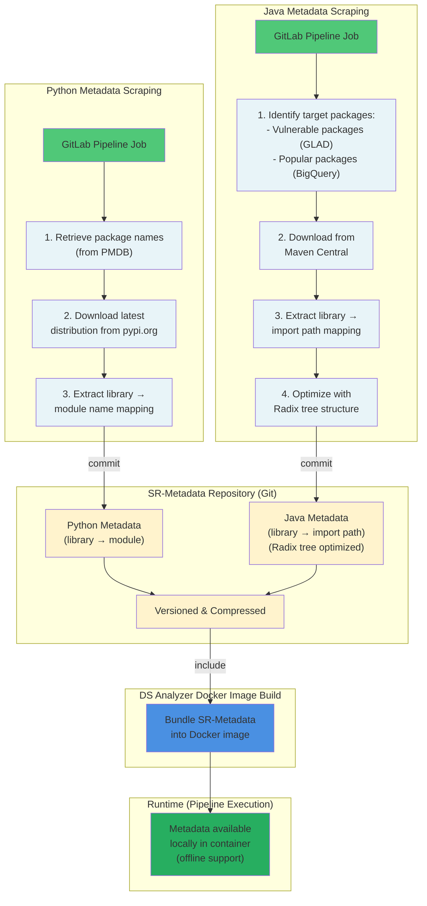

---
# This is the title of your design document. Keep it short, simple, and descriptive. A
# good title can help communicate what the design document is and should be considered
# as part of any review.
title: "Static Reachability"
status: implemented
creation-date: "2025-10-01"
authors: [ "@nilieskou" ]
coaches: [ "@mbenayoun" ]
dris: [ "@joelpatterson", "@nilieskou" ]
owning-stage: "~devops::secure"
participating-stages: []
# Hides this page in the left sidebar. Recommended so we don't pollute it.
toc_hide: true
---

<!-- This renders the design document header on the detail page, so don't remove it-->


## Summary

Static Reachability is a feature within GitLab's Dependency Scanning that determines whether a dependency is actively used (imported) by the application code.
This contextual information enriches vulnerability findings, enabling users to prioritize remediation efforts by focusing on vulnerabilities in dependencies that are actually reachable from their codebase,
rather than treating all vulnerabilities equally regardless of their actual impact.

The feature supports Java, JavaScript/TypeScript, and Python projects, integrating seamlessly into the existing Dependency Scanning pipeline workflow.
Reachability data is surfaced in the Vulnerability Report and Vulnerability Details pages, with filtering capabilities to help security teams triage findings more effectively.

## Motivation

Security teams face a critical challenge in vulnerability management: they receive overwhelming volumes of vulnerability findings from dependency scanning, but lack the context needed to prioritize remediation efforts effectively. This creates decision paralysis and inefficient resource allocation.
Currently, teams rely on three generic data points to assess risk:

CVSS Severity: A standardized but context-agnostic score
EPSS Score: Exploit prediction based on threat intelligence
KEV (Known Exploited Vulnerabilities): Catalog of actively exploited CVEs

While valuable, these metrics tell only part of the story. A critical vulnerability in an unused library poses significantly less risk than a medium-severity vulnerability in a heavily-used dependency. Without this contextual insight, teams waste time investigating and remediating vulnerabilities that have minimal actual impact on their applications.

By introducing reachability data we enable teams to filter noise, focus effort, reduce time-to-remediation and improve security posture.
Reachability analysis is increasingly expected in modern security tools. By implementing this feature, GitLab strengthens its competitive position in the Application Security Testing market and delivers tangible value to customers managing complex dependency ecosystems.

### Goals

1. **Provide reachability context**: Determine whether dependencies are actively imported in the application code
1. **Reduce noise**: Allow users to filter and deprioritize vulnerabilities in unused dependencies
1. **Improve remediation efficiency**: Enable faster, more informed triage decisions
1. **Support major ecosystems**: Cover Java (Maven), Python (PyPI), and JavaScript/TypeScript (npm, pnpm, yarn)
1. **Enable offline environments**: Support air-gapped and self-managed instances

### Non-Goals

1. **Dynamic/Runtime Reachability**: This design focuses on static analysis only; runtime call graph analysis is out of scope
1. **Cross-file deep analysis**: To maintain performance, the analysis does not perform exhaustive cross-file data flow tracking
1. **Automatic severity adjustment**: Reachability status is informational only
1. **Function-level reachability**: The current scope is dependency-level (is the library used?), not function-level (is the vulnerable function called?)

## Proposal

Static Reachability requires package metadata to function correctly across different programming languages.
For instance, in Python, the package name listed in an SBOM may differ from the name used in import statements.
In Java, imports reference specific paths within a library rather than the library name itself.
To perform Static Reachability analysis, we need mappings that connect package names to their corresponding import identifiers—whether that's the actual import name in Python or the internal import paths in Java.
JavaScript and TypeScript do not require this metadata because package names in npm registries match the import names used in code, eliminating the need for translation mappings.

The [SR-metadata](https://gitlab.com/gitlab-org/security-products/static-reachability-metadata/-/tree/v1?ref_type=heads) repository maintains up-to-date PyPI and Maven package metadata, refreshed weekly through language-specific scrapers. **This metadata is bundled into the DS analyzer's Docker image** to support offline usage.

Static Reachability runs as part of Dependency Scanning within CI/CD pipelines and is available in the new DS analyzer. The analyzer first generates SBOMs, then attempts Static Reachability analysis for each supported language when the feature is enabled. Since SR can extend execution time, it's disabled by default. The analysis uses semgrep-core to identify import statements and cross-references them with SR-metadata to determine which SBOM components are actively used. Reachability information is embedded in the SBOM reports and ingested when the Dependency Scanning job completes. Vulnerabilities include a reachability field that appears in both the vulnerability report and detail pages, allowing users to filter by reachability state.

## Design and implementation details

### High Level Design

Below you can see a diagram on how Static Reachability Analysis works and integrates with the GitLab Platform.

```mermaid
graph TB
    subgraph Metadata["Metadata Scraping Pipeline (Weekly)"]
        Trigger["⏰ Scheduled Pipeline<br/>(Once per week)"]
        PyPI["PyPI Scraper<br/>(Extract module names)"]
        Maven["Maven Scraper<br/>(Extract package info)"]
        
        Trigger -->|triggers| PyPI
        Trigger -->|triggers| Maven
    end
    
    subgraph MetadataRepo["SR-Metadata Repository<br/>(Git)"]
        PyPIData["PyPI Module Data<br/>(library → module mapping)"]
        MavenData["Maven Package Data<br/>(package metadata)"]
    end
    
    PyPI -->|writes| PyPIData
    Maven -->|writes| MavenData
    
    subgraph DockerImage["<b>DS Analyzer Docker Image</b><br/>"]
        BundledMeta["Bundled SR-Metadata<br/>(PyPI + Maven data)"]
    end
    
    PyPIData -->|bundled into| BundledMeta
    MavenData -->|bundled into| BundledMeta
    
    subgraph DSAnalyzer["Dependency Scanning Analyzer"]
        SBOM["1️⃣ Generate SBOM<br/>(Parse lockfiles)"]
        
        subgraph SRCheck["2️⃣ Check SR Eligibility"]
            LangCheck["Supported Language?<br/>(Java/Python/JS)"]
            SREnabled["SR Enabled?"]
        end
        
        subgraph SRAnalysis["3️⃣ Static Reachability Analysis"]
            Semgrep["semgrep-core<br/>(Find imports)"]
            MetadataUse["Use Bundled SR-Metadata<br/>(library mappings)"]
        end
        
        Enrich["4️⃣ Enrich SBOM<br/>(Add reachability properties)"]
        Output["SBOM Output<br/>(gl-sbom-*.cdx.json)"]
        
        SBOM --> LangCheck
        LangCheck -->|Yes| SREnabled
        LangCheck -->|No| Output
        SREnabled -->|Yes| Semgrep
        SREnabled -->|No| Output
        
        Semgrep --> MetadataUse
        MetadataUse -->|reads| BundledMeta
        Semgrep --> Enrich
        Enrich --> Output
    end
    
    subgraph GitLabRails["GitLab Rails Platform"]
        Ingest["SBOM Ingestion Service"]
        VulnDB["Vulnerability Database<br/>(with reachability_status)"]
        GraphQL["GraphQL API<br/>(reachability field)"]
    end
    
    Output -->|artifact| Ingest
    Ingest --> VulnDB
    VulnDB --> GraphQL
    
    subgraph UI["Frontend UI"]
        VulnReport["Vulnerability Report<br/>(Reachability column)"]
        VulnDetails["Vulnerability Details<br/>(Reachability indicator)"]
    end
    
    GraphQL --> VulnReport
    GraphQL --> VulnDetails
    
    style Trigger fill:#4a90e2
    style PyPI fill:#50c878
    style Maven fill:#50c878
    style PyPIData fill:#fff3cd
    style MavenData fill:#fff3cd
    style BundledMeta fill:#fff3cd
    style SBOM fill:#e8f4f8
    style Semgrep fill:#ff6b6b
    style Enrich fill:#9b59b6
    style Output fill:#27ae60
    style Ingest fill:#3498db
    style VulnDB fill:#2c3e50
    style GraphQL fill:#16a085
    style VulnReport fill:#f39c12
    style VulnDetails fill:#f39c12
```



### Reachability Status Values

| Status | Meaning |
|--------|---------|
| **Reachable: Yes** | Analysis confirmed the dependency is imported |
| **Reachable: Not Found** | Analysis could not find evidence that the dependency is imported |
| **Reachable: Not Available** | Reachability analysis data are missing |

The design intentionally avoids a "Not Reachable" status to prevent false negatives. If analysis cannot confirm usage, it defaults to "Not Found" rather than incorrectly marking a dependency as unused.

### Metadata Scraper Infrastructure

For Python and Java, external metadata is required to map library names to importable module names:



Python metadata is scraped weekly from pypi.org through a GitLab pipeline job that:

- Retrieves all PyPI package names from PMDB
- Downloads the latest distribution for each package from pypi.org
- Extracts the mapping between library names and module (import) names
- Commits the data to the SR-metadata git repository

We intentionally scope this process to the latest version only, as the library-to-module name mapping rarely changes across versions.

Java metadata follows a similar weekly scraping schedule. However, Java Static Reachability requires mappings between library names and import paths, which presents a unique challenge: import paths can vary significantly between package versions, and collecting exhaustive data for all versions creates prohibitive storage requirements. To address this, we focus on two key subsets:

- Vulnerable packages with known security advisories. Source is the GitLab Advisory DB.
- The most popular Java packages

This targeted approach covers the majority of customer packages while keeping data manageable. Additionally, we employ a Radix tree structure to optimize storage efficiency, as Java import paths share long common prefixes that compress well with this data structure.

### SBOM Enrichment Process

Reachability data are stored in the SBOM report using the  `gitlab:dependency_scanning_component:reachability` property to each component:

```json
{
  "bom-ref": "pkg:pypi/requests@2.28.0",
  "name": "requests",
  "version": "2.28.0",
  "properties": [
    {
      "name": "gitlab:dependency_scanning_component:reachability",
      "value": "in_use"
    }
  ]
}
```

The reachability property supports two values: `in_use` and `not_found`.
During SBOM report ingestion, these values are mapped to `Yes` and `Not Found` respectively in the reachability field.
If the property is absent, it indicates that Static Reachability analysis did not run, and the field displays `Not Available`.
This can happen if static reachability analysis is not enabled or failed to execute or if the language is not supported.

## Alternative Solutions

### 1. Import + Usage Analysis

**Approach**: Initially, the design included not just detecting if a dependency was **imported**, but also verifying that the imported library was **actually called/used** in the application code .

**Why We Considered It**:

- More precise than import-only detection
- Filters out dependencies that are imported but never invoked
- Reduces false positives by confirming actual code execution

**Why We Rejected It**:

- A dependency is imported and automatically some init code is executed.
- Decided to implement it as part of function level static reachability
- Simplifying the whole flow

**Decision**: We scoped the feature to **import-level reachability only** (is the library imported?). This provides the majority of the value with less complexity.

**Key Insight**: A dependency that is imported but not called is still a risk if it has a supply chain vulnerability. Import-level detection is sufficient for the primary use case of prioritizing remediation efforts.

**Reference**: [Epic #15780 - Static Reachability Analysis - GA](https://gitlab.com/groups/gitlab-org/-/epics/15780#note_2558241464)

### 2. Static Reachability as a Separate Preceding Job

**Approach**: During the Beta phase, Static Reachability was implemented as a **separate CI job that ran before the Dependency Scanning job**, with explicit job dependencies.

**Why We Considered It**:

- Clear separation of concerns. Static reachability was performed by the SCA-to-sarif-matcher codebase.  
- Easier to debug individual components
- Allows independent scaling of each job

**Why We Rejected It**:

- **Job orchestration complexity**: Managing dependencies between jobs introduced fragility
- **Operational complexity**: Due to heavy CI/CD customer customisations, operational failures could not be avoided.
- **User experience**: Multiple jobs made CI/CD templates harder to understand and configure

**Decision**: We consolidated all functionality into a **single Dependency Scanning job** that handles:

1. SBOM generation
2. Static Reachability analysis (if enabled)
3. SBOM enrichment

This eliminated job orchestration complexity and provided a cleaner user experience.

**Reference**: [Spike #525958 - Monolithic vs Composable Architecture](https://gitlab.com/gitlab-org/gitlab/-/issues/525958), [Enabling Static Reachability as part of the pipeline](https://gitlab.com/gitlab-org/gitlab/-/work_items/523358)

### 3. Client-Provided Docker Image (Experiment Phase)

**Approach**: During the Experiment phase, Static Reachability required users to provide a **Docker image containing their application code** to the `SCA-to-sarif-matcher` tool for analysis. This was required to find the mapping between library names and import paths/names.

**Why We Considered It**:

- Simplified initial implementation
- Leveraged existing Oxeye/Lightz-aio analysis engine
- Reduced infrastructure requirements

**Why We Rejected It**:

- **User friction**: Requiring users to provide a Docker image was a significant barrier to adoption

**Decision**: We implemented a **metadata scraping approach** where:

1. We pre-scrape library-to-module mappings from PyPI and Maven Central
2. Store this metadata in the SR-metadata Git repository
3. Bundle metadata into the DS analyzer Docker image

**Benefits of This Approach**:

- No user-provided Docker images required
- Cleaner separation between data collection and analysis

**Reference**: [Issue #520509 - Static reachability should be able to run without requiring a docker image](https://gitlab.com/gitlab-org/gitlab/-/issues/520509)

### 4. Analysis Engine Migration: Lightz-aio to semgrep-core

**Approach**: Initially, Static Reachability used the **Lightz-aio analysis engine** to perform cross-file call graph analysis. This required a separate `sca-to-sarif-matcher` tool for the SBOM enrichment.

**Why We Considered It**:

- Leveraged proven proprietary analysis engine

**Why We Rejected It**:

- **Performance bottleneck**: Lightz-aio's cross-file capabilities made it very slow (40+ minutes for large Python projects like OpenAPI)
- **Limited flexibility**: Difficult to integrate into the DS analyzer pipeline without job orchestration

**Decision**: We migrated to **semgrep-core** (open-source Semgrep) as the analysis engine and **integrated it directly into the DS analyzer**. This approach:

1. **Eliminated `sca-to-sarif-matcher`**: Removed the intermediary tool entirely, reducing complexity
2. **Consolidated analysis**: All Static Reachability logic now lives in the DS analyzer
3. **Improved performance**: Single-file analysis is orders of magnitude faster than cross-file analysis
4. **Simplified integration**: No separate job dependencies or tool orchestration needed

**Trade-offs**:

- **Accepted limitation**: We may miss imports where the import statement and usage are in different files (rare edge case)
- **Benefit**: Pipelines complete in minutes instead of hours, making the feature practical for real-world CI/CD workflows

**Reference**: [Issue #537156 - Spike: Investigate opengrep/semgrep as an alternative for Lightz-aio](https://gitlab.com/gitlab-org/gitlab/-/issues/537156)

## Future Work

### Function-Level Static Reachability (FLSR)

**Vision**: Extend Static Reachability beyond import detection to **function-level analysis**, determining not just whether a dependency is imported, but whether the specific vulnerable function within that dependency is actually called.

**Approach**:

- Track dependency functions are called from the application code
- Only flag vulnerabilities in packages that are demonstrably used and a vulnerable function is called
- Offline analyze vulnerable packages with a solution to identify the vulnerable function

**Benefits**:

- **Precision**: Eliminates false positives from unused functions within imported libraries
- **Risk accuracy**: Provides the most accurate risk assessment possible. A vulnerable libray doesn't automatically means that the application code is affected.
- **Remediation prioritization**: Enables even more granular prioritization of security work

**Scope Limitations**:
To maintain practical performance and complexity, FLSR will focus on **first-layer transitive dependencies only**:

- ✅ **Direct dependencies**: Analyze functions called from the application code
- ✅ **First-layer transitive dependencies**: Analyze functions called by direct dependencies
- ❌ **Second-layer and beyond**: Do not analyze deeper transitive chains (dependency of a transitive dependency)

**Rationale for Scope**:

- **Complexity explosion**: Analyzing arbitrarily deep dependency chains creates exponential complexity
- **Performance**: Limiting scope keeps analysis time reasonable for CI/CD pipelines
- **Maintainability**: Reduces the surface area for bugs and edge cases

**Reference**: [Epic #16844 - Function Level Static Reachability](https://gitlab.com/groups/gitlab-org/-/epics/16844)
