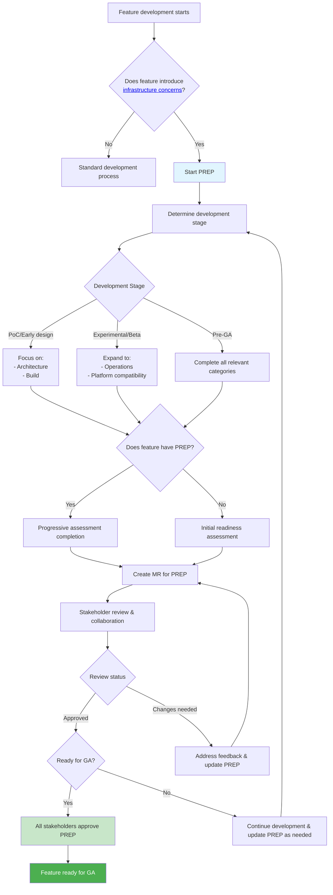

The GitLab **Platform Readiness Enablement Process (PREP)** encompasses the systematic evaluation of GitLab
features for production readiness across GitLab.com, Dedicated, and Self-Managed
platforms. As GitLab's readiness evaluation capabilities expand to cover additional
domains, this framework will evolve to provide a unified assessment experience
for all product teams, preventing process fragmentation while ensuring
comprehensive feature and component readiness across the entire GitLab ecosystem.

This assessment empowers product teams to self-serve their readiness evaluation
and helps reviewing teams ensure that features are ready for production
deployment.

**PREP** addresses infrastructure concerns that apply to any GitLab feature or component,
regardless of its domain. It serves as a communication bridge between product
and infrastructure teams, ensuring features are ultimately ready for production
deployment across all GitLab platforms.

## Vision Statement

One unified and paved path to production: Empowering development teams to own requirements and developers to ship higher-quality features through proactive, AI-informed context, and seamless systems integration.

## Why we recommend PREP

The unique position of GitLab as both a SaaS provider (GitLab.com) and software
vendor (GitLab Self-Managed and GitLab Dedicated) creates critical readiness gaps
that existing processes don't address. GitLab has experienced platform
compatibility failures where features reached general availability (GA) without
validation across GitLab Self-Managed and GitLab Dedicated platforms, causing
customer deployment issues and increased support burden.

The Production Readiness Review only covers GitLab.com operational
readiness, leaving no systematic evaluation for GitLab Self-Managed and GitLab
Dedicated platform requirements, or evidence-based validation across different
customer environments. This gap led to reactive problem discovery, with
cross-platform compatibility issues found post-release requiring considerable
engineering work and delayed GA promotions.

PREP fills this critical void by providing a self-service, evidence-based
framework for product teams to systematically evaluate their features' readiness
across the entire GitLab platform ecosystem, ensuring consistent quality for all
customers.

{}
A completed and approved PREP is **strongly recommended** as the fastest
and simplest way for any new feature or changeset to reach GA status across all deployment platforms.
{}

## When is the best time to engage with PREP?

We strongly recommend engaging with PREP as early as possible for any feature that introduces or makes significant changes to _infrastructure or core components_. Here are a
few examples that can help you to ascertain this:

- Are you proposing to introduce a new service or component? Are you rearchitecting a core component?

  If you're adding a completely new service that needs to be
  packaged, distributed, and operated independently, we recommend you participate in PREP. If you are
  fundamentally changing how an existing core component functions or adding new dependencies for a
  core component, we recommend you particpate in PREP. If you are
  adding functionality within existing services, you likely don't need to.

- Does your feature require new infrastructure dependencies?

  If your feature needs new databases, external services, storage backends, or
  networking components (such as requiring a highly available database), we recommend PREP. API additions within existing frameworks
  would likely not need additional evaluations.

- Does your feature have significant operational resource requirements?

  If your feature or component introduces new computational, storage, or memory requirements
  that could impact deployment sizing, scaling, or resource allocation across
  different environments, PREP ia strongly recommended. Lightweight additions to existing services
  would not apply to this recommendation.

- Does your feature require new installation, configuration, or deployment steps?

  If customers need to perform additional setup, configure new components, or
  modify their deployment procedures to use your feature, you should participate in PREP.

- Does your feature behave differently across GitLab.com, GitLab Dedicated, and
  GitLab Self-Managed?

  If your feature has platform-specific considerations, compatibility requirements,
  or performance characteristics that vary by deployment method, we recommend PREP.

- Does your feature introduce new infrastructure concerns?

  If your feature affects security models, monitoring requirements, backup
  procedures, upgrade processes, or other operational aspects beyond its core
  functionality, we recommend PREP.

If you answered "yes" to any of these questions, your feature likely introduces
novel infrastructure concerns or other platform dependencies would be reviewed during PREP.

## Relationship to Production Readiness Review

Platform Readiness Enablement Process **combines** the existing [Production Readiness Review](/handbook/engineering/infrastructure-platforms/production/readiness) and Operational Readiness Review processes, to focus on ensuring features work correctly across all GitLab deployment pathways and methods.

## Key principles

PREP is built on several core principles that distinguish it from other readiness
processes:

- **Self-Service**: Designed for independent completion by product teams with
  clear guidance and stakeholder contact information
- **Progressive**: Answers evolve with feature maturity through the development
  lifecycle - not all questions need to be answered simultaneously
- **Evidence-Based**: Every response must be supported by concrete documentation,
  implementation details, or tracking issues
- **Collaborative**: Facilitates ongoing collaboration between product teams and
  reviewing teams with validation at key gates

## Assessment scope

PREP covers 11 categories of infrastructure concerns, each with specific
questionnaires and reviewing stakeholders:

- **Build & Deployment**: Artifact generation, packaging, deployment strategies
- **Documentation & Support**: User documentation, support materials
- **Installation & Configuration**: Installation methods, configuration options
- **Observability**: Monitoring, logging, alerting
- **Operations**: Maintenance, upgrades, lifecycle management
- **Performance & Scalability**: Performance requirements, scaling behavior
- **Platform Strategy**: Platform compatibility, strategic alignment
- **Quality Assurance**: Testing strategies, quality gates
- **Security & Compliance**: Security requirements, compliance needs
- **Service Architecture**: Service design, architectural patterns

For the complete list of categories and their reviewing stakeholders, see the
[assessment structure documentation](https://gitlab.com/gitlab-org/architecture/readiness#assessment-structure).

## Roles and responsibilities

Product and reviewing teams have different roles and responsibilities.

### Product teams

- **Complete the PREP assessment** with evidence-based responses and concrete
  documentation
- **Build and maintain** containers, Helm charts, deployment artifacts, and
  configuration
- **Provide comprehensive documentation** including implementation details,
  architecture decisions, and operational procedures
- **Respond to review feedback** promptly and iterate on the assessment based on
  stakeholder input
- **Engage stakeholders early** in the development process and communicate
  realistic timeline expectations

### Reviewing teams (Infrastructure/Platform)

- **Provide guidance** on questionnaire requirements and clarify assessment
  expectations
- **Review assessments** for completeness, technical accuracy, and alignment
  with platform standards
- **Offer best-effort support** for implementation questions and architectural
  guidance
- **Validate readiness** at key development stage gates and provide timely
  feedback
- **Approve final assessments** before GA promotion, ensuring all requirements
  are met

{}
Product teams are responsible for the actual implementation work including
building containers, writing Helm charts, creating deployment configurations,
and maintaining operational documentation. Reviewing teams provide guidance,
validation, and approval but do not build these artifacts for product teams.
{}

## Process overview

The following diagram illustrates the PREP flow:

## Key advice

- **Start early** in your feature development lifecycle - PREP approval is strongly recommended to increase the likelihood of being ready for rollout across all GitLab platforms.
- **Read the [Readiness project README](https://gitlab.com/gitlab-org/architecture/readiness/-/blob/main/README.md)**
  for comprehensive guidance
- **Engage stakeholders early** and communicate transparently about timelines
- **Focus on evidence-based responses** with concrete documentation and links
- **Plan for GA gate** to ensure your PREP is completed and approved before
  attempting GA promotion
- **Remember** that this is a collaborative process designed to ensure your
  feature succeeds across all GitLab platforms
- **PREP is a living process** that improves through your input and feedback.

## Perform the assessment

Follow these three steps to perform your PREP.

### Step 1: Access the repository

PREP is managed through the [gitlab-org/architecture/readiness](https://gitlab.com/gitlab-org/architecture/readiness)
repository.

**Read the comprehensive guide**: Before starting your assessment, review the
[complete README](https://gitlab.com/gitlab-org/architecture/readiness/-/blob/main/README.md) which contains:

- Detailed step-by-step usage instructions
- Progressive completion guidance aligned with development stages
- Quality standards and best practices
- Review process and stakeholder engagement
- Escalation procedures

### Step 2: Determine your starting point

Your approach depends on your feature's current [development stage](https://docs.gitlab.com/policy/development_stages_support/):

- **PoC/Early Design**: Focus on foundational architectural and security
  considerations
- **Experimental/Beta**: Expand to operational and platform compatibility
  concerns
- **Pre-GA**: Complete all relevant categories with comprehensive evidence

### Step 3: Create your assessment

Follow the [step-by-step usage instructions](https://gitlab.com/gitlab-org/architecture/readiness#step-by-step-usage-instructions)
in the repository `README` to:

1. Clone the repository and create your feature branch
1. Set up your feature directory structure
1. Copy relevant questionnaire templates
1. Begin progressive completion based on your development stage
1. Create merge requests for collaborative review

## Review and approval process

The PREP review process involves multiple stakeholders and follows a structured
approach:

- **Self-service completion** by product teams with evidence-based responses
- **Progressive validation** by infrastructure teams at development stage gates
- **Collaborative iteration** through merge request discussions
- **Final approval required before GA promotion** - All relevant stakeholders
  must explicitly approve the completed assessment

Before any feature can be promoted to general availability, the PREP must be:

- Completed for all relevant categories based on the feature's scope
- Supported by comprehensive evidence documentation
- Reviewed and explicitly approved by all required stakeholder teams
- Free of any unresolved blocking issues or gaps

For detailed information about the review process, stakeholder engagement, and
escalation procedures, see the [Review Process section](https://gitlab.com/gitlab-org/architecture/readiness#review-process-and-responsibilities)
in the repository documentation.

## Get help and support

For more information, please see the [internal handbook page](https://internal.gitlab.com/handbook/product/platforms/feature-readiness-assessment/)
