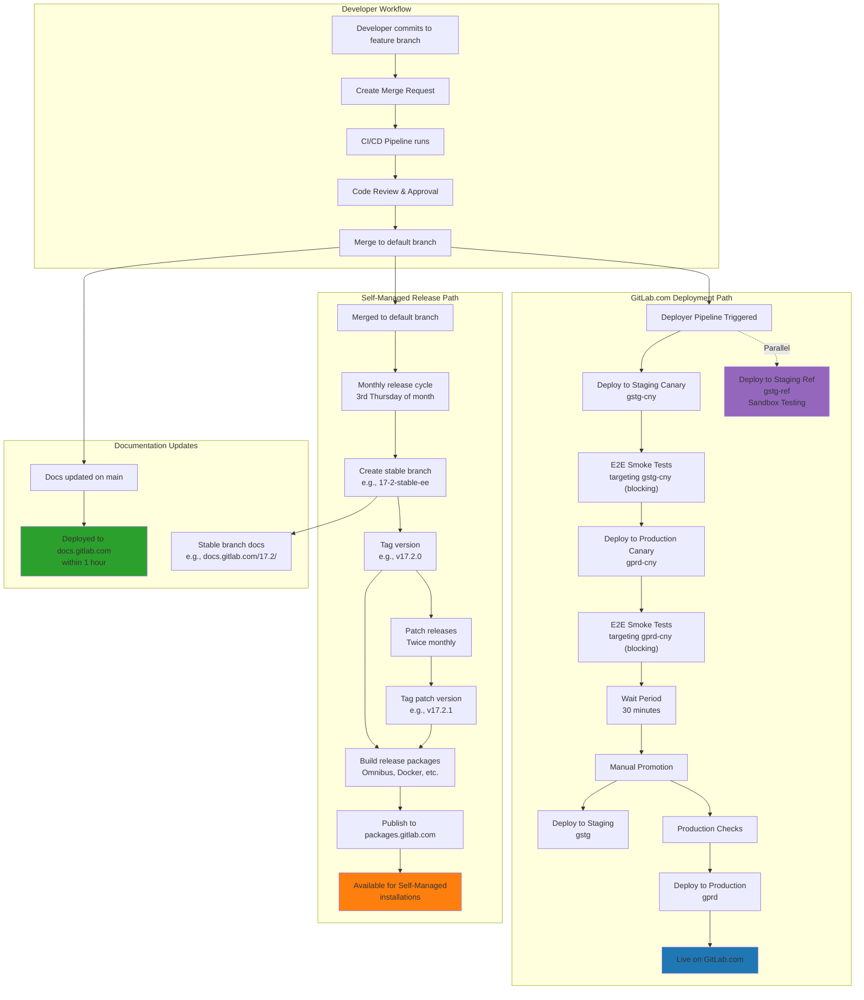

## GitLab Deployment Workflow

The following diagram illustrates the complete deployment workflow from developer commit to production deployment on GitLab.com and self-managed releases.

## Post-Deployment Migrations

Post-deployment migrations have their own dedicated workflow and are not guaranteed to run within a specific timeframe. The deployment team reserves the right to run them when deemed necessary. However, they are always executed prior to release management tasks.

For more details, see the [Post-Deploy Migration (PDM) Execution](/handbook/engineering/deployments-and-releases/deployments/#post-deploy-migration-pdm-execution) section in the deployments handbook.

## Related Documentation

For additional context on the deployment process, refer to the [Deploying Packages](/handbook/engineering/deployments-and-releases/deployments/#deploying-packages) section in the deployments and releases handbook.
